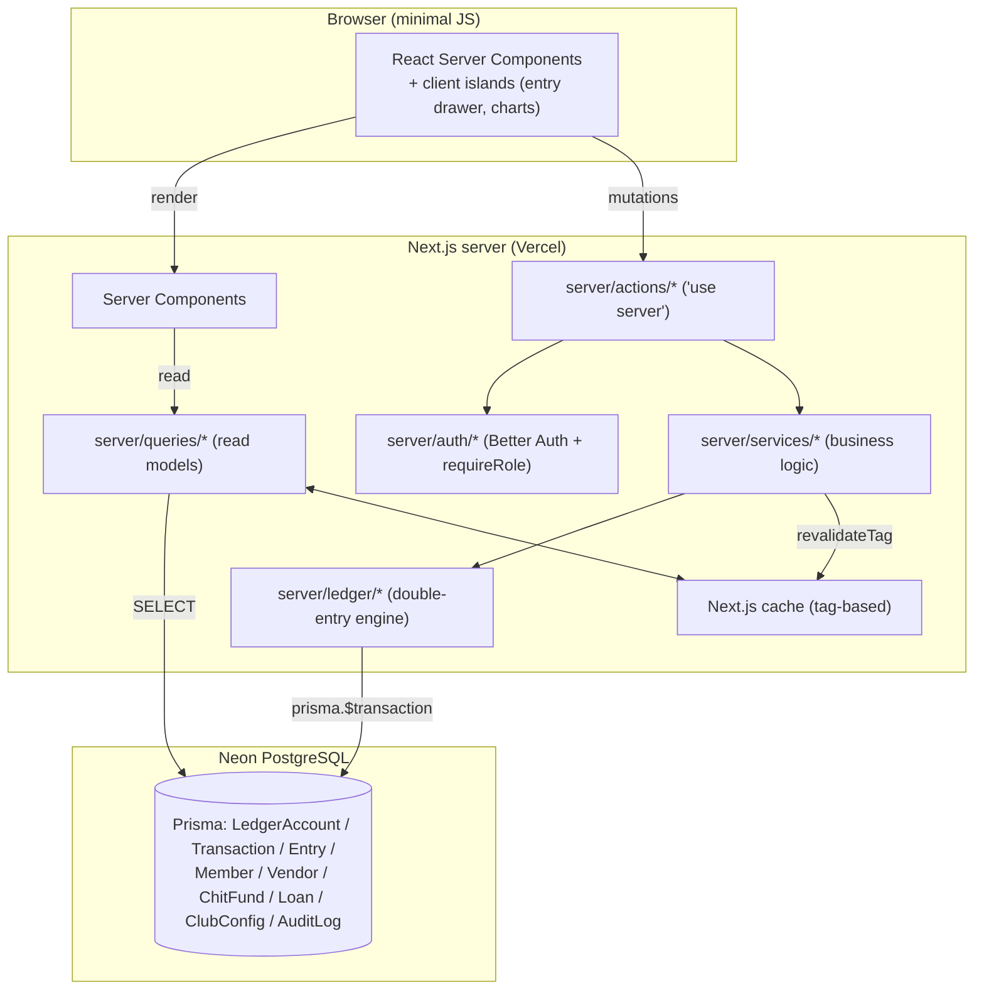
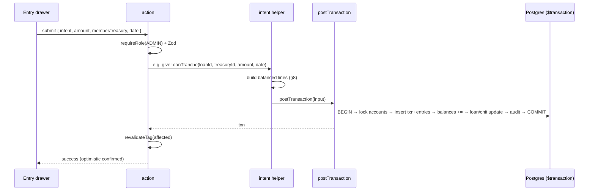
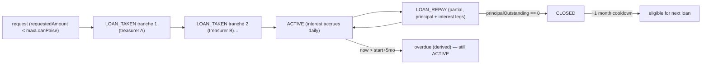
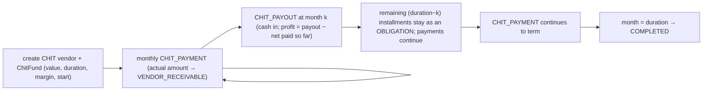
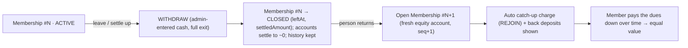
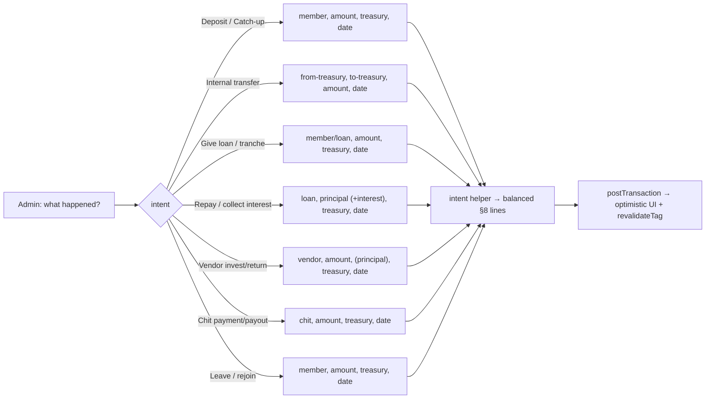
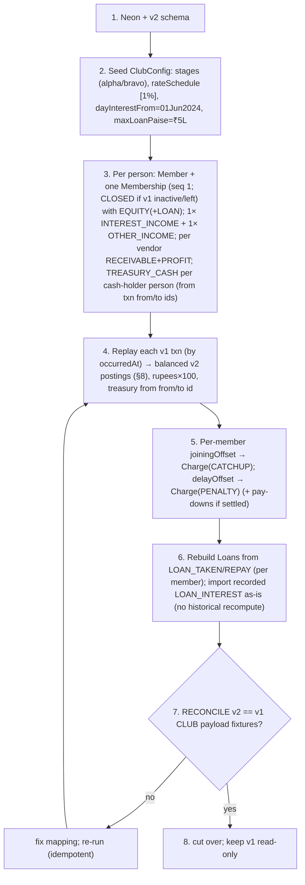

# Peacock Investment Club — Implementation Plan (Build Bible)

> **Status:** Pre-build, design-in-progress. Single, expanded, line-by-line engineering plan for
> building the new Peacock repository from scratch. Consolidates and supersedes (for build
> purposes) the three source planning docs.
>
> **Revision 8** — current model: **banker identity** — `Member` = the **person/customer** (one login,
> stable), `Membership` = a **stint/account** (opens on join, **closes on leave**, a new one opens on
> rejoin); per-stint `MEMBER_EQUITY`/`LOAN_RECEIVABLE`/loans/charges, `TREASURY_CASH` on the person.
> The club holds **no cash** (treasurers do); **multi-tranche loans** with a **fixed-at-origination
> rate** + configurable **overdue penalty** (default 0); **`GENERAL`** + `CHIT` vendors (no BANK; bank
> = GENERAL `category`) and **ramping chit installments**; **catch-up & penalty are `Charge` dues**
> (multiple over time, reasons, paid down in instalments; catch-up → `MEMBER_EQUITY`, penalty →
> `OTHER_INCOME`); **withdrawal = full exit, settled in cash → membership closes**; **profit-per-member**
> with exit share **proportional to deposits paid**; **login** = pick member + password (default =
> phone, unique, **forced change on first login**, **admin reset**); simple **in-app notifications**.
> Undecided items marked **`‹TBD›`**.
>
> **Audience:** the engineer(s) building this. Everything needed to start typing lives here.
> **Out of scope:** visual styling (see `DESIGN_PROMPTS.md`). Functionally the UI mirrors v1.

---

## Table of contents

1. [Purpose & domain](#1-purpose--domain)
2. [Glossary](#2-glossary)
3. [Tech stack](#3-tech-stack)
4. [Locked decisions & defaults](#4-locked-decisions--defaults)
5. [Architecture at a glance](#5-architecture-at-a-glance)
6. [The double-entry ledger — mental model](#6-the-double-entry-ledger--mental-model)
7. [Chart of accounts](#7-chart-of-accounts)
8. [Posting spec — every transaction type, line by line](#8-posting-spec--every-transaction-type-line-by-line)
9. [Database schema (full Prisma + commentary)](#9-database-schema-full-prisma--commentary)
10. [Money handling — the BigInt/paise contract](#10-money-handling--the-bigintpaise-contract)
11. [Dates, timezone & month boundaries](#11-dates-timezone--month-boundaries)
12. [The critical write path — `postTransaction`](#12-the-critical-write-path--posttransaction)
13. [Reverse & edit](#13-reverse--edit)
14. [Loans in depth — tranches, rate schedule, interest](#14-loans-in-depth--tranches-rate-schedule-interest)
15. [Chit funds in depth](#15-chit-funds-in-depth)
16. [Members — deposits, catch-up, withdraw & rejoin](#16-members--deposits-catch-up-withdraw--rejoin)
17. [Calculations — every figure derived, line by line](#17-calculations--every-figure-derived-line-by-line)
18. [Read models / queries](#18-read-models--queries)
19. [Analytics & graphs](#19-analytics--graphs)
20. [Auth, roles & permissions](#20-auth-roles--permissions)
21. [Caching & revalidation](#21-caching--revalidation)
22. [Validation (Zod) & the service contract](#22-validation-zod--the-service-contract)
23. [App structure, routes & the entry drawer](#23-app-structure-routes--the-entry-drawer)
24. [Migration v1 → v2](#24-migration-v1--v2)
25. [Testing strategy](#25-testing-strategy)
26. [Build phases & checklists](#26-build-phases--checklists)
27. [Performance budget](#27-performance-budget)
28. [Open questions / TBDs](#28-open-questions--tbds)

---

## 1. Purpose & domain

**Peacock** is a private investment-club / chit-fund manager for a single club ("Many feathers,
one fortune"). It models real money moving between members, the club's pooled value, and external
vendors.

### The parties

| Party | What it is |
|-------|-----------|
| **Member** | A person in the club. Pays a recurring **monthly deposit**, can **borrow** (loans with daily interest), can **withdraw / leave** and later **rejoin**. All members hold **equal status and value**. |
| **Treasurer** | A **member who currently physically holds club cash**. The club itself is not a physical entity and **holds no money** — cash always sits with one or more member-treasurers. Anyone can be a treasurer (admin or plain member; long- or short-term). |
| **Admin** | A member with **write access** (daily data entry, managing members/vendors/loans/config). Admin is just a member with a role flag. |
| **Vendor** | An external place the club puts money. Two types: **`CHIT`** fund (monthly installments toward a chit, payout later, with an obligation to keep paying) and **`GENERAL`** (any other placement — invest, get returns, profit = returns − invested; **also covers bank deposits/interest**: a treasurer parks club cash in a bank and returns the interest as a GENERAL return). |

So there are really only two kinds of people — **members**, some of whom are **admins** — plus the
**treasurer** capability (holding cash) which any member can have.

### The money flows, in plain English

1. **Deposits.** Every member owes a monthly deposit. The amount is **stage-based** and has been
   raised over time (₹1,000 → ₹2,000). The app tracks *expected vs paid* per member.
2. **Cash lives with treasurers.** When a member pays, the cash goes to a specific treasurer.
   Treasurers can move club cash between themselves (**internal transfer**). Total club cash =
   sum of all treasurers' holdings.
3. **Loans.** The club lends pooled cash to a member. A loan may be **disbursed in tranches**
   (different treasurers chip in over a few days), accrues **daily interest** on the
   outstanding-principal timeline, must be repaid within **5 months** (after which it is
   **overdue** but still active), and is repaid (possibly in parts) back to treasurers.
4. **Vendors.** The club places cash with a **general vendor** (e.g. a bank that earns interest, or
   any other placement) or pays into a **chit fund**
   monthly (gets a payout later, with profit/loss). Money out with vendors is club value too.
5. **Catch-up & penalty (charges/dues).** Amounts a member **owes**, raised as **multiple charges
   over time** (each with a reason) and **paid down in instalments**. **Catch-up** equalises a
   new/returning member's value (builds their own capital); **penalty** is a manual charge that
   becomes club income. Both auto-suggested + admin-editable.
6. **Withdraw / rejoin.** A member leaving **settles out** their value (admin enters the amount);
   their account is **frozen → INACTIVE** but history is kept. They can later **reactivate** by
   repaying (in one or two terms) plus catch-up.

### Two audiences

| Audience | Does |
|----------|------|
| **Admin** (a member) | Daily data entry + management. |
| **Members** | **Read-only transparency** over the whole club. No writes. |

### Why v2 (what v1 got wrong)

`Float` money → drift; MongoDB JSON "passbook" recomputed on every write; two sources of truth;
four cache layers; background recompute jobs; heavy REST. v2: **one ledger, integer paise, O(1)
writes, derive time-based values on read, one cache layer, server actions instead of REST.**

---

## 2. Glossary

| Term | Meaning |
|------|---------|
| **Paise** | ₹1 = 100 paise. All money stored as integer paise in `BigInt`. |
| **Ledger account** (`LedgerAccount`) | A balance bucket in the chart of accounts (≠ Better-Auth `Account`). |
| **Treasury** (`TREASURY_CASH`) | A cash-holding account owned by a member-treasurer. |
| **Entry** | One signed line of a transaction, posted to one ledger account. |
| **Transaction** | A balanced group of entries whose `amount`s **sum to zero**. |
| **Stock / Flow** | A "right now" balance vs a lifetime running total. |
| **Derived-on-read** | Computed at read time, never stored (e.g. loan interest-to-date). |
| **Stage** | A period with a fixed expected monthly deposit (alpha ₹1,000, bravo ₹2,000). |
| **Charge** | A due a member **owes** — **catch-up** (equalisation, builds their own value) or **penalty** (club income). Raised multiple times over time, each with a reason; paid down in instalments. (Replaces v1 "offset".) |
| **Tranche** | One disbursement installment of a single loan (loans may be funded by several). |
| **Rate schedule** | Time-versioned global monthly interest rate `[{ rateBps, effectiveFrom }]`. |
| **`dayInterestFrom`** | Date from which interest is pro-rated daily; before it, whole-month only. |
| **Overdue** | A loan still active past its 5-month term — **derived**, not a stored status. |
| **Chit fund** | A `CHIT` vendor: pay a fixed monthly installment for N months, receive a payout. |
| **Reversal** | A transaction negating a prior one; how edits/deletes happen. |
| **bps** | Basis points. 1% = 100 bps. |
| **IST** | Asia/Kolkata; all month bucketing uses it. |

---

## 3. Tech stack

| Layer | Choice | Why |
|-------|--------|-----|
| Language | **TypeScript** (strict) | End-to-end type safety. |
| Framework | **Next.js App Router**, RSC + Server Actions | One codebase, minimal client JS, no REST. |
| Database | **PostgreSQL** (Neon) | Relational + ACID; ideal for a ledger; free tier. |
| ORM | **Prisma** | Typed queries, migrations, `$transaction` for atomic posting. |
| Money | **`BigInt` paise** | Exact integer math; format to ₹ only at the display edge. |
| Auth | **Better Auth** (Prisma adapter) | Lightweight; owns User/Session/Account/Verification. |
| Validation | **Zod** | One validation source for actions and forms. |
| UI components | **shadcn/ui** (Radix-based) | Accessible primitives we own and compose; not a heavy UI framework. |
| Styling | **Tailwind CSS** + **CVA** + `cn()` (`clsx`+`tailwind-merge`) | Theme-token-driven; variants via class-variance-authority; **no hard-coded styles**. |
| Theming | **CSS variables (shadcn HSL tokens)** + Tailwind theme scale | Light/dark from tokens; zero magic numbers/hex. |
| Icons | **lucide-react** | Ships with shadcn; consistent, tree-shakeable. |
| Forms | **react-hook-form** + `@hookform/resolvers` (Zod) | Don't hand-roll forms; shared Zod schemas. |
| Tables | **@tanstack/react-table** (headless) | Ledger/member/loan tables without reinventing. |
| Optimistic UI | React `useOptimistic` / `useActionState` (React Query optional) | RSC + actions usually remove the need for a client cache lib. |
| Caching | **Next.js cache + `revalidateTag()`** | One predictable layer; invalidation clears local **and** Vercel/CDN. |
| File storage | **Vercel Blob** | Avatars/files. |
| Charts | a maintained chart lib (pick in P3) | Series come pre-computed from the ledger. |
| Testing | **Vitest** (unit) + **Playwright** (e2e later) | Heavy unit testing on the ledger/interest. |
| Hosting | **Vercel** + **Neon** | Serverless-friendly; no required background workers. |
| Timezone | **Asia/Kolkata (IST)** | All month boundaries. |

### 3.1 Database choice & portability (PostgreSQL now, MongoDB later?)

**Decision for now: PostgreSQL + Prisma.** The owner may revisit MongoDB later; the plan keeps the
door open with a clean seam, but is honest about the trade-offs.

**Why PG is the better fit for *this* app:** a ledger lives or dies on **atomic multi-row writes**
(`postTransaction` updates several account balances + entries + loan/chit rows in one transaction).
PG gives that natively. The analytics are **grouped aggregates** (`GROUP BY month`, running
`SUM`) — SQL's home turf.

**Keeping it swappable (so a later move isn't a rewrite):**
- **Prisma is the single data layer** and supports **both** PostgreSQL and MongoDB, so the schema
  and most queries port with modest changes.
- All DB access goes through **`server/queries/*` and the `ledger` engine** — no Prisma calls
  scattered in components. Swapping the datasource touches a contained layer.
- Avoid PG-only escapes in app logic: prefer Prisma's `groupBy`/aggregations over raw SQL so the
  analytics layer has a portable path (a raw-SQL fast path can be added later for PG only).

**Caveats to accept if Mongo is chosen later (flagged, not blocking):**
- **Transactions need a replica set** in Mongo (Atlas provides this); single-node dev Mongo can't
  do the multi-document `$transaction` the ledger relies on.
- **`BigInt` mapping differs** — PG stores it natively; Mongo uses `Long`/`Decimal128`. The
  `lib/money` boundary localizes this, but the Prisma field type changes.
- **Referential integrity / unique compound constraints** (`@@unique([memberId, kind])`,
  `onDelete: Restrict`) are weaker/different in Mongo and would shift enforcement into the service
  layer.
- Net: **migrating is "not a big deal" for the *schema*, but the *transaction guarantees* are the
  thing to validate** on Mongo. Recommendation: build on PG; only move if there's a strong external
  reason, and keep the ledger engine the single place that assumes ACID.

---

## 4. Locked decisions & defaults

### 4.1 Hard-locked

- PostgreSQL (Neon) + Prisma; double-entry ledger + incremental cached balances.
- Money = integer paise (`BigInt`); format to ₹ only at display.
- Next.js App Router + RSC + Server Actions (no REST).
- Time-based interest derived on read; optional cached rollups allowed (no *required* jobs).
- Better Auth; tag-based caching only; Vercel Blob.
- **Sign convention:** assets/receivables **positive**; equity & income **negative**.
- **Asia/Kolkata** for all month boundaries.
- Single club, clean `clubId` seam for later.

### 4.2 Domain rules locked in Revision 2

1. **Club holds no cash.** Cash lives in **`TREASURY_CASH`** accounts, one per treasurer-member,
   created **on demand**. Anyone can be a treasurer. `availableCash = Σ TREASURY_CASH`.
2. **`FUNDS_TRANSFER`** (treasury → treasury) is a real, frequently-used, net-zero transaction.
3. **Loans are sequential, not concurrent:** one active loan per member; must clear all
   outstanding before a new one; **no top-ups**; **1-month cooldown** after full repayment.
4. **A loan may be disbursed in multiple tranches** (different treasurers, over days) — modeled as
   one `Loan` with several `LOAN_TAKEN` events.
5. **Loan term = 5 months.** Past term → **overdue** (derived flag), **still ACTIVE**.
6. **Interest rate is global & time-versioned.** 1%/month from club start; admin can change it
   (e.g. → 2%) effective a date; accrual uses the rate in effect for each period.
7. **Interest is daily** from `dayInterestFrom` (01 Jun 2024): whole anchored months + leftover
   days at a daily rate; before that date, whole-month only.
8. **No repayment-amount validation** (no enforced minimum; round figures are advisory).
9. **Loan limit = ₹5,00,000**, configurable in admin settings (revisable).
10. **Vendors are typed:** `GENERAL` (generic placement: invest → return, profit = returns −
    invested; covers bank deposits/interest) and `CHIT` (monthly installments + payout, with a
    remaining-obligation if payout taken early, its own schedule §15). There is **no separate BANK
    type** — a bank is a GENERAL vendor with `category = "Bank"` (a display label for grouping in
    reports; it carries no special behavior).
11. **Catch-up** replaces "offset": **join-time equalisation** (missed deposits + profit-per-member).
    Both are **`Charge` dues** (multiple over time, reasons, paid down in instalments); catch-up →
    `MEMBER_EQUITY` on pay-down, penalty → `OTHER_INCOME`.
12. **Withdraw = settle (admin-entered amount) → freeze → INACTIVE**, keep history. **Reactivate**
    = repay (1–2 terms) + catch-up (profit-per-member + owed deposits).
13. **Roles = `ADMIN` / `MEMBER`** only; **treasurer is a flag**, not a role. (`SUPER_ADMIN`
    optional later if a "manages admins" tier is wanted.)
14. **Member visibility:** full read transparency, no write.
15. **Edit/delete:** admin only, via reversal (audited); period-lock seam built, off by default.
16. **Member ↔ User:** separate entities, optional `Member.userId` link.

### 4.3 Deposit stages (locked from owner data)

```
alpha : ₹1,000/month  01 Sep 2020 → 31 Aug 2023
bravo : ₹2,000/month  31 Aug 2023 → present
club startedAt        01 Sep 2020
dayInterestFrom       01 Jun 2024
```
Stored in `ClubConfig.stages` as paise. Month boundaries defined so exactly one stage owns each
month (alpha through Aug 2023, bravo from Sep 2023). Dates were given MM/DD/YYYY in IST.

---

## 5. Architecture at a glance



- **Reads:** Server Components call `server/queries/*` directly (typed, no HTTP), cached + tagged.
- **Writes:** UI → `actions/*` → `services/*` → `ledger/*` → `prisma.$transaction`, then
  `revalidateTag()` only the affected tags.
- **Money conversion** lives only in `lib/money`. The **ledger engine is the single choke point**
  for all balance changes and is the most heavily tested module.

---

## 6. The double-entry ledger — mental model

Every financial event is **one balanced `Transaction`** of signed `Entry` lines that **sum to
zero**. Each line posts to one `LedgerAccount` whose cached `balance` is updated **in the same DB
transaction**.

### Invariants

```
Per Transaction t:    Σ entry.amount == 0                 (enforced before commit)
Per LedgerAccount a:  a.balance == Σ entry.amount         (maintained incrementally; re-summed only to audit)
```

### Sign convention

- **Asset/receivable** (`TREASURY_CASH`, `LOAN_RECEIVABLE`, `VENDOR_RECEIVABLE`) → **positive**.
- **Equity/income** (`MEMBER_EQUITY`, `INTEREST_INCOME`, `VENDOR_PROFIT`) → **negative**.

Net club value nets to zero automatically (assets = equity + income), so we never hand-maintain a
`netClubValue` field.

### The four kinds of numbers

| Kind | Definition | How v2 computes it |
|------|-----------|--------------------|
| **Stock** | balance "right now" | read `LedgerAccount.balance` (O(1)) |
| **Flow** | lifetime running total | `SUM(entry.amount)` filtered by type/account (indexed) |
| **Expected/config** | pure function of config + time | `getMemberTotalDeposit(now)` over stages |
| **Derived-on-read** | time-based, computed on display | `interestToDate(loan)`, `pending = expected − actual` |

No passbook. Nothing that can drift.

---

## 7. Chart of accounts

| Kind (`LedgerAccountKind`) | Cardinality | Normal sign | Meaning |
|----------------------------|-------------|-------------|---------|
| `TREASURY_CASH` | 1 per treasurer-**person** (on demand) | + | Club cash physically held by that person |
| `MEMBER_EQUITY` | 1 per **membership (stint)** | − | The stint's stake/contributions |
| `LOAN_RECEIVABLE` | 1 per **membership (stint)** | + | Principal owed in that stint |
| `VENDOR_RECEIVABLE` | 1 per vendor (general / chit) | + | Principal/installments currently placed with the vendor |
| `INTEREST_INCOME` | exactly 1 | − | Club income from loan interest |
| `OTHER_INCOME` | exactly 1 | − | Club income not from loans/vendors — e.g. **penalty pay-downs** |
| `VENDOR_PROFIT` | 1 per vendor | − | Realized profit (or loss) from that vendor |

Creation rules: `INTEREST_INCOME` + `OTHER_INCOME` once at seed; `MEMBER_EQUITY` (+ `LOAN_RECEIVABLE`
lazily) **when a membership/stint opens** (first join, and again on each rejoin); `VENDOR_RECEIVABLE`
+ `VENDOR_PROFIT` when a vendor is created; `TREASURY_CASH` the first time a **person** holds cash.

> There is **no single club-cash account**. "Available cash" is always `Σ TREASURY_CASH`. This is
> the central structural difference from v1 and from Revision 1 of this plan.

---

## 8. Posting spec — every transaction type, line by line

`A` = amount (paise, > 0). `(m)` member, `(v)` vendor, `(t)`/`(t1,t2)` treasury. `P` = principal
portion. Every row **sums to zero**.

| `TxnType` | Postings (signed paise) | Side-effect |
|-----------|-------------------------|-------------|
| `PERIODIC_DEPOSIT` | `TREASURY_CASH(t) +A`, `MEMBER_EQUITY(m) −A` | — |
| `CATCHUP` (pay down a catch-up charge) | `TREASURY_CASH(t) +A`, `MEMBER_EQUITY(m) −A` | reduces member's outstanding catch-up due; builds their capital |
| `PENALTY` (pay down a penalty charge) | `TREASURY_CASH(t) +A`, `OTHER_INCOME −A` | reduces member's outstanding penalty due; club income (shared profit) |
| `WITHDRAW` | `TREASURY_CASH(t) −A`, `MEMBER_EQUITY(m) +A` | on full settlement: membership → CLOSED |
| `REJOIN` | `TREASURY_CASH(t) +A`, `MEMBER_EQUITY(m) −A` | member → ACTIVE |
| `FUNDS_TRANSFER` | `TREASURY_CASH(t1) −A`, `TREASURY_CASH(t2) +A` | net-zero on total club cash |
| `LOAN_TAKEN` (tranche) | `TREASURY_CASH(t) −A`, `LOAN_RECEIVABLE(m) +A` | `loan.principalOutstanding += A` |
| `LOAN_REPAY` | `TREASURY_CASH(t) +P`, `LOAN_RECEIVABLE(m) −P` [+ interest leg] | `principalOutstanding −= P`; if 0 → CLOSED |
| `LOAN_INTEREST` | `TREASURY_CASH(t) +A`, `INTEREST_INCOME −A` | — |
| `VENDOR_INVEST` (general) | `TREASURY_CASH(t) −A`, `VENDOR_RECEIVABLE(v) +A` | — |
| `VENDOR_RETURN` (general) | `TREASURY_CASH(t) +A`, `VENDOR_RECEIVABLE(v) −P`, `VENDOR_PROFIT(v) −(A−P)` | — (bank interest: P=0, so all of A is profit) |
| `VENDOR_WRITEOFF` | `VENDOR_RECEIVABLE(v) −R`, `VENDOR_PROFIT(v) +R` (R = residual) | clears shortfall as loss on close |
| `CHIT_PAYMENT` (installment) | `TREASURY_CASH(t) −A`, `VENDOR_RECEIVABLE(v) +A` | `chit.installmentsPaid += 1` |
| `CHIT_PAYOUT` | `TREASURY_CASH(t) +A`, `VENDOR_RECEIVABLE(v) −P`, `VENDOR_PROFIT(v) −(A−P)` | mark payout; track remaining obligation |
| `REVERSAL` | negated copy of target's lines | undo target's side-effects |

Notes:
- A `LOAN_REPAY` may carry a combined principal + interest payment — the interest portion is posted
  as a `LOAN_INTEREST` leg in the same transaction (admin allocates principal vs interest).
- `WITHDRAW` amount is **admin-entered** (the system shows the computed settlement value as a
  guide; the entered figure may be slightly less — see §16).
- **No `ADJUSTMENT` type.** Fixing a specific entry = **edit/delete** (which posts a `REVERSAL`
  internally, §13). There is no free-form manual balance nudge — money owed = a `Charge`, money lost
  = `VENDOR_WRITEOFF`, a mistyped entry = edit/delete.

### Worked examples

**Deposit ₹2,000 collected by treasurer T** (A = 200000):
```
TREASURY_CASH(T) +200000 ; MEMBER_EQUITY(m) -200000        // sum 0 ✓
```

**Internal transfer ₹50,000 from treasurer A to B** (A = 5000000):
```
TREASURY_CASH(A) -5000000 ; TREASURY_CASH(B) +5000000      // sum 0 ✓ ; total cash unchanged
```

**Loan tranche 1: treasurer A funds ₹1,00,000 of a ₹2,50,000 loan** (A = 10000000):
```
TREASURY_CASH(A) -10000000 ; LOAN_RECEIVABLE(m) +10000000  // loan.principalOutstanding += 10000000
```

**Vendor (general) returns ₹22,000, ₹20,000 principal** (A = 2200000, P = 2000000):
```
TREASURY_CASH(t) +2200000 ; VENDOR_RECEIVABLE(v) -2000000 ; VENDOR_PROFIT(v) -200000   // sum 0 ✓
```

**Chit closes ₹2,000 short** (R = 200000): `VENDOR_RECEIVABLE −200000 ; VENDOR_PROFIT +200000` (loss).

---

## 9. Database schema (full Prisma + commentary)

> Ledger accounts are `LedgerAccount` to avoid clashing with Better Auth's `Account`.

```prisma
generator client { provider = "prisma-client-js" }
datasource db { provider = "postgresql"; url = env("DATABASE_URL") }

// ---------- Identity (banker model: Member = the person/customer; Membership = an account/stint) ----------
model Member {                                 // THE PERSON — stable identity, never duplicated
  id          String   @id @default(cuid())
  firstName   String
  lastName    String?
  phone       String   @unique             // REQUIRED + unique; also the default password seed
  email       String?                       // optional contact
  username    String?  @unique              // optional handle; auto-generated from name if blank
  avatarUrl   String?
  role        MemberRole   @default(MEMBER)   // ADMIN or MEMBER (admin = write access)
  isTreasurer Boolean      @default(false)    // person-level: they physically hold club cash
  userId      String?  @unique                 // optional Better Auth user link
  mustChangePassword Boolean @default(true)    // first login forces a change (default pw = phone)
  customerSince DateTime                        // first-ever join date (display)
  memberships Membership[]                     // one per stint (join → leave → rejoin opens a new one)
  treasury    LedgerAccount? @relation("MemberTreasury")  // TREASURY_CASH lives on the PERSON
  archivedAt  DateTime?
  createdAt   DateTime @default(now())
  updatedAt   DateTime @updatedAt
}

model Membership {                             // ONE STINT / "account" — opens on join, closes on leave
  id          String   @id @default(cuid())
  memberId    String                           // the person
  member      Member   @relation(fields: [memberId], references: [id])
  seq         Int                              // 1, 2, 3… ("Membership #N") per member
  status      MembershipStatus @default(ACTIVE) // ACTIVE / CLOSED  (a person is "active" iff they have an ACTIVE membership)
  joinedAt    DateTime                          // start of this stint (drives expected deposits for it)
  leftAt      DateTime?                         // settlement/close date
  settledAmount BigInt?                         // cash paid out at close (admin-entered)
  accounts    LedgerAccount[]                  // THIS stint's MEMBER_EQUITY (+ LOAN_RECEIVABLE)
  loans       Loan[]
  charges     Charge[]                         // catch-up & penalty dues for THIS stint
  createdAt   DateTime @default(now())
  @@unique([memberId, seq])
  @@index([memberId, status])
}

model Vendor {
  id          String   @id @default(cuid())
  name        String
  type        VendorType                        // GENERAL or CHIT (behavioral: how postings/profit work)
  category    String?                           // display label only (e.g. "Bank", "Stocks"); no behavior
  status      VendorStatus @default(ACTIVE)     // ACTIVE / INACTIVE / CLOSED
  accounts    LedgerAccount[]                   // receivable + profit
  chit        ChitFund?                          // present iff type = CHIT
  startedAt   DateTime @default(now())
  closedAt    DateTime?
  archivedAt  DateTime?
  createdAt   DateTime @default(now())
  updatedAt   DateTime @updatedAt
}

model ChitFund {
  id                 String  @id @default(cuid())
  vendorId           String  @unique
  vendor             Vendor  @relation(fields: [vendorId], references: [id])
  chitValue          BigInt                      // face value, e.g. ₹5,00,000
  durationMonths     Int                         // e.g. 20
  marginInstallment  BigInt                      // the CAP = chitValue / durationMonths (e.g. ₹25,000); installments ramp up to this
  startedAt          DateTime
  payoutMonth        Int?                        // month index the payout was taken (10..20 or last)
  payoutAt           DateTime?
  payoutAmount       BigInt?                     // cash received at payout
  status             ChitStatus @default(RUNNING) // RUNNING / PAID_OUT / COMPLETED
  createdAt          DateTime @default(now())
}

// ---------- Ledger ----------
model LedgerAccount {
  id           String   @id @default(cuid())
  kind         LedgerAccountKind
  balance      BigInt   @default(0)            // cached running balance (paise)
  membershipId String?                          // for MEMBER_EQUITY / LOAN_RECEIVABLE — scoped to a STINT
  membership   Membership? @relation(fields: [membershipId], references: [id])
  memberId     String?  @unique                 // for TREASURY_CASH — the PERSON holds cash (one per person)
  member       Member?  @relation("MemberTreasury", fields: [memberId], references: [id])
  vendorId     String?                          // for VENDOR_RECEIVABLE / VENDOR_PROFIT
  vendor       Vendor?  @relation(fields: [vendorId], references: [id])
  entries      Entry[]
  createdAt    DateTime @default(now())
  @@unique([membershipId, kind])                // one equity / one loan-acct per stint, per kind
  @@unique([vendorId, kind])
  @@index([kind])
}

model Transaction {
  id          String   @id @default(cuid())
  type        TxnType                            // CATCHUP/PENALTY here = cash pay-downs of a Charge (§ Charge model)
  occurredAt  DateTime                           // drives month bucketing (UTC stored, IST bucketed)
  description String?
  reference   String?
  reversesId  String?  @unique                   // set when this reverses another txn
  membershipId String?                           // member-scoped txns belong to a STINT (deposits, pay-downs, loans, settle, rejoin)
  loanId      String?                            // link for loan-related txns (tranches, repay, interest)
  vendorId    String?                            // link for vendor/chit txns
  entries     Entry[]
  createdById String?
  createdAt   DateTime @default(now())
  updatedAt   DateTime @updatedAt
  @@index([occurredAt])
  @@index([type, occurredAt])
  @@index([membershipId])
  @@index([loanId])
  @@index([vendorId])
}

model Entry {
  id            String  @id @default(cuid())
  transactionId String
  accountId     String
  amount        BigInt                            // signed paise
  transaction   Transaction   @relation(fields: [transactionId], references: [id], onDelete: Restrict)
  account       LedgerAccount @relation(fields: [accountId], references: [id])
  @@index([accountId])
  @@index([transactionId])
}

model Loan {
  id                   String   @id @default(cuid())
  membershipId         String                     // belongs to a STINT (a member must clear loans before leaving)
  membership           Membership @relation(fields: [membershipId], references: [id])
  requestedAmount      BigInt                     // what the member asked for (funded via tranches)
  principalOutstanding BigInt   @default(0)       // Σ disbursed − Σ repaid (kept current)
  monthlyRateBps       Int                        // SNAPSHOT of rateAt(startedAt); fixed for the loan's life (§14.2)
  startedAt            DateTime                   // first tranche date; drives the 5-month term
  closedAt             DateTime?
  status               LoanStatus @default(ACTIVE) // ACTIVE / CLOSED  (overdue is derived)
  createdAt            DateTime @default(now())
  @@index([membershipId])
  @@index([status])
}

// ---------- Config & audit ----------
model ClubConfig {
  id               String   @id @default("singleton")
  name             String
  startedAt        DateTime
  stages           Json     // [{ name, amountPaise, startDate, endDate? }]
  rateSchedule     Json     // [{ rateBps, effectiveFrom }]  (1% from start; admin appends changes)
  dayInterestFrom  DateTime // daily proration applies from this date onward
  maxLoanPaise     BigInt   // current loan limit (₹5,00,000), revisable
  loanTermMonths   Int      @default(5)
  loanCooldownMonths Int    @default(1)
  overduePenaltyBps  Int    @default(0)  // AUTO extra monthly rate on the overdue portion (G1); CURRENT config — applies instantly to ALL loans
  dividendEnabled  Boolean  @default(false) // periodic member dividend seam (G2); off for now
  timezone         String   @default("Asia/Kolkata")
  updatedAt        DateTime @updatedAt
}
// NOTE: late/delayed-deposit penalty is NOT an auto config — it's a manual penalty CHARGE the admin
// raises (Charge model), paid down via PENALTY transactions → OTHER_INCOME. See §16.2.

model Notification {
  id          String   @id @default(cuid())
  recipientId String                            // member/user who should see it
  type        String                            // e.g. "password.reset_requested", "entry.created", "member.joined"
  title       String
  body        String?
  link        String?                           // deep-link to the related item
  isRead      Boolean  @default(false)
  createdAt   DateTime @default(now())
  @@index([recipientId, isRead])
}

model Charge {                                   // a due the member OWES (catch-up or penalty), paid down over time
  id           String   @id @default(cuid())
  membershipId String                             // belongs to a STINT
  membership   Membership @relation(fields: [membershipId], references: [id])
  kind        ChargeKind                          // CATCHUP or PENALTY
  reason      String                              // see ChargeReason enums (stored as string for flexibility)
  amount      BigInt                              // paise owed (admin-editable; suggestion computed)
  occurredAt  DateTime
  note        String?
  createdById String?
  createdAt   DateTime @default(now())
  @@index([membershipId, kind])
}
// Charges do NOT post to the cash ledger; they are tracked dues. Cash moves only when paid down via
// CATCHUP (→ MEMBER_EQUITY) / PENALTY (→ OTHER_INCOME) transactions. Outstanding due per kind =
// Σ Charge.amount − Σ matching pay-down transactions (derive-on-read). Shown cumulatively on the
// member page. A member may have many charges of each kind over time (e.g. one catch-up per rejoin).

model AuditLog {
  id         String   @id @default(cuid())
  actorId    String?
  action     String
  entityType String
  entityId   String
  meta       Json?
  createdAt  DateTime @default(now())
  @@index([entityType, entityId])
}

// Optional cache, rebuilt deterministically from the ledger (added only if profiling needs it):
// model MonthlyRollup { month DateTime @id; data Json; builtAt DateTime }

enum LedgerAccountKind { TREASURY_CASH MEMBER_EQUITY LOAN_RECEIVABLE VENDOR_RECEIVABLE INTEREST_INCOME OTHER_INCOME VENDOR_PROFIT }
// CATCHUP / PENALTY here are the PAY-DOWN cash transactions (paying off a Charge). Raising a charge
// is a Charge row, not a TxnType.
enum TxnType { PERIODIC_DEPOSIT CATCHUP PENALTY WITHDRAW REJOIN FUNDS_TRANSFER LOAN_TAKEN LOAN_REPAY LOAN_INTEREST VENDOR_INVEST VENDOR_RETURN VENDOR_WRITEOFF CHIT_PAYMENT CHIT_PAYOUT REVERSAL }
enum ChargeKind { CATCHUP PENALTY }
// Reason values (stored as string on Charge.reason):
//   catch-up: FIRST_TIME_JOIN | REJOIN | PROFIT_GAP_TOPUP | MID_TERM_EQUALISATION | OTHER
//   penalty:  DELAYED_PAYMENT | LOAN_REPAYMENT_DELAY | HOLDING_TOO_LONG | MISSED_DEPOSIT | OTHER
enum MemberRole { ADMIN MEMBER }
enum MembershipStatus { ACTIVE CLOSED }        // a person is "active" iff they have an ACTIVE membership
enum VendorType { GENERAL CHIT }
enum VendorStatus { ACTIVE INACTIVE CLOSED }
enum ChitStatus { RUNNING PAID_OUT COMPLETED }
enum LoanStatus { ACTIVE CLOSED }
```

### Commentary

- **Banker model:** `Member` = the **person/customer** (one login, one phone, stable). `Membership` =
  one **stint/account** (opens on join, **closes on leave**, a **new** one opens on rejoin). Per-stint
  ledger accounts (`MEMBER_EQUITY`, `LOAN_RECEIVABLE`), loans, and charges hang off the **membership**;
  `TREASURY_CASH` and identity/role hang off the **person**. This keeps each stint's numbers clean and
  old stints as history (see §16.3).
- **Scoping rule:** every member-scoped figure (§16, §17.2) is computed for the member's **ACTIVE
  membership**; past memberships are read-only history. Club aggregates (§17.3) sum across **active
  memberships** (active-member count = active memberships; profit-per-member divides by them).
- **Loan principal timeline is reconstructed from `LOAN_TAKEN`/`LOAN_REPAY` entries** (by
  `loanId` + `occurredAt`); no separate tranche table. `principalOutstanding` is the cached stock.
- **No per-loan rate**: interest uses the global `rateSchedule` (a rate bump applies to all live
  loans from its effective date). `‹TBD›` if any loan ever needs an override.
- **`ClubConfig.rateSchedule`** seeded as `[{ rateBps: 100, effectiveFrom: clubStart }]` (1%).
- Money inside JSON (`stages`, `payoutAmount` etc.) is stored as **string paise** to avoid JS
  float in JSON.

---

## 10. Money handling — the BigInt/paise contract

Money is `BigInt` paise on the server, everywhere. It becomes a formatted ₹ string only at the
display edge, only via `lib/money`.

`BigInt` is **not** serializable in RSC payloads / Server Action returns by default, so DTOs cross
the boundary as **string paise** (field suffix `Paise`, e.g. `availableCashPaise: string`).

### `lib/money` API (P0)

```ts
type Paise = bigint
rupeesToPaise(r: number|string): Paise   // validates ≤ 2 dp
paiseToRupees(p: Paise): number          // for charts/math only
formatINR(p: Paise): string              // Intl en-IN → "₹5,000.00"
serializePaise(p): string ; parsePaise(s): Paise
addPaise(...xs): Paise ; negate(p): Paise ; isZero(p): boolean
roundToWholeRupee(p: Paise): Paise       // interest rounding (§14)
```

Never do floating-point math on money. Map rows → DTOs (don't globally monkey-patch
`BigInt.toJSON`). Rounding happens only where a real rule applies (interest), as a tested function.

---

## 11. Dates, timezone & month boundaries

All bucketing/age math in **IST** (no DST — simplifies things), timestamps stored UTC.

### `lib/date` API (P0)

```ts
TZ = "Asia/Kolkata"
monthStartIST(d) ; monthEndIST(d)
monthsSince(start, asOf): number               // whole months, IST
anchoredMonths(from, asOf): { months, extraDays }  // day-of-month anchored (the "20th→20th" rule, §14)
daysInMonthIST(d): number
bucketKey(d): "YYYY-MM"
```

`anchoredMonths` implements the owner's loan-interest counting: a loan from the **20th** completes
one "month" on the **20th** of the next month; trailing days are counted separately. Unit-tested
against month-length edges (e.g. 31 Jan → 28 Feb).

---

## 12. The critical write path — `postTransaction`

The single choke point for all balance changes (`server/ledger/postTransaction.ts`).

```ts
interface PostTransactionInput {
  type: TxnType
  occurredAt: Date; description?: string; reference?: string
  loanId?: string; vendorId?: string; reversesId?: string
  lines: { accountId: string; amount: Paise }[]   // signed, must sum to 0
  actorId?: string
}
```

Callers rarely hand-build `lines`; intent helpers (§22) build them from §8.

```
postTransaction(input):
  # 0. pure pre-validate
  assert input.lines.length >= 2
  assert Σ line.amount == 0
  assert every line.amount != 0
  Zod type-specific shape check (correct account kinds; A>0; P<=A; etc.)

  # 1. one DB transaction
  prisma.$transaction(tx => {
    accounts = tx.ledgerAccount.findMany(id IN lines.accountId)  # FOR UPDATE (lock)
    assert all referenced accounts exist
    txn = tx.transaction.create({ ...header })
    tx.entry.createMany(lines → { transactionId, accountId, amount })
    for line: tx.ledgerAccount.update(id=line.accountId, balance += line.amount)   # atomic increment, O(lines)
    if input.loanId: apply loan side-effects (LOAN_TAKEN/REPAY/REVERSAL) → principalOutstanding, status
    if input.vendorId && chit: apply chit side-effects (installmentsPaid, payout, status)
    tx.auditLog.create({ ... })
    return txn
  })

  # 2. after commit
  revalidateTag(...affectedTags(input))
```

Why the ordering: validate before any write; everything atomic in one `$transaction`; balances via
SQL `increment` (safe under concurrency with row locks); `revalidateTag` only after commit.



### 12.1 Validations & invariants (no-drawbacks guardrails)

Beyond `Σ lines == 0`, the engine + services enforce (each unit-tested):

| Guard | Rule |
|-------|------|
| **Non-negative treasury** | A cash-out leg (`WITHDRAW`, `LOAN_TAKEN`, `VENDOR_INVEST`, `CHIT_PAYMENT`, `FUNDS_TRANSFER` source) must not drive `TREASURY_CASH(t).balance` below 0 — a treasurer can't pay out cash they don't hold. |
| **Account-kind correctness** | Each `TxnType` may only touch the kinds in its §8 row (e.g. `LOAN_INTEREST` hits `TREASURY_CASH` + `INTEREST_INCOME` only). |
| **Loan funding cap** | Σ disbursed tranches ≤ `loan.requestedAmount`; `requestedAmount ≤ ClubConfig.maxLoanPaise`. |
| **No top-up** | No `LOAN_TAKEN` once the loan is fully funded (Σ tranches == requestedAmount) or in repayment. |
| **One active loan / cooldown** | Opening a loan requires the member has **no** ACTIVE loan, no outstanding loan balance, and ≥ `loanCooldownMonths` since the last loan's `closedAt`. |
| **Repay ≤ outstanding** | `LOAN_REPAY` principal leg ≤ `principalOutstanding`; closes the loan exactly at 0. |
| **Vendor return split** | `P ≤ A` on `VENDOR_RETURN` / `CHIT_PAYOUT`; residual cleared via `VENDOR_WRITEOFF` on close. |
| **Frozen member** | No new financial postings (except reactivation) against an `INACTIVE`/`LEFT` member. |
| **Period lock** | If the target month is locked, refuse create/edit/reverse (seam off by default). |
| **Positive amounts** | Every line `amount != 0`; intent amounts `> 0`; rounding only via `lib/money`. |

These run in the **pure pre-validate** step (§12) where possible, and inside the `$transaction`
(with `FOR UPDATE` locks) for balance-dependent checks (non-negative treasury, repay ≤ outstanding)
so they're race-safe.

---

## 13. Reverse & edit

```
reverseTransaction(targetId, actorId):
  target = load txn + entries ; assert not already reversed ; assert period not locked
  post REVERSAL with negated lines, reversesId=target.id, same loanId/vendorId
  # loan/chit side-effects undone in the REVERSAL branch

editTransaction(targetId, corrected, actorId):
  $transaction: reverseTransaction(targetId) ; postTransaction(corrected)   # atomic; O(lines)
```

Delete = reverse (history kept, balances restored). Edit = reverse + re-post. Both refuse on a
locked period. `‹TBD›` `REVERSAL.occurredAt`: date "now" (audit-accurate) vs target's date
(keeps analytics buckets stable) — recommend dating the reversal to the target's `occurredAt` for
edits so buckets stay correct.

---

## 14. Loans in depth — tranches, rate schedule, interest

The richest part of the system. **One `Loan` = one borrowing**, funded by tranches, repaid in
parts, interest derived from the principal timeline crossed with the global rate schedule.

### 14.1 Lifecycle & rules



- **Eligibility:** member has **no** ACTIVE loan and no outstanding balance; ≥ 1 month since last
  loan's `closedAt`; `requestedAmount ≤ ClubConfig.maxLoanPaise`.
- **Tranches:** multiple `LOAN_TAKEN` until cumulative disbursed = `requestedAmount`. **No top-ups
  after fully funded.** `startedAt` = first tranche date.
- **Overdue:** `isOverdue(loan) = status==ACTIVE && monthsSince(startedAt, now) > loanTermMonths`.
  Derived; not stored.
- **Repayment:** any amount (no minimum), to any treasury; may include an interest portion.
- **Close:** when `principalOutstanding == 0` → `CLOSED`, `closedAt = occurredAt`.

### 14.2 The global rate schedule — applies to NEW loans only

```
ClubConfig.rateSchedule = [{ rateBps, effectiveFrom }, ...]   # sorted
rateAt(date) = rateBps of the latest entry with effectiveFrom <= date
```
Seed: `[{ rateBps: 100, effectiveFrom: clubStart }]` (1%/month). The admin may append e.g.
`{ rateBps: 200, effectiveFrom: <date> }`.

**A rate change affects only loans that START on/after its effective date.** An existing loan
**keeps the rate it was opened with for its entire life** — rate changes never apply mid-loan. So
each `Loan` snapshots its rate at creation: `loan.monthlyRateBps = rateAt(loan.startedAt)`. This
removes all mid-loan rate-splitting from the interest engine.

### 14.3 Interest engine (derive-on-read)

Each loan has a **single fixed rate** (§14.2). The principal-over-time curve has breakpoints only
at **each tranche**, **each repayment**, and **`dayInterestFrom`**. **The month-anchor resets at
each principal change** ("from that day the interest is calculated for that ₹30,000").

```
interestToDate(loan, asOf = now):
  rate     = loan.monthlyRateBps / 10000                  # fixed for the whole loan
  events   = sorted [(date, ±amount)] from LOAN_TAKEN(+) and LOAN_REPAY principal legs(−)
  segments = principalTimeline(events, asOf)              # (balance B, segStart, segEnd), B constant per segment
  total = 0
  for (B, s, e) in segments:
      for (ss, ee, daily) in splitAtDailyBoundary(s, e):  # split only at dayInterestFrom
          { months, extraDays } = anchoredMonths(ss, ee)  # anchored at ss (the segment's own start)
          if daily:                                       # on/after dayInterestFrom
              dailyRate = (B*rate) / daysInIncompleteMonthIST(ss, months)   # monthlyRate ÷ days in the trailing incomplete month
              total += B*rate*months + dailyRate*extraDays
          else:                                           # before dayInterestFrom: whole-month, round partial up
              total += B*rate * (months + (extraDays > 0 ? 1 : 0))
  total += overduePenalty(loan, asOf)                     # G1; 0 when overduePenaltyBps == 0
  return roundToWholeRupee(total)

# Overdue penalty — uses the CURRENT global config (applies instantly to all loans), NOT a snapshot.
overduePenalty(loan, asOf):
  penaltyBps = ClubConfig.overduePenaltyBps              # default 0 → returns 0
  if penaltyBps == 0: return 0
  termEnd = loan.startedAt + ClubConfig.loanTermMonths (IST)
  if asOf <= termEnd: return 0
  # accrue extra rate on the outstanding-balance timeline ONLY for the overdue window [termEnd, asOf]
  return Σ over segments in [termEnd, asOf] of  B * (penaltyBps/10000) * (anchored months + daily extra)

interestPending(loan) = interestToDate(loan) − Σ loan's LOAN_INTEREST payments
```

- **Daily denominator (owner-confirmed):** the trailing leftover days are pro-rated over the number
  of days in **the incomplete (next, partial) anchored month** — i.e. `daysInIncompleteMonthIST(ss,
  months)` = days between the last completed anchor (`ss + months`) and the following anchor
  (`ss + months + 1 month`). Daily rate = `monthlyRate ÷ that day-count`.
- **Worked example (owner's):** ₹1L day 0; +₹1.5L day 7 (→ ₹2.5L); single-shot repay at ~5 months
  ⇒ `accrue(₹1L, day0→day7)` + `accrue(₹2.5L, day7→repay)`. Partial: repay ₹2L mid-way, remaining
  ₹50k accrues from that day (anchor reset) until paid two weeks later at the daily rate.

`‹TBD›` only the migration edge remains: pre-`dayInterestFrom` partial month rounds **up** to a
full month (assumed) — lock to v1 fixtures.

### 14.4 Loan figures

```
loan.outstanding        = LOAN_RECEIVABLE(m).balance contribution from this loan (or principalOutstanding)
loan.interestToDate     = §14.3
loan.interestPending    = interestToDate − interestPaid
loan.isOverdue          = derived (§14.1)
member.currentLoanOutstanding = LOAN_RECEIVABLE(m).balance
expectedTotalLoanInterest     = Σ active loans interestToDate(loan)   # club-level, derive-on-read
```

### 14.5 Borrower priority (advisory, G5)

The backend derives a **priority hint** for the new-loan screen; it is **advisory only** — the admin
may follow it or not. Higher priority = members who have borrowed less.

```
borrowerPriority(m) = HIGH  if member never took a loan or has minimal borrowing history
                    = LOW   if member borrows frequently / large
# surfaced in the loan UI as a HIGH/LOW badge; NOT a hard block on lending.
```

---

## 15. Chit funds in depth

A `CHIT` vendor models: pay a **monthly installment that ramps up over time** for
`durationMonths`; receive a **payout** at some month (10..20 or last); **must keep paying to term
even if payout taken early**.

**Installments vary (owner-confirmed):** they start lower and increase month to month, **capped at
the margin** `marginInstallment = chitValue / durationMonths` (e.g. ₹5,00,000 / 20 = ₹25,000) —
never beyond. Actual amounts are recorded per `CHIT_PAYMENT` entry; `marginInstallment` is the cap
used for the **maximum** remaining-obligation estimate.

### Mechanics (owner's example: ₹5,00,000 chit, 20 months, margin ₹25,000)



### Accounts & postings

- **Installment:** `CHIT_PAYMENT` → `TREASURY_CASH(t) −A`, `VENDOR_RECEIVABLE(v) +A`; `installmentsPaid++`.
- **Payout:** `CHIT_PAYOUT` → `TREASURY_CASH(t) +A`, `VENDOR_RECEIVABLE(v) −P`, `VENDOR_PROFIT(v) −(A−P)`.
- **Close short / loss:** `VENDOR_WRITEOFF`.

### Derived figures

```
chit.totalPaid           = Σ CHIT_PAYMENT to date                     # actual amounts
chit.installmentsLeft     = max(0, durationMonths − installmentsPaid)
chit.remainingObligation  = installmentsLeft × marginInstallment      # MAX liability still owed (cap-based; actuals may be less)
chit.netProfit            = (payoutAmount ?? 0) − totalPaid           # may be negative
   active : reported as max(netProfit, 0) until COMPLETED (rule §17)
   completed: full netProfit
```

Profit recognition (recommended, owner to confirm): realize profit at payout; carry
`remainingObligation` as a disclosed liability that **reduces** `currentValue` / `profitPerMember`
(§17.3). `remainingObligation` is a conservative **maximum** (installments ramp toward the margin
but may be lower), so the obligation shown is the worst case.

---

## 16. Members — deposits, catch-up, withdraw & rejoin

### 16.1 Expected deposit (stage-based)

```
getMemberTotalDeposit(member, asOf):           # expected cumulative deposit, paise
  total = 0
  for stage in ClubConfig.stages:
      from = max(stage.startDate, member.joinedAt-relevant start)
      to   = min(stage.endDate ?? asOf, asOf)
      total += stage.amountPaise × monthsBetweenInclusive(from, to)   # IST, clamp ≥ 0
  return total
```
`‹TBD›` exact month-count semantics (join-month inclusive? first-month proration?) — lock to v1
fixtures during migration.

### 16.2 Catch-up & penalty — *charges* (dues) paid down over time

Both catch-up and penalty are **`Charge` records** — amounts the member **owes** — raised
**multiple times over time**, each with a **reason** (§9), and **paid down later in any number of
instalments**. A charge is **not** a cash-ledger transaction; cash moves only on pay-down.

```
# Raising a charge (admin action / auto on rejoin) — creates a Charge row, no cash leg:
Charge { memberId, kind: CATCHUP|PENALTY, reason, amount, occurredAt }

# Suggested amounts (admin-editable):
catchUpSuggestion(m) = max(0, profitPerMember(now) − memberProfit(m))   # the profit gap → equal value
penaltySuggestion(m) = m.pendingDuesSoFar                               # from the member's pending dues

# Paying a charge down — a cash transaction (any number of instalments):
CATCHUP pay-down:  TREASURY_CASH(t) +A, MEMBER_EQUITY(m) −A     # builds the member's OWN capital
PENALTY pay-down:  TREASURY_CASH(t) +A, OTHER_INCOME    −A     # club income → shared profit

# Outstanding dues (derive-on-read), shown cumulatively on the member page:
catchUpOwed(m)  = Σ Charge(CATCHUP, m).amount  − Σ CATCHUP pay-downs(m)
penaltyOwed(m)  = Σ Charge(PENALTY, m).amount  − Σ PENALTY pay-downs(m)
```

- **Rejoin auto-creates a catch-up charge** (reason `REJOIN`), suggested + admin-editable; the
  rejoin screen also shows **back deposits** (missed monthly since club start). See §16.3.
- **Income recognition (decision):** penalty is profit **when paid** (`OTHER_INCOME`); an unpaid
  penalty charge is a **due** (receivable), shown as owed but **not yet profit**. `‹CONFIRM›` —
  alternative is to accrue owed penalties as pending profit (like pending loan interest).
- **Migration mapping:** v1 `joiningOffset` → a `Charge(CATCHUP, FIRST_TIME_JOIN)`; v1 `delayOffset`
  → a `Charge(PENALTY, DELAYED_PAYMENT)`. If v1 recorded these as already-settled, also emit the
  matching pay-down so the outstanding nets to v1's state.

### 16.3 Leave (close membership) → rejoin (open new membership) — the banker model

A person is one stable **Member**; each stint is a **Membership** ("account"). Leaving **closes**
the current membership; rejoining **opens a new one**. Old memberships stay as read-only **history**
linked to the person.



**Withdrawal is a FULL EXIT only (G3)** — no partial / profit-only / stay-and-withdraw. On leave the
**membership closes**; on rejoin a **brand-new membership opens** (so old deposits, profit,
catch-ups and penalties never mix into the new stint).

- **Withdraw / leave:** the system **computes a guide value** and shows it; the **admin enters the
  actual settlement** (may be slightly less). The guide nets the member's capital, their loan, and
  their profit share:

  ```
  memberSettlementGuide(m) =
        contributedCapital(m)            # paid periodic + catch-up deposits (their actual capital in)
      + memberProfitShare(m)             # PROPORTIONAL to how fully they paid (locked, see below)
      − memberLoanOutstanding(m)         # loan principal netted out of the settlement
      − memberInterestPending(m)         # unpaid accrued loan interest netted out
  ```

  **Profit share is PROPORTIONAL to deposit completeness (LOCKED — owner G3/follow-up):**
  ```
  paidRatio(m)         = min(1, contributedCapital(m) / expectedDeposit(m))
  memberProfitShare(m) = profitPerMember × paidRatio(m)
  # e.g. expected ₹30,000, paid ₹20,000 → paidRatio = 2/3 → profit reduced by the unpaid 1/3.
  ```
  The reduction *is* the effective "penalty" for underpaying. **The UI shows BOTH numbers:** the
  **full** share (`profitPerMember`, what they'd get if fully paid) and the **actual** reduced share
  (`× paidRatio`), so the shortfall is explicit.

  **Pending/unpaid deposits are NOT subtracted as a debt** — a leaver who underpaid simply
  contributed less capital and earns proportionally less profit; their unpaid deposits are not
  collected on exit. Posting: `TREASURY_CASH(t) −A`, `MEMBER_EQUITY(stint) +A`; the **membership →
  `CLOSED`** (`leftAt`, `settledAmount`); **all history retained** under the person.

  > **⚠ Cash-flow caveat (still open):** part of `profitPerMember` is *unrealized* (uncollected loan
  > interest). Paying a leaver that share in cash pays out money the club hasn't collected yet.
  > Confirm whether settled **cash** includes unrealized profit or only displays it.
- **Rejoin (open new membership):** admin opens **Membership #N+1** (fresh `MEMBER_EQUITY` account).
  The rejoin screen shows **back deposits** + an **auto-added catch-up charge** (reason `REJOIN`,
  editable) = **total to rejoin**; on confirm the new membership is `ACTIVE` and the member **pays the
  dues down over time**. The old membership stays `CLOSED` in history.

Pending uses **contributions, not balance** (rule §17.1), so a settled/zero equity never creates
phantom debt. **All member figures are scoped to the active membership** (§ schema commentary).

---

## 17. Calculations — every figure derived, line by line

> **⚠ Sign normalization (read first).** Entries on equity/income accounts (`MEMBER_EQUITY`,
> `INTEREST_INCOME`, `VENDOR_PROFIT`) are **negative** for the normal direction. Use a helper that
> returns a **positive magnitude**:
> ```
> flow(type, scope?) = | Σ entry.amount WHERE txn.type=type [AND scope] |
> ```
> i.e. sum the cash leg (positive for inflows) or negate the equity/income leg; an income/equity
> "balance read" is reported as `−account.balance`. Every `SUM`/`flow`/income-balance below is the
> **normalized positive** value unless a `±` is shown. Unit-tested.

### 17.1 Business rules (carry over verbatim)

1. **Pending uses contributions, not balance** — withdrawn principal isn't phantom debt.
2. **Profit-withdrawal split** — a `WITHDRAW`/settlement beyond contributed principal is profit
   withdrawn.
3. **Vendor/chit profit recognition** — active → `max(net, 0)`; closed/completed → full `net`
   (may be negative).
4. **Current value = asset-side identity** — `Σ treasuries + Σ loans outstanding + Σ vendor
   holdings` (never the equity-side sum).
5. **Interest = anchored months + daily, time-versioned rate, rounded to ₹** (§14).
6. **Stage-based expected deposits** (§16.1); **catch-up equalizes value** (§16.2).

### 17.2 Member figures (member `m`)

| Figure | Kind | Derivation |
|--------|------|-----------|
| Periodic deposits | flow | `flow(PERIODIC_DEPOSIT, m)` |
| Catch-up charged / paid / owed | charges/flow/derived | `Σ Charge(CATCHUP,m)` / `flow(CATCHUP, m)` / `catchUpOwed(m)` |
| Penalty charged / paid / owed | charges/flow/derived | `Σ Charge(PENALTY,m)` / `flow(PENALTY, m)` / `penaltyOwed(m)` |
| Total deposits / balance | stock | `−MEMBER_EQUITY(m).balance` |
| Withdrawals / settled | flow | `flow(WITHDRAW, m)` |
| Profit withdrawn | derived | settlement beyond contributed principal (rule §17.1.2) |
| Loan outstanding | stock | `LOAN_RECEIVABLE(m).balance` |
| Interest paid / pending | flow / derived | `flow(LOAN_INTEREST, m)` / `interestToDate − paid` |
| Expected deposit (to date) | expected | `getMemberTotalDeposit(m, now)` |
| Pending contribution | derived | `expected − periodic` (contributions, not balance) |
| Deposit status | derived | `OVERDUE` when pending contribution > 0 past the month due; UI shows a "pending/overdue" indicator. The penalty for chronic lateness is a **manual penalty charge** (admin-raised), not an auto charge. |
| Profit share (full / actual) | derived | full = `profitPerMember`; actual = `profitPerMember × min(1, paid/expected)` (§16.3). UI shows both. |

### 17.3 Club / dashboard tiles

> Layout (Summary view's 5 headline cards + trend + recent activity, and the detailed Club Passbook
> sections) is specified in `PRODUCT.md` §14. The formulas below compute every figure those views
> show.

```
activeMembers           = COUNT(memberships WHERE status = ACTIVE)   # one active membership per active person
clubAgeMonths           = monthsSince(ClubConfig.startedAt, now)            # IST

# Cash (no single club account)
availableCash           = Σ TREASURY_CASH.balance                          # + per-treasurer breakdown
perTreasurer[t]         = TREASURY_CASH(t).balance

# Member funds
totalExpectedDeposits   = Σ_active getMemberTotalDeposit(m, now)
memberDepositsPaid      = flow(PERIODIC_DEPOSIT)
totalMemberPending      = Σ_active( expected − periodic )        # unpaid monthly deposits (capital, not profit)
totalCatchUp            = flow(CATCHUP)

# Loans
totalLoanGiven          = flow(LOAN_TAKEN)                                  # lifetime disbursed
currentLoanOutstanding  = Σ LOAN_RECEIVABLE.balance
totalInterestCollected  = −INTEREST_INCOME.balance
expectedTotalLoanInterest = Σ active loans interestToDate(loan)            # derive-on-read (§14)
interestBalance         = max(0, expectedTotalLoanInterest − totalInterestCollected)
overdueLoans            = COUNT(active loans WHERE isOverdue)

# Vendors (general + chit)
vendorHolding           = Σ VENDOR_RECEIVABLE.balance
vendorProfit            = Σ vendor P&L (active: max(net,0); closed/completed: net)   # net = −VENDOR_PROFIT(v).balance
chitRemainingObligation = Σ running chits' remainingObligation

# Valuation
totalProfit             = vendorProfit + totalInterestCollected
totalInvested           = currentLoanOutstanding + vendorHolding
currentValue            = availableCash + currentLoanOutstanding + vendorHolding     # asset-side identity (realized)
totalPortfolioValue     = currentValue + interestBalance + totalMemberPending
pendingAmounts          = totalMemberPending + interestBalance

# Comprehensive profit-per-member (shown on dashboard; also the withdraw/rejoin guide, §16.3)
# KEY RULE (owner): pending INTEREST is profit; pending DEPOSITS are NOT profit (they are capital owed).
otherIncome             = −OTHER_INCOME.balance                                      # delayed-payment penalties etc. (income stored negative)
realizedProfit          = totalInterestCollected + vendorProfit + otherIncome         # already in the books
pendingInterestProfit   = interestBalance                                            # loan interest accrued up to TODAY, not yet collected → PROFIT
                                                                                     # (loan interest is the only thing that ACCRUES continuously)
obligationsOut          = chitRemainingObligation                                    # future chit installments still owed → reduces profit
netDistributableProfit  = realizedProfit + pendingInterestProfit − obligationsOut − profitWithdrawals
profitPerMember         = netDistributableProfit / activeMembers                     # ← DASHBOARD TILE
returnPerMember         = profitPerMember                                            # alias (kept for parity)
availableProfit         = realizedProfit − profitWithdrawals                         # cash-realizable subset

# NOTES:
# - totalMemberPending (unpaid deposits) is CAPITAL owed, NOT profit. It sits in
#   totalPortfolioValue / pendingAmounts but is deliberately EXCLUDED from netDistributableProfit.
# - Bank/general/chit profit is recognized only when REALIZED (on VENDOR_RETURN / CHIT_PAYOUT),
#   so it lands in realizedProfit. Only LOAN INTEREST accrues continuously, so it is the only
#   "pending" item counted as profit. (A running chit before payout shows obligationsOut, not gain.)
# - In the withdraw guide (§16.3) a member's own pending deposits REDUCE their settlement (capital
#   still owed), while their share of pendingInterestProfit INCREASES it.
# - Division remainder: profitPerMember floors to whole paise; the residual stays in the club pot
#   (never silently dropped). Settlement uses the per-member share as a guide; admin enters the final.
```

---

## 18. Read models / queries

`server/queries/*`, each typed, Zod-validated DTO (money = string paise), tag-cached.

| Query | Returns | Backed by |
|-------|---------|-----------|
| `getDashboard()` | §17.3 tiles + per-treasurer cash | balance reads + a few `SUM`s + interest over active loans |
| `getMemberStatement(id)` | §17.2 figures + member's txns + loans | member accounts + filtered entries |
| `listMembers()` | members + balances + pending + role/treasurer flags | members → accounts |
| `listTreasurers()` | members holding cash + amounts | `TREASURY_CASH` accounts |
| `listLoans(filter?)` | loans + outstanding + interestToDate + overdue | loans + interest engine |
| `listVendors()` | general + chits, holding + profit + obligation | vendor accounts + chit |
| `getChit(id)` | chit schedule, paid, payout, obligation | `ChitFund` + entries |
| `listTransactions(filter, page)` | paginated ledger | transactions + entries (indexed) |
| `getGraphSeries(range)` | §19 series | grouped aggregates over entries |

---

## 19. Analytics & graphs

Both kinds straight from the ledger; historical edits reflect instantly.

```
balanceAsOf(account, monthEnd) = Σ entry.amount WHERE account=a AND occurredAt <= monthEnd
flow(type, month)              = Σ entry.amount WHERE type=t AND occurredAt IN month  GROUP BY month
interestThroughMonth(M)        = Σ active loans interestToDate(loan, monthEndIST(M))
```

Series (decision 16): portfolio value · available cash (and per-treasurer) · outstanding loans ·
deposits/month · interest/month · member-vs-club-average. **Optional `MonthlyRollup`** cache,
rebuilt deterministically from the ledger and invalidated for the earliest dirty month, added only
if profiling demands (owner OK'd background caching for non-time-sensitive aggregates).

---

## 20. Auth, roles & permissions

- **Better Auth** owns User/Session/Account/Verification. `Member.userId` optionally links.
- **Roles: `ADMIN` / `MEMBER`** on the member (write vs read). **Treasurer** is a separate
  capability (`isTreasurer` + holding a `TREASURY_CASH` account), not a role.
- `requireRole(min)` wraps protected actions/pages.

| Capability | ADMIN | MEMBER |
|------------|:-----:|:------:|
| View dashboard, members, loans, vendors, transactions, own statement | ✓ | ✓ (read) |
| Create / edit / reverse transactions; manage members/vendors/loans/chits | ✓ | — |
| Hold club cash (be a treasurer) | ✓ (any member) | ✓ (any member) |
| Edit club config (stages, rate schedule, loan limit); lock periods | ✓ | — |

`‹TBD›` whether to add `SUPER_ADMIN` (manages admins) — not needed for v1 functionality.

---

## 21. Caching & revalidation

One layer: Next.js cache, tag-invalidated, only after commit.

| Tag | Covers | Invalidated by |
|-----|--------|----------------|
| `dashboard` | tiles | any financial mutation |
| `member:{id}` / `members` | statement / list | member-touching mutations |
| `treasuries` | treasurer cash | any cash movement / transfer |
| `loans` | loan views | loan mutations |
| `vendors` | general + chit views | vendor/chit mutations |
| `transactions` | ledger | any txn create/reverse |
| `analytics` | graphs | any financial mutation |
| `config` | ClubConfig | config edits |

```
affectedTags(input):
  tags = ["dashboard","analytics","transactions","treasuries"]   # cash leg almost always present
  if touches member m: tags += ["member:"+m, "members"]
  if loan-related:      tags += ["loans"]
  if vendor/chit:       tags += ["vendors"]
  return unique(tags)

# config mutations cascade (stages/rate/limit feed derived views):
configTags() = ["config","dashboard","members","loans","vendors","analytics"]   # or a global config-version tag
```

---

## 22. Validation (Zod) & the service contract

**Mutations** (`actions/*` → `services/*` → `ledger`): `postTransaction`, `reverseTransaction`,
`editTransaction`; **person** CRUD (`createMember`, edit identity/role/treasurer);
**membership lifecycle** `settleMembership` (full-exit cash → membership `CLOSED`) /
`openMembership` (rejoin → new `Membership` seq+1 + auto catch-up charge); treasurer
designate/transfer; vendor CRUD (`GENERAL`/`CHIT`); chit `payInstallment` / `recordPayout`;
loan `addLoanDisbursement` (auto-creates the loan on first call) / `repayLoan` / `payInterest` /
`closeLoan`; `updateClubConfig` (incl. `appendRateChange`, `setLoanLimit`, `editStages`);
`lockPeriod`. **Auth/account:** `resetMemberPassword` (admin → default = phone), `requestPasswordReset`
(member → notifies admins), `changeOwnPassword` (clears `mustChangePassword`), `updateOwnAvatar`.

**Charges (dues):** `addCatchupCharge(memberId, {amount, reason, occurredAt})`,
`addPenaltyCharge(memberId, {amount, reason, occurredAt})` — create a `Charge` row (no cash leg);
`catchUpSuggestion(m)` / `penaltySuggestion(m)` compute the editable defaults. Pay-downs are the
intent helpers `payCatchup` / `payPenalty` (cash ≤ outstanding, with a treasury).

**Intent helpers** that build §8 lines: `depositForMember`, `payCatchup`, `payPenalty`,
`transferCash`, `giveLoanTranche` (auto-creates/links the loan), `repayLoan`, `payLoanInterest`,
`vendorInvest`, `vendorReturn`, `chitPayment`, `chitPayout`, `settleMembership` (closes the stint),
`openMembership` (rejoin → new stint, auto-adds the rejoin catch-up charge).

**Notifications:** `notify(recipientId, type, {title, body, link})` — called **inline** inside the
relevant services (no jobs), e.g. on entry create, member join, leave/rejoin, and password-reset
request/done. Queries: `listNotifications(recipientId)`, `markRead`.

**Queries:** as §18. All inputs/outputs Zod-validated; money fields = string paise.

```ts
'use server'
export async function repayLoan(form: unknown) {
  const s = await requireRole('ADMIN')
  const i = RepayLoanSchema.parse(form)   // { loanId, treasuryId, principalPaise, interestPaise?, occurredAt }
  const txn = await services.repayLoan(i, s.userId)
  for (const t of affectedTags({ type:'LOAN_REPAY', loanId:i.loanId, memberId:i.memberId })) revalidateTag(t)
  return { ok: true, id: txn.id }
}
```

---

## 23. App structure, routes & the entry drawer

**Feature-based (feature-sliced) architecture.** Group by feature/domain, not file type. Each
feature owns its UI + co-located server actions/queries/schemas; the ledger engine and libs stay
central (cross-cutting core). See `CLAUDE.md` → Engineering standards for the full rules.

```
src/
  app/                          # App Router: thin route shells that compose feature UI
    (auth)/login
    dashboard/ members/[id] loans/ transactions/ vendors/[id] treasury/ analytics/ settings/ profile/
  features/                     # ← the bulk of the app, one folder per domain
    dashboard/  { components, hooks, queries }
    members/    { components, hooks, actions, queries, schema, types }
    loans/      { components, hooks, actions, queries, schema, types }
    vendors/    { components, hooks, actions, queries, schema, types }   # incl. chit
    treasury/   { components, hooks, actions, queries, schema }
    transactions/ { components, hooks, queries }      # ledger view + entry drawer
    analytics/  { components, hooks, queries }
    settings/   { components, hooks, actions, schema } # ClubConfig
  server/                       # cross-cutting core (not feature-specific)
    ledger/                     # double-entry engine + interest engine + invariants (heavily tested)
    services/                   # postTransaction wrappers + intent helpers shared across features
    auth/                       # Better Auth + requireRole
    db/                         # Prisma client singleton
  components/
    ui/                         # shadcn primitives (button, dialog, card, …)
    shared/                     # cross-feature reusable composites (StatCard, MoneyText, EmptyState…)
  lib/                          # money (paise↔₹), date (IST/anchoredMonths), zod helpers, cn(), format
prisma/  schema.prisma  seed.ts  migrate-from-v1.ts
```

- **Route files stay thin** — they import and compose feature components/queries; logic lives in
  `features/*` and `server/*`.
- A feature's `actions` are `'use server'` entry points → `server/services` → `server/ledger`.
- Anything used by 2+ features graduates to `components/shared` or `lib`.

The admin picks an **intent** ("What happened?" in plain language — each tagged **IN / OUT /
neutral**), the drawer builds the posting and **always asks which treasury** handles the cash. The
full intent set (see `PRODUCT.md` §17 for the canonical list) maps to `TxnType` as:

| Intent (UI label) | Dir | `TxnType` |
|-------------------|:---:|-----------|
| Member paid deposit | IN | `PERIODIC_DEPOSIT` |
| Pay catch-up | IN | `CATCHUP` pay-down (→ `MEMBER_EQUITY`; reduces `catchUpOwed`) |
| Pay penalty | IN | `PENALTY` pay-down (→ `OTHER_INCOME`; reduces `penaltyOwed`) |
| Give a loan (tranche) | OUT | `LOAN_TAKEN` |
| Record repayment | IN | `LOAN_REPAY` (+ optional `LOAN_INTEREST` leg) |
| Collect interest | IN | `LOAN_INTEREST` |
| Funds transfer | neutral | `FUNDS_TRANSFER` |
| Vendor investment | OUT | `VENDOR_INVEST` |
| Vendor return | IN | `VENDOR_RETURN` |
| Chit installment | OUT | `CHIT_PAYMENT` |
| Chit payout | IN | `CHIT_PAYOUT` |
| Member leaves (settle up) | OUT | `WITHDRAW` (full exit only) |
| Member rejoins | IN | `REJOIN` |
| Vendor write-off (admin, from vendor close) | neutral | `VENDOR_WRITEOFF` |

> **No `ADJUSTMENT`, no manual "correction" intent.** Fixing a specific transaction = **Edit/Delete**
> on its ledger row (posts a `REVERSAL` internally, §13). `REVERSAL` is engine-only, never a drawer
> card. There is no free-form balance-nudge.
>
> **Raising a charge is NOT in this drawer.** *Add catch-up charge* and *Add penalty charge* (and the
> auto catch-up on rejoin) create a `Charge` row from the **member page** — no cash leg. The drawer's
> *Pay catch-up* / *Pay penalty* are the cash pay-downs. Pay-down form: **remaining balance** (shown),
> **pay amount** (≤ remaining, with Full / ½ / ⅓ presets), **received-by treasurer** — recorded as
> cash held by that treasurer; split across any number of instalments.



The first screen is a grid of plain-language cards (like the mockup): **Member paid deposit · Pay
catch-up · Pay penalty · Give a loan · Record repayment · Collect interest · Funds transfer · Vendor
investment · Vendor return · Chit installment · Chit payout · Member leaves · Member rejoins**. Step 2
collects the few specifics for the chosen intent. **There is no "corrections" group** — fixing a
specific entry is **Edit/Delete** on the ledger row, and **Vendor write-off** is reached from the
vendor's close flow.

---

## 24. Migration v1 → v2

> **Confirmed:** we **migrate** v1's full history. The owner provides a v1 export (a JSON backup);
> it lives **git-ignored** at `migration/data/v1-backup.json` (contains PII + credentials — never
> committed). The importer is **idempotent / re-runnable** so it can sync repeatedly until cutover.
> See `migration/README.md` for the source shape.

### v1 source shape (from the real backup)

One JSON object with `account` (33), `passbook` (35), `transaction` (1344). **Amounts are in
rupees** (× 100 → paise). **`fromId`/`toId` are account ids and one side is the treasurer**, so the
correct `TREASURY_CASH` is recorded for every entry.

### Type mapping (v1 → v2)

| v1 | v2 |
|----|----|
| `account.type=MEMBER` | `Member` (person) **+ one `Membership` (seq 1)** carrying `MEMBER_EQUITY` (+ lazy `LOAN_RECEIVABLE`). v1 `INACTIVE`/`LEFT` → that membership is `CLOSED`. (v1 has no rejoin stints, so one membership each.) |
| `account.type=VENDOR`, passbook `isChit=false` | `Vendor(GENERAL)` (bank → `category="Bank"`) |
| `account.type=VENDOR`, passbook `isChit=true` | `Vendor(CHIT)` + `ChitFund` |
| `passbook.kind=CLUB` | not an entity in v2 — its `payload` is the **reconciliation target** |
| txn `PERIODIC_DEPOSIT` | `PERIODIC_DEPOSIT` |
| txn `OFFSET_DEPOSIT` | `CATCHUP` |
| txn `WITHDRAW` | `WITHDRAW` (full-exit settlement) |
| txn `LOAN_TAKEN` / `LOAN_REPAY` / `LOAN_INTEREST` | same (loans rebuilt per member, date order) |
| txn `VENDOR_INVEST` | `VENDOR_INVEST` |
| txn `VENDOR_RETURNS` | `VENDOR_RETURN` |
| txn `FUNDS_TRANSFER` | `FUNDS_TRANSFER` (treasury→treasury) |
| passbook `joiningOffset` (>0) | a `Charge(CATCHUP, FIRST_TIME_JOIN)` (+ matching `CATCHUP` pay-down if v1 shows it settled) |
| passbook `delayOffset` (>0) | a `Charge(PENALTY, DELAYED_PAYMENT)` (+ matching `PENALTY` pay-down if settled) |



### Reconciliation gate (captured fixtures from the CLUB passbook `payload`)

The import must reproduce v1's reported numbers, e.g. (from the provided backup):
`availableCashBalance ₹2,87,865 · loansOutstanding ₹14,50,000 · loansPrincipalDisbursed ₹58,15,000 ·
interestCollectedTotal ₹1,64,127 · pendingLoanInterest ₹66,249 · expectedTotalLoanInterest ₹2,30,376 ·
vendorInvestmentTotal ₹16,45,600 · vendorReturnsTotal ₹17,08,940 · activeMembersCount 16 ·
memberTotalDepositExpected ₹1,00,000/member · activeMemberPendingTotal ₹82,000`. These are the
hard pass/fail targets (and double as unit-test fixtures for the calc engine).

- **No historical interest recompute:** `LOAN_INTEREST` is imported as recorded, so pre-2024
  rounding is irrelevant; derive-on-read interest only ever runs on **active** (daily-era) loans.
- **`memberTotalDepositExpected = ₹1,00,000`** validates the expected-deposit model: full club life
  for everyone (₹1,000×36 + ₹2,000×32, current month counted).

---

## 25. Testing strategy

| Layer | Tool | What |
|-------|------|------|
| Ledger invariants | Vitest | `Σ lines = 0`; `balance == Σ entries`; reversal restores exactly; double-reverse rejected |
| Every `TxnType` | Vitest | postings + balance deltas + loan/chit side-effects (treasury-aware) |
| **Loan interest** | Vitest | multi-tranche + partial repay + fixed per-loan rate + dayInterestFrom + anchored months/days (daily = monthlyRate ÷ incomplete-month days) vs hand-computed and v1 fixtures |
| Chit | Vitest | installments, early payout + remaining obligation, profit recognition |
| Business rules §17.1 | Vitest | pending-from-contributions, profit split, vendor/chit active/closed, asset-side value |
| Money / dates | Vitest | paise↔₹, no drift, IST boundaries, anchored months |
| Withdraw/rejoin | Vitest | settle→freeze→reactivate; equal-value catch-up |
| Reconciliation | script | v2 totals == v1 reported (migration gate) |
| E2E (later) | Playwright | login → deposit → loan tranche → repay → chit → dashboard updates |

v1 fixtures are the source of truth for "correct."

---

## 26. Build phases & checklists

### P0 — Foundation
- [ ] Next.js (App Router, TS strict), ESLint/Prettier, CI (typecheck + test).
- [ ] Prisma + Neon; apply schema (with `@@unique([memberId,kind])`).
- [ ] `lib/money` + `lib/date` (incl. `anchoredMonths`) + exhaustive tests.
- [ ] Better Auth + `requireRole`.
- [ ] **`ledger/postTransaction` + `reverseTransaction`** + exhaustive tests (invariants, every
      `TxnType`, treasury-aware), gated by v1 fixtures.
- [ ] **Interest engine** (§14.3) + tests (multi-tranche, partial, rate schedule, daily boundary).
- [ ] `seed.ts` (ClubConfig with stages/rateSchedule/limit; INTEREST_INCOME + OTHER_INCOME accounts).

### P1 — Core data + entry
- [ ] ClubConfig settings (stages, rate-change append, loan limit, overdue penalty, dividend toggle).
- [ ] Notifications (DB-backed, inline triggers, in-app bell); password flows (default=phone,
      force-change-on-first-login, admin reset, forgot-request).
- [ ] Member CRUD (role, treasurer flag); Vendor CRUD (GENERAL/CHIT + ChitFund).
- [ ] Loan open/tranche/repay/interest/close; chit payment/payout.
- [ ] Withdraw/settle + reactivate + catch-up flows.
- [ ] Intent helpers + entry drawer (treasury-aware, optimistic UI); transactions view.

### P2 — Reads & dashboards
- [ ] `getDashboard` (+ per-treasurer), `getMemberStatement`, `listMembers`, `listTreasurers`,
      `listLoans` (overdue), `listVendors`/`getChit`. Interest-on-read everywhere.
- [ ] Tag caching + `affectedTags` / config cascade wired in.

### P3 — Analytics & polish
- [ ] `getGraphSeries`; the 6 series; exports; empty/loading; mobile cards.

### P4 — Migration
- [ ] `migrate-from-v1.ts` (idempotent) incl. treasury assignment + reconciliation → green; cut over.

---

## 27. Performance budget

- **Writes O(lines)** (2–3 typical): header + entries + atomic `increment`s + maybe one loan/chit
  update + audit. No recompute, no replay. Edits = reverse + re-post = O(lines).
- **Dashboard** = a few indexed balance reads + a few `SUM`s + one interest pass over **active**
  loans. Indexed by `kind`, `type+occurredAt`, `occurredAt`, `loanId`, `vendorId`.
- **Analytics** = one/two grouped aggregates over indexed `occurredAt`/`type`.
- **No required background jobs**; optional rollup cache only if profiling needs it.
- One cache layer; tag invalidation touches only affected views.

The "very fast website" goal holds because v1's expensive move
(recompute-everything-per-write + multi-layer invalidation) **does not exist** here.

---

## 28. Open questions / TBDs

**Resolved (Rev 3):** daily denominator = `monthlyRate ÷ days in the incomplete trailing month`;
rate changes apply to **new loans only** (each loan keeps its opening rate); chit installments
**vary, ramping up to the margin** `chitValue/durationMonths`; migration assigns treasuries from
**v1's recorded treasurer per transaction**; pending **interest is profit**, pending **deposits are
not** (capital owed).

**Resolved (Rev 4 — owner answers to G1–G7):**
- **G1 Overdue penalty:** configurable `overduePenaltyBps`, **default 0**; when set it applies
  **instantly to all current + future loans** (current config, not a per-loan snapshot). Functionality
  implemented (§14.3 `overduePenalty`), no penalty by default.
- **G2 Dividend:** **no** periodic member dividend; profit accumulates to the club until a member
  leaves. `dividendEnabled` seam kept **off**.
- **G3 Withdrawal = full exit only:** no partial withdrawal, no profit-only withdrawal, no
  withdrawal without leaving (§16.3). *(Profit-share formula at exit is the one open item below.)*
- **G4 Vendor types:** **dropped `BANK`** — types are now **`GENERAL`** + `CHIT`; a bank is a
  GENERAL vendor with `category = "Bank"` (display label only). Bank interest realized on receipt.
- **★ Profit share at exit (LOCKED):** **proportional to deposit completeness** —
  `profitPerMember × min(1, paid/expected)`; UI shows both the full and the reduced value (§16.3).
- **G5 Borrower priority:** derived HIGH/LOW hint shown in the loan UI, **advisory**, admin's choice
  (§14.5).
- **G6 Catch-up:** auto-computed guide = cumulative expected deposit (start→today) + profit-per-
  member; **admin-editable** (§16.2).
- **G7 Late deposit:** a **manual penalty** (not an auto config); overdue/pending deposits still
  flagged in the UI (§17.2). *(Auto `lateDepositPenaltyPaise` removed. **Superseded by Rev 7:** the
  penalty is now a `Charge`, paid down via `PENALTY` transactions.)*

**Resolved (Rev 5 — latest owner answers):**
- **Login/accounts:** phone is **unique & required**; default password = phone; **first login forces
  a change**; **forgot-password → admin** (admin notified in-app, admin resets); members can edit
  **their own avatar + password**, admins edit the rest.
- **Catch-up vs penalty:** catch-up = equalisation; delayed-payment = manual penalty (→
  `OTHER_INCOME`, counts as profit). `TxnSubtype` removed. *(**Superseded by Rev 7:** both are now
  `Charge` dues paid down over time — see below.)*
- **Settlement:** the leaver is **paid out in cash at the time** (admin-entered amount, incl. their
  profit share) — the earlier cash-vs-paper question is **closed: it's cash**.
- **Notifications:** simple DB-backed, inline-triggered, in-app (members: relevant events; admins:
  forgot-password requests, new entries, lifecycle).

**Resolved (Rev 6 — final open items + v1 data received):**
- **A1 Penalty:** delayed-payment penalty is **shared profit** (`OTHER_INCOME`) — everyone shares,
  **including the member who paid it**.
- **A2 Reversal date:** reversal/edit carries the **original entry's `occurredAt`** (so historical
  months/charts stay correct), with `createdAt = now` for the audit trail.
- **A3 `SUPER_ADMIN`:** **not added** — roles stay `ADMIN`/`MEMBER` (any admin manages admins).
- **A4 Chit profit timing:** **realize at payout**, and always **net the remaining obligation** in
  club profit (per-vendor line shows gross + net-of-obligation).
- **B0 Migration:** **migrating full history** from the owner's v1 JSON export (git-ignored at
  `migration/data/`). Idempotent script; reconciles to the v1 CLUB payload (§24).
- **B1 Pre-2024 rounding:** **moot** — historical `LOAN_INTEREST` is imported as recorded; interest
  is only derived-on-read for active (daily-era) loans.
- **B2 Expected deposit:** **full club life for everyone, current month counted** — validated by v1's
  `memberTotalDepositExpected = ₹1,00,000` (₹1,000×36 + ₹2,000×32). `paid = periodic + catch-up`.

**Resolved (Rev 7 — catch-up & penalty become *charges/dues*):**
- Catch-up and penalty are now **`Charge` records** (amounts owed), raised **multiple times over
  time**, each with a **reason**, **paid down in any number of instalments** (pay-down form: remaining
  balance + amount ≤ remaining with Full/½/⅓ presets + received-by treasurer). Member page shows them
  **cumulatively** (charged/paid/owed).
- **Catch-up** pay-down → `MEMBER_EQUITY` (member's own value); **penalty** pay-down → `OTHER_INCOME`
  (shared profit). Suggestions: catch-up = profit gap (`profitPerMember − memberProfit`); penalty =
  from pending dues. Both **admin-editable**.
- **Rejoin auto-adds a catch-up charge** (reason `REJOIN`, editable); the rejoin screen shows **back
  deposits + catch-up = total to rejoin**.
- `‹CONFIRM›` penalty income recognised **on pay-down** (unpaid penalty = a due, not yet profit) —
  vs accruing owed penalties as pending profit.

Still open (truly minor, non-blocking):

1. **Penalty income timing** — realize on pay-down (current) vs accrue when charged (`‹CONFIRM›`).
2. **Chit installment exact ramp** — actual amounts come from each `CHIT_PAYMENT` entry; the margin
   is the cap. (No decision needed unless you want a fixed schedule.)
