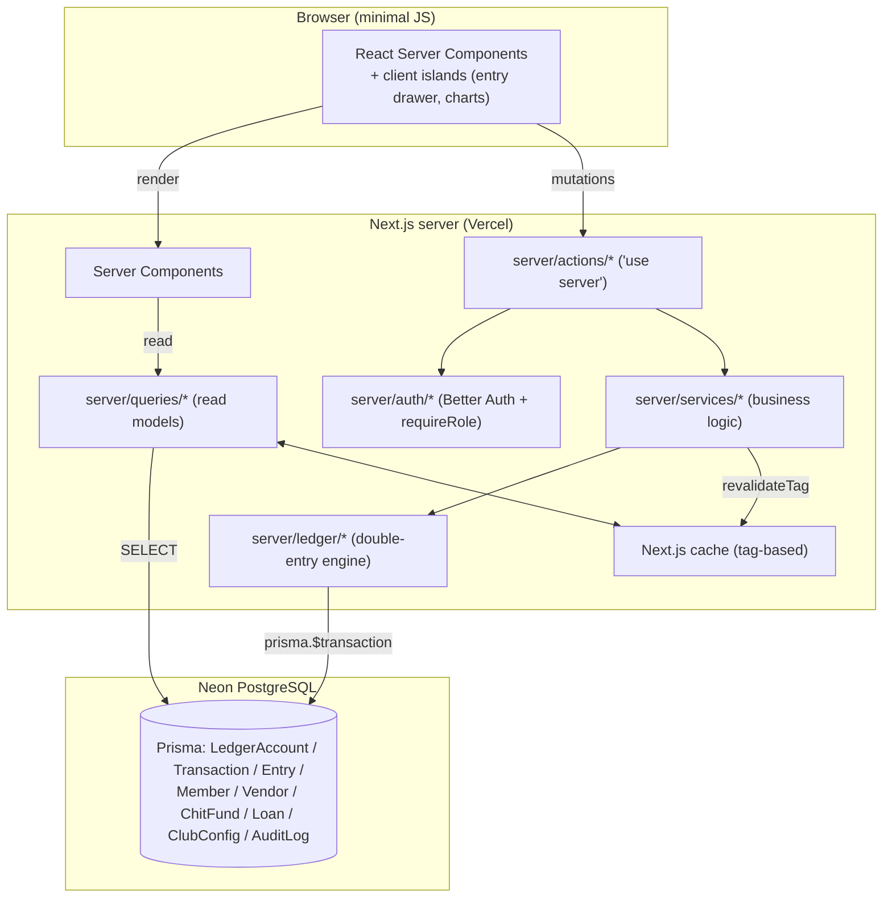
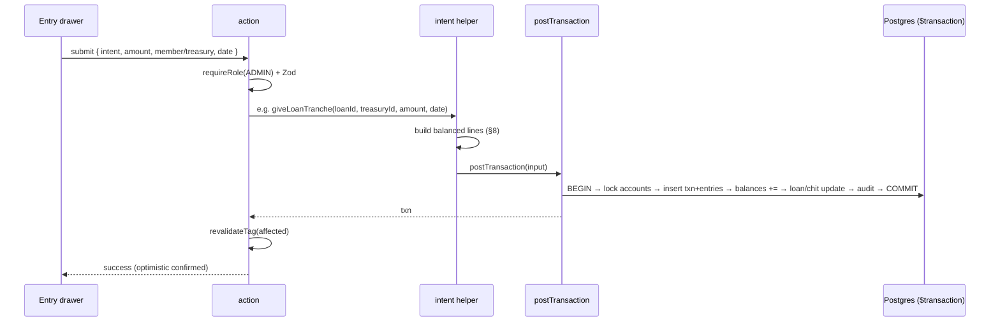
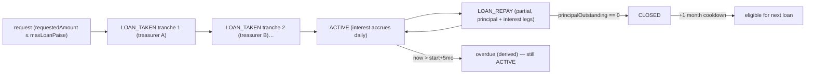
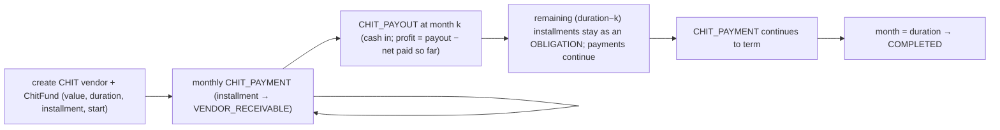
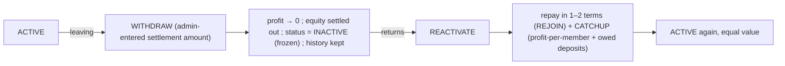
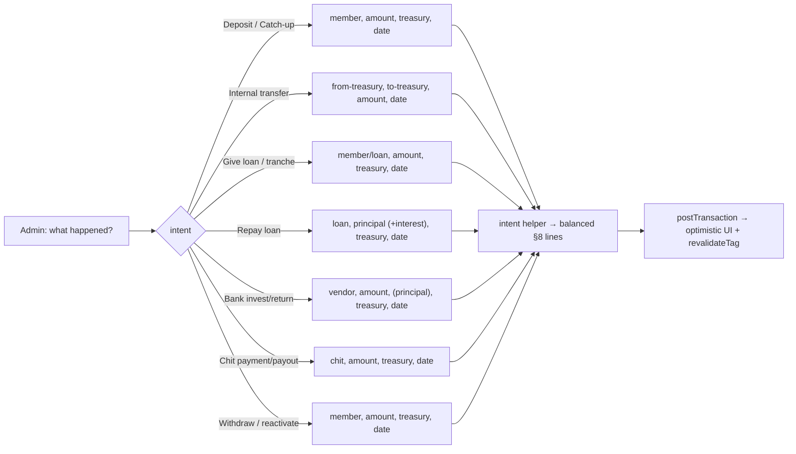
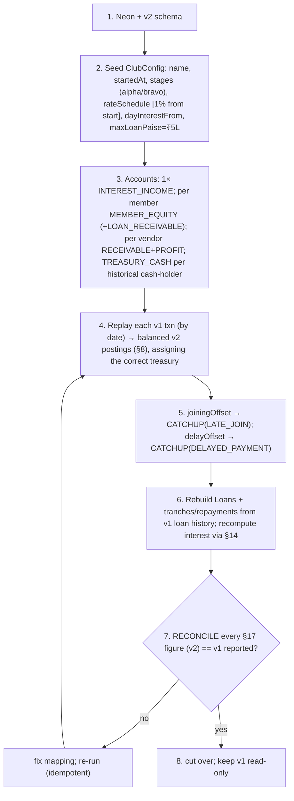

# Peacock v2 — Implementation Plan (Build Bible)

> **Status:** Pre-build, design-in-progress. Single, expanded, line-by-line engineering plan for
> building the new Peacock repository from scratch. Consolidates and supersedes (for build
> purposes) the three source planning docs.
>
> **Revision 2** — folds in the owner's domain clarifications: the club holds **no cash**
> (member-treasurers do), **multi-tranche loans** with a **time-versioned global interest rate**,
> **chit-fund** vendors as a first-class mechanism, **catch-up** (renamed from "offset"), and a
> **settle / freeze / reactivate** withdraw-rejoin flow. Items still genuinely undecided are
> marked **`‹TBD›`**.
>
> **Audience:** the engineer(s) building this. Everything needed to start typing lives here.
> **Out of scope:** visual styling (see `DESIGN_PROMPTS.md`). Functionally the UI mirrors v1.

---

## Table of contents

1. [Purpose & domain](#1-purpose--domain)
2. [Glossary](#2-glossary)
3. [Tech stack](#3-tech-stack)
4. [Locked decisions & defaults](#4-locked-decisions--defaults)
5. [Architecture at a glance](#5-architecture-at-a-glance)
6. [The double-entry ledger — mental model](#6-the-double-entry-ledger--mental-model)
7. [Chart of accounts](#7-chart-of-accounts)
8. [Posting spec — every transaction type, line by line](#8-posting-spec--every-transaction-type-line-by-line)
9. [Database schema (full Prisma + commentary)](#9-database-schema-full-prisma--commentary)
10. [Money handling — the BigInt/paise contract](#10-money-handling--the-bigintpaise-contract)
11. [Dates, timezone & month boundaries](#11-dates-timezone--month-boundaries)
12. [The critical write path — `postTransaction`](#12-the-critical-write-path--posttransaction)
13. [Reverse & edit](#13-reverse--edit)
14. [Loans in depth — tranches, rate schedule, interest](#14-loans-in-depth--tranches-rate-schedule-interest)
15. [Chit funds in depth](#15-chit-funds-in-depth)
16. [Members — deposits, catch-up, withdraw & rejoin](#16-members--deposits-catch-up-withdraw--rejoin)
17. [Calculations — every figure derived, line by line](#17-calculations--every-figure-derived-line-by-line)
18. [Read models / queries](#18-read-models--queries)
19. [Analytics & graphs](#19-analytics--graphs)
20. [Auth, roles & permissions](#20-auth-roles--permissions)
21. [Caching & revalidation](#21-caching--revalidation)
22. [Validation (Zod) & the service contract](#22-validation-zod--the-service-contract)
23. [App structure, routes & the entry drawer](#23-app-structure-routes--the-entry-drawer)
24. [Migration v1 → v2](#24-migration-v1--v2)
25. [Testing strategy](#25-testing-strategy)
26. [Build phases & checklists](#26-build-phases--checklists)
27. [Performance budget](#27-performance-budget)
28. [Open questions / TBDs](#28-open-questions--tbds)

---

## 1. Purpose & domain

**Peacock** is a private investment-club / chit-fund manager for a single club ("Many feathers,
one fortune"). It models real money moving between members, the club's pooled value, and external
vendors.

### The parties

| Party | What it is |
|-------|-----------|
| **Member** | A person in the club. Pays a recurring **monthly deposit**, can **borrow** (loans with daily interest), can **withdraw / leave** and later **rejoin**. All members hold **equal status and value**. |
| **Treasurer** | A **member who currently physically holds club cash**. The club itself is not a physical entity and **holds no money** — cash always sits with one or more member-treasurers. Anyone can be a treasurer (admin or plain member; long- or short-term). |
| **Admin** | A member with **write access** (daily data entry, managing members/vendors/loans/config). Admin is just a member with a role flag. |
| **Vendor** | An external place the club puts money: a **`BANK`** (lump deposit, earns interest) or a **`CHIT`** fund (monthly installments toward a chit, payout later). |

So there are really only two kinds of people — **members**, some of whom are **admins** — plus the
**treasurer** capability (holding cash) which any member can have.

### The money flows, in plain English

1. **Deposits.** Every member owes a monthly deposit. The amount is **stage-based** and has been
   raised over time (₹1,000 → ₹2,000). The app tracks *expected vs paid* per member.
2. **Cash lives with treasurers.** When a member pays, the cash goes to a specific treasurer.
   Treasurers can move club cash between themselves (**internal transfer**). Total club cash =
   sum of all treasurers' holdings.
3. **Loans.** The club lends pooled cash to a member. A loan may be **disbursed in tranches**
   (different treasurers chip in over a few days), accrues **daily interest** on the
   outstanding-principal timeline, must be repaid within **5 months** (after which it is
   **overdue** but still active), and is repaid (possibly in parts) back to treasurers.
4. **Vendors.** The club places cash with a **bank** (earns interest) or pays into a **chit fund**
   monthly (gets a payout later, with profit/loss). Money out with vendors is club value too.
5. **Catch-up (equalization).** A new or returning member must pay, on top of the prevailing
   deposit, a **catch-up** equal to existing members' accumulated profit-per-member, so everyone
   holds equal value. Two kinds: **late-join** and **delayed-payment**.
6. **Withdraw / rejoin.** A member leaving **settles out** their value (admin enters the amount);
   their account is **frozen → INACTIVE** but history is kept. They can later **reactivate** by
   repaying (in one or two terms) plus catch-up.

### Two audiences

| Audience | Does |
|----------|------|
| **Admin** (a member) | Daily data entry + management. |
| **Members** | **Read-only transparency** over the whole club. No writes. |

### Why v2 (what v1 got wrong)

`Float` money → drift; MongoDB JSON "passbook" recomputed on every write; two sources of truth;
four cache layers; background recompute jobs; heavy REST. v2: **one ledger, integer paise, O(1)
writes, derive time-based values on read, one cache layer, server actions instead of REST.**

---

## 2. Glossary

| Term | Meaning |
|------|---------|
| **Paise** | ₹1 = 100 paise. All money stored as integer paise in `BigInt`. |
| **Ledger account** (`LedgerAccount`) | A balance bucket in the chart of accounts (≠ Better-Auth `Account`). |
| **Treasury** (`TREASURY_CASH`) | A cash-holding account owned by a member-treasurer. |
| **Entry** | One signed line of a transaction, posted to one ledger account. |
| **Transaction** | A balanced group of entries whose `amount`s **sum to zero**. |
| **Stock / Flow** | A "right now" balance vs a lifetime running total. |
| **Derived-on-read** | Computed at read time, never stored (e.g. loan interest-to-date). |
| **Stage** | A period with a fixed expected monthly deposit (alpha ₹1,000, bravo ₹2,000). |
| **Catch-up** | Equalization payment by a new/returning member (was v1 "offset"). Subtypes: **late-join**, **delayed-payment**. |
| **Tranche** | One disbursement installment of a single loan (loans may be funded by several). |
| **Rate schedule** | Time-versioned global monthly interest rate `[{ rateBps, effectiveFrom }]`. |
| **`dayInterestFrom`** | Date from which interest is pro-rated daily; before it, whole-month only. |
| **Overdue** | A loan still active past its 5-month term — **derived**, not a stored status. |
| **Chit fund** | A `CHIT` vendor: pay a fixed monthly installment for N months, receive a payout. |
| **Reversal** | A transaction negating a prior one; how edits/deletes happen. |
| **bps** | Basis points. 1% = 100 bps. |
| **IST** | Asia/Kolkata; all month bucketing uses it. |

---

## 3. Tech stack

| Layer | Choice | Why |
|-------|--------|-----|
| Language | **TypeScript** (strict) | End-to-end type safety. |
| Framework | **Next.js App Router**, RSC + Server Actions | One codebase, minimal client JS, no REST. |
| Database | **PostgreSQL** (Neon) | Relational + ACID; ideal for a ledger; free tier. |
| ORM | **Prisma** | Typed queries, migrations, `$transaction` for atomic posting. |
| Money | **`BigInt` paise** | Exact integer math; format to ₹ only at the display edge. |
| Auth | **Better Auth** (Prisma adapter) | Lightweight; owns User/Session/Account/Verification. |
| Validation | **Zod** | One validation source for actions and forms. |
| Caching | **Next.js cache + `revalidateTag()`** | One predictable invalidation layer. |
| File storage | **Vercel Blob** | Avatars/files. |
| Charts | lightweight lib (pick in P3) | Series come pre-computed from the ledger. |
| Testing | **Vitest** (unit) + **Playwright** (e2e later) | Heavy unit testing on the ledger/interest. |
| Hosting | **Vercel** + **Neon** | Serverless-friendly; no required background workers. |
| Timezone | **Asia/Kolkata (IST)** | All month boundaries. |

---

## 4. Locked decisions & defaults

### 4.1 Hard-locked

- PostgreSQL (Neon) + Prisma; double-entry ledger + incremental cached balances.
- Money = integer paise (`BigInt`); format to ₹ only at display.
- Next.js App Router + RSC + Server Actions (no REST).
- Time-based interest derived on read; optional cached rollups allowed (no *required* jobs).
- Better Auth; tag-based caching only; Vercel Blob.
- **Sign convention:** assets/receivables **positive**; equity & income **negative**.
- **Asia/Kolkata** for all month boundaries.
- Single club, clean `clubId` seam for later.

### 4.2 Domain rules locked in Revision 2

1. **Club holds no cash.** Cash lives in **`TREASURY_CASH`** accounts, one per treasurer-member,
   created **on demand**. Anyone can be a treasurer. `availableCash = Σ TREASURY_CASH`.
2. **`FUNDS_TRANSFER`** (treasury → treasury) is a real, frequently-used, net-zero transaction.
3. **Loans are sequential, not concurrent:** one active loan per member; must clear all
   outstanding before a new one; **no top-ups**; **1-month cooldown** after full repayment.
4. **A loan may be disbursed in multiple tranches** (different treasurers, over days) — modeled as
   one `Loan` with several `LOAN_TAKEN` events.
5. **Loan term = 5 months.** Past term → **overdue** (derived flag), **still ACTIVE**.
6. **Interest rate is global & time-versioned.** 1%/month from club start; admin can change it
   (e.g. → 2%) effective a date; accrual uses the rate in effect for each period.
7. **Interest is daily** from `dayInterestFrom` (01 Jun 2024): whole anchored months + leftover
   days at a daily rate; before that date, whole-month only.
8. **No repayment-amount validation** (no enforced minimum; round figures are advisory).
9. **Loan limit = ₹5,00,000**, configurable in admin settings (revisable).
10. **Vendors are typed:** `BANK` (lump, earns interest) and `CHIT` (monthly installments +
    payout, with a remaining-obligation if payout taken early).
11. **Catch-up** replaces "offset": late-join + delayed-payment subtypes; equalizes member value.
12. **Withdraw = settle (admin-entered amount) → freeze → INACTIVE**, keep history. **Reactivate**
    = repay (1–2 terms) + catch-up (profit-per-member + owed deposits).
13. **Roles = `ADMIN` / `MEMBER`** only; **treasurer is a flag**, not a role. (`SUPER_ADMIN`
    optional later if a "manages admins" tier is wanted.)
14. **Member visibility:** full read transparency, no write.
15. **Edit/delete:** admin only, via reversal (audited); period-lock seam built, off by default.
16. **Member ↔ User:** separate entities, optional `Member.userId` link.

### 4.3 Deposit stages (locked from owner data)

```
alpha : ₹1,000/month  01 Sep 2020 → 31 Aug 2023
bravo : ₹2,000/month  31 Aug 2023 → present
club startedAt        01 Sep 2020
dayInterestFrom       01 Jun 2024
```
Stored in `ClubConfig.stages` as paise. Month boundaries defined so exactly one stage owns each
month (alpha through Aug 2023, bravo from Sep 2023). Dates were given MM/DD/YYYY in IST.

---

## 5. Architecture at a glance



- **Reads:** Server Components call `server/queries/*` directly (typed, no HTTP), cached + tagged.
- **Writes:** UI → `actions/*` → `services/*` → `ledger/*` → `prisma.$transaction`, then
  `revalidateTag()` only the affected tags.
- **Money conversion** lives only in `lib/money`. The **ledger engine is the single choke point**
  for all balance changes and is the most heavily tested module.

---

## 6. The double-entry ledger — mental model

Every financial event is **one balanced `Transaction`** of signed `Entry` lines that **sum to
zero**. Each line posts to one `LedgerAccount` whose cached `balance` is updated **in the same DB
transaction**.

### Invariants

```
Per Transaction t:    Σ entry.amount == 0                 (enforced before commit)
Per LedgerAccount a:  a.balance == Σ entry.amount         (maintained incrementally; re-summed only to audit)
```

### Sign convention

- **Asset/receivable** (`TREASURY_CASH`, `LOAN_RECEIVABLE`, `VENDOR_RECEIVABLE`) → **positive**.
- **Equity/income** (`MEMBER_EQUITY`, `INTEREST_INCOME`, `VENDOR_PROFIT`) → **negative**.

Net club value nets to zero automatically (assets = equity + income), so we never hand-maintain a
`netClubValue` field.

### The four kinds of numbers

| Kind | Definition | How v2 computes it |
|------|-----------|--------------------|
| **Stock** | balance "right now" | read `LedgerAccount.balance` (O(1)) |
| **Flow** | lifetime running total | `SUM(entry.amount)` filtered by type/account (indexed) |
| **Expected/config** | pure function of config + time | `getMemberTotalDeposit(now)` over stages |
| **Derived-on-read** | time-based, computed on display | `interestToDate(loan)`, `pending = expected − actual` |

No passbook. Nothing that can drift.

---

## 7. Chart of accounts

| Kind (`LedgerAccountKind`) | Cardinality | Normal sign | Meaning |
|----------------------------|-------------|-------------|---------|
| `TREASURY_CASH` | 1 per treasurer-member (on demand) | + | Club cash physically held by that member |
| `MEMBER_EQUITY` | 1 per member | − | The member's stake/contributions |
| `LOAN_RECEIVABLE` | 1 per member | + | Principal the member currently owes |
| `VENDOR_RECEIVABLE` | 1 per vendor (bank or chit) | + | Principal/installments currently placed with the vendor |
| `INTEREST_INCOME` | exactly 1 | − | Club income from loan interest |
| `VENDOR_PROFIT` | 1 per vendor | − | Realized profit (or loss) from that vendor |

Creation rules: `INTEREST_INCOME` once at seed; `MEMBER_EQUITY` (+ `LOAN_RECEIVABLE` lazily) when a
member is created; `VENDOR_RECEIVABLE` + `VENDOR_PROFIT` when a vendor is created; `TREASURY_CASH`
the first time a member holds cash (or when flagged treasurer).

> There is **no single club-cash account**. "Available cash" is always `Σ TREASURY_CASH`. This is
> the central structural difference from v1 and from Revision 1 of this plan.

---

## 8. Posting spec — every transaction type, line by line

`A` = amount (paise, > 0). `(m)` member, `(v)` vendor, `(t)`/`(t1,t2)` treasury. `P` = principal
portion. Every row **sums to zero**.

| `TxnType` | Postings (signed paise) | Side-effect |
|-----------|-------------------------|-------------|
| `PERIODIC_DEPOSIT` | `TREASURY_CASH(t) +A`, `MEMBER_EQUITY(m) −A` | — |
| `CATCHUP` (subtype late-join / delayed) | `TREASURY_CASH(t) +A`, `MEMBER_EQUITY(m) −A` | — |
| `ADJUSTMENT` | `TREASURY_CASH(t) +A`, `MEMBER_EQUITY(m) −A` (or signed for corrections) | — |
| `WITHDRAW` | `TREASURY_CASH(t) −A`, `MEMBER_EQUITY(m) +A` | on full settlement: member → INACTIVE, frozen |
| `REJOIN` | `TREASURY_CASH(t) +A`, `MEMBER_EQUITY(m) −A` | member → ACTIVE |
| `FUNDS_TRANSFER` | `TREASURY_CASH(t1) −A`, `TREASURY_CASH(t2) +A` | net-zero on total club cash |
| `LOAN_TAKEN` (tranche) | `TREASURY_CASH(t) −A`, `LOAN_RECEIVABLE(m) +A` | `loan.principalOutstanding += A` |
| `LOAN_REPAY` | `TREASURY_CASH(t) +P`, `LOAN_RECEIVABLE(m) −P` [+ interest leg] | `principalOutstanding −= P`; if 0 → CLOSED |
| `LOAN_INTEREST` | `TREASURY_CASH(t) +A`, `INTEREST_INCOME −A` | — |
| `VENDOR_INVEST` (bank) | `TREASURY_CASH(t) −A`, `VENDOR_RECEIVABLE(v) +A` | — |
| `VENDOR_RETURN` (bank) | `TREASURY_CASH(t) +A`, `VENDOR_RECEIVABLE(v) −P`, `VENDOR_PROFIT(v) −(A−P)` | — |
| `VENDOR_WRITEOFF` | `VENDOR_RECEIVABLE(v) −R`, `VENDOR_PROFIT(v) +R` (R = residual) | clears shortfall as loss on close |
| `CHIT_PAYMENT` (installment) | `TREASURY_CASH(t) −A`, `VENDOR_RECEIVABLE(v) +A` | `chit.installmentsPaid += 1` |
| `CHIT_PAYOUT` | `TREASURY_CASH(t) +A`, `VENDOR_RECEIVABLE(v) −P`, `VENDOR_PROFIT(v) −(A−P)` | mark payout; track remaining obligation |
| `REVERSAL` | negated copy of target's lines | undo target's side-effects |

Notes:
- A `LOAN_REPAY` may carry a combined principal + interest payment — the interest portion is posted
  as a `LOAN_INTEREST` leg in the same transaction (admin allocates principal vs interest).
- `WITHDRAW` amount is **admin-entered** (the system shows the computed settlement value as a
  guide; the entered figure may be slightly less — see §16).
- `ADJUSTMENT` is the generic signed correction; catch-up and deposits are the common positives.

### Worked examples

**Deposit ₹2,000 collected by treasurer T** (A = 200000):
```
TREASURY_CASH(T) +200000 ; MEMBER_EQUITY(m) -200000        // sum 0 ✓
```

**Internal transfer ₹50,000 from treasurer A to B** (A = 5000000):
```
TREASURY_CASH(A) -5000000 ; TREASURY_CASH(B) +5000000      // sum 0 ✓ ; total cash unchanged
```

**Loan tranche 1: treasurer A funds ₹1,00,000 of a ₹2,50,000 loan** (A = 10000000):
```
TREASURY_CASH(A) -10000000 ; LOAN_RECEIVABLE(m) +10000000  // loan.principalOutstanding += 10000000
```

**Vendor (bank) returns ₹22,000, ₹20,000 principal** (A = 2200000, P = 2000000):
```
TREASURY_CASH(t) +2200000 ; VENDOR_RECEIVABLE(v) -2000000 ; VENDOR_PROFIT(v) -200000   // sum 0 ✓
```

**Chit closes ₹2,000 short** (R = 200000): `VENDOR_RECEIVABLE −200000 ; VENDOR_PROFIT +200000` (loss).

---

## 9. Database schema (full Prisma + commentary)

> Ledger accounts are `LedgerAccount` to avoid clashing with Better Auth's `Account`.

```prisma
generator client { provider = "prisma-client-js" }
datasource db { provider = "postgresql"; url = env("DATABASE_URL") }

// ---------- Identity ----------
model Member {
  id          String   @id @default(cuid())
  firstName   String
  lastName    String?
  phone       String?
  avatarUrl   String?
  role        MemberRole   @default(MEMBER)   // ADMIN or MEMBER (admin = write access)
  isTreasurer Boolean      @default(false)    // convenience flag; treasury cash lives in LedgerAccount
  status      MemberStatus @default(ACTIVE)   // ACTIVE / INACTIVE (frozen) / LEFT
  joinedAt    DateTime                         // admission date (drives late-join catch-up)
  userId      String?  @unique                 // optional Better Auth user link
  accounts    LedgerAccount[]                  // equity, loan-receivable, and treasury (if any)
  loans       Loan[]
  archivedAt  DateTime?
  createdAt   DateTime @default(now())
  updatedAt   DateTime @updatedAt
  @@index([status])
}

model Vendor {
  id          String   @id @default(cuid())
  name        String
  type        VendorType                        // BANK or CHIT
  status      VendorStatus @default(ACTIVE)     // ACTIVE / INACTIVE / CLOSED
  accounts    LedgerAccount[]                   // receivable + profit
  chit        ChitFund?                          // present iff type = CHIT
  startedAt   DateTime @default(now())
  closedAt    DateTime?
  archivedAt  DateTime?
  createdAt   DateTime @default(now())
  updatedAt   DateTime @updatedAt
}

model ChitFund {
  id                 String  @id @default(cuid())
  vendorId           String  @unique
  vendor             Vendor  @relation(fields: [vendorId], references: [id])
  chitValue          BigInt                      // face value, e.g. ₹5,00,000
  durationMonths     Int                         // e.g. 20
  monthlyInstallment BigInt                      // expected monthly payment (may vary; see §15)
  startedAt          DateTime
  payoutMonth        Int?                        // month index the payout was taken (10..20 or last)
  payoutAt           DateTime?
  payoutAmount       BigInt?                     // cash received at payout
  status             ChitStatus @default(RUNNING) // RUNNING / PAID_OUT / COMPLETED
  createdAt          DateTime @default(now())
}

// ---------- Ledger ----------
model LedgerAccount {
  id        String   @id @default(cuid())
  kind      LedgerAccountKind
  balance   BigInt   @default(0)               // cached running balance (paise)
  memberId  String?                             // for TREASURY_CASH / MEMBER_EQUITY / LOAN_RECEIVABLE
  member    Member?  @relation(fields: [memberId], references: [id])
  vendorId  String?                             // for VENDOR_RECEIVABLE / VENDOR_PROFIT
  vendor    Vendor?  @relation(fields: [vendorId], references: [id])
  entries   Entry[]
  createdAt DateTime @default(now())
  @@unique([memberId, kind])                    // one equity / one loan-acct / one treasury per member, per kind
  @@unique([vendorId, kind])
  @@index([kind])
}

model Transaction {
  id          String   @id @default(cuid())
  type        TxnType
  subtype     TxnSubtype?                        // e.g. catch-up LATE_JOIN / DELAYED_PAYMENT
  occurredAt  DateTime                           // drives month bucketing (UTC stored, IST bucketed)
  description String?
  reference   String?
  reversesId  String?  @unique                   // set when this reverses another txn
  loanId      String?                            // link for loan-related txns (tranches, repay, interest)
  vendorId    String?                            // link for vendor/chit txns
  entries     Entry[]
  createdById String?
  createdAt   DateTime @default(now())
  updatedAt   DateTime @updatedAt
  @@index([occurredAt])
  @@index([type, occurredAt])
  @@index([loanId])
  @@index([vendorId])
}

model Entry {
  id            String  @id @default(cuid())
  transactionId String
  accountId     String
  amount        BigInt                            // signed paise
  transaction   Transaction   @relation(fields: [transactionId], references: [id], onDelete: Restrict)
  account       LedgerAccount @relation(fields: [accountId], references: [id])
  @@index([accountId])
  @@index([transactionId])
}

model Loan {
  id                   String   @id @default(cuid())
  memberId             String
  member               Member   @relation(fields: [memberId], references: [id])
  requestedAmount      BigInt                     // what the member asked for (funded via tranches)
  principalOutstanding BigInt   @default(0)       // Σ disbursed − Σ repaid (kept current)
  startedAt            DateTime                   // first tranche date; drives the 5-month term
  closedAt             DateTime?
  status               LoanStatus @default(ACTIVE) // ACTIVE / CLOSED  (overdue is derived)
  createdAt            DateTime @default(now())
  @@index([memberId])
  @@index([status])
  // NOTE: no per-loan rate — interest uses the global time-versioned rate schedule (§14).
}

// ---------- Config & audit ----------
model ClubConfig {
  id               String   @id @default("singleton")
  name             String
  startedAt        DateTime
  stages           Json     // [{ name, amountPaise, startDate, endDate? }]
  rateSchedule     Json     // [{ rateBps, effectiveFrom }]  (1% from start; admin appends changes)
  dayInterestFrom  DateTime // daily proration applies from this date onward
  maxLoanPaise     BigInt   // current loan limit (₹5,00,000), revisable
  loanTermMonths   Int      @default(5)
  loanCooldownMonths Int    @default(1)
  timezone         String   @default("Asia/Kolkata")
  updatedAt        DateTime @updatedAt
}

model AuditLog {
  id         String   @id @default(cuid())
  actorId    String?
  action     String
  entityType String
  entityId   String
  meta       Json?
  createdAt  DateTime @default(now())
  @@index([entityType, entityId])
}

// Optional cache, rebuilt deterministically from the ledger (added only if profiling needs it):
// model MonthlyRollup { month DateTime @id; data Json; builtAt DateTime }

enum LedgerAccountKind { TREASURY_CASH MEMBER_EQUITY LOAN_RECEIVABLE VENDOR_RECEIVABLE INTEREST_INCOME VENDOR_PROFIT }
enum TxnType { PERIODIC_DEPOSIT CATCHUP ADJUSTMENT WITHDRAW REJOIN FUNDS_TRANSFER LOAN_TAKEN LOAN_REPAY LOAN_INTEREST VENDOR_INVEST VENDOR_RETURN VENDOR_WRITEOFF CHIT_PAYMENT CHIT_PAYOUT REVERSAL }
enum TxnSubtype { LATE_JOIN DELAYED_PAYMENT }
enum MemberRole { ADMIN MEMBER }
enum MemberStatus { ACTIVE INACTIVE LEFT }
enum VendorType { BANK CHIT }
enum VendorStatus { ACTIVE INACTIVE CLOSED }
enum ChitStatus { RUNNING PAID_OUT COMPLETED }
enum LoanStatus { ACTIVE CLOSED }
```

### Commentary

- **`@@unique([memberId, kind])`** resolves Revision 1's bug: a member can now hold up to three
  accounts (equity, loan-receivable, treasury), at most one of each kind.
- **Loan principal timeline is reconstructed from `LOAN_TAKEN`/`LOAN_REPAY` entries** (by
  `loanId` + `occurredAt`); no separate tranche table. `principalOutstanding` is the cached stock.
- **No per-loan rate**: interest uses the global `rateSchedule` (a rate bump applies to all live
  loans from its effective date). `‹TBD›` if any loan ever needs an override.
- **`ClubConfig.rateSchedule`** seeded as `[{ rateBps: 100, effectiveFrom: clubStart }]` (1%).
- Money inside JSON (`stages`, `payoutAmount` etc.) is stored as **string paise** to avoid JS
  float in JSON.

---

## 10. Money handling — the BigInt/paise contract

Money is `BigInt` paise on the server, everywhere. It becomes a formatted ₹ string only at the
display edge, only via `lib/money`.

`BigInt` is **not** serializable in RSC payloads / Server Action returns by default, so DTOs cross
the boundary as **string paise** (field suffix `Paise`, e.g. `availableCashPaise: string`).

### `lib/money` API (P0)

```ts
type Paise = bigint
rupeesToPaise(r: number|string): Paise   // validates ≤ 2 dp
paiseToRupees(p: Paise): number          // for charts/math only
formatINR(p: Paise): string              // Intl en-IN → "₹5,000.00"
serializePaise(p): string ; parsePaise(s): Paise
addPaise(...xs): Paise ; negate(p): Paise ; isZero(p): boolean
roundToWholeRupee(p: Paise): Paise       // interest rounding (§14)
```

Never do floating-point math on money. Map rows → DTOs (don't globally monkey-patch
`BigInt.toJSON`). Rounding happens only where a real rule applies (interest), as a tested function.

---

## 11. Dates, timezone & month boundaries

All bucketing/age math in **IST** (no DST — simplifies things), timestamps stored UTC.

### `lib/date` API (P0)

```ts
TZ = "Asia/Kolkata"
monthStartIST(d) ; monthEndIST(d)
monthsSince(start, asOf): number               // whole months, IST
anchoredMonths(from, asOf): { months, extraDays }  // day-of-month anchored (the "20th→20th" rule, §14)
daysInMonthIST(d): number
bucketKey(d): "YYYY-MM"
```

`anchoredMonths` implements the owner's loan-interest counting: a loan from the **20th** completes
one "month" on the **20th** of the next month; trailing days are counted separately. Unit-tested
against month-length edges (e.g. 31 Jan → 28 Feb).

---

## 12. The critical write path — `postTransaction`

The single choke point for all balance changes (`server/ledger/postTransaction.ts`).

```ts
interface PostTransactionInput {
  type: TxnType; subtype?: TxnSubtype
  occurredAt: Date; description?: string; reference?: string
  loanId?: string; vendorId?: string; reversesId?: string
  lines: { accountId: string; amount: Paise }[]   // signed, must sum to 0
  actorId?: string
}
```

Callers rarely hand-build `lines`; intent helpers (§22) build them from §8.

```
postTransaction(input):
  # 0. pure pre-validate
  assert input.lines.length >= 2
  assert Σ line.amount == 0
  assert every line.amount != 0
  Zod type-specific shape check (correct account kinds; A>0; P<=A; etc.)

  # 1. one DB transaction
  prisma.$transaction(tx => {
    accounts = tx.ledgerAccount.findMany(id IN lines.accountId)  # FOR UPDATE (lock)
    assert all referenced accounts exist
    txn = tx.transaction.create({ ...header })
    tx.entry.createMany(lines → { transactionId, accountId, amount })
    for line: tx.ledgerAccount.update(id=line.accountId, balance += line.amount)   # atomic increment, O(lines)
    if input.loanId: apply loan side-effects (LOAN_TAKEN/REPAY/REVERSAL) → principalOutstanding, status
    if input.vendorId && chit: apply chit side-effects (installmentsPaid, payout, status)
    tx.auditLog.create({ ... })
    return txn
  })

  # 2. after commit
  revalidateTag(...affectedTags(input))
```

Why the ordering: validate before any write; everything atomic in one `$transaction`; balances via
SQL `increment` (safe under concurrency with row locks); `revalidateTag` only after commit.



---

## 13. Reverse & edit

```
reverseTransaction(targetId, actorId):
  target = load txn + entries ; assert not already reversed ; assert period not locked
  post REVERSAL with negated lines, reversesId=target.id, same loanId/vendorId
  # loan/chit side-effects undone in the REVERSAL branch

editTransaction(targetId, corrected, actorId):
  $transaction: reverseTransaction(targetId) ; postTransaction(corrected)   # atomic; O(lines)
```

Delete = reverse (history kept, balances restored). Edit = reverse + re-post. Both refuse on a
locked period. `‹TBD›` `REVERSAL.occurredAt`: date "now" (audit-accurate) vs target's date
(keeps analytics buckets stable) — recommend dating the reversal to the target's `occurredAt` for
edits so buckets stay correct.

---

## 14. Loans in depth — tranches, rate schedule, interest

The richest part of the system. **One `Loan` = one borrowing**, funded by tranches, repaid in
parts, interest derived from the principal timeline crossed with the global rate schedule.

### 14.1 Lifecycle & rules



- **Eligibility:** member has **no** ACTIVE loan and no outstanding balance; ≥ 1 month since last
  loan's `closedAt`; `requestedAmount ≤ ClubConfig.maxLoanPaise`.
- **Tranches:** multiple `LOAN_TAKEN` until cumulative disbursed = `requestedAmount`. **No top-ups
  after fully funded.** `startedAt` = first tranche date.
- **Overdue:** `isOverdue(loan) = status==ACTIVE && monthsSince(startedAt, now) > loanTermMonths`.
  Derived; not stored.
- **Repayment:** any amount (no minimum), to any treasury; may include an interest portion.
- **Close:** when `principalOutstanding == 0` → `CLOSED`, `closedAt = occurredAt`.

### 14.2 The global rate schedule

```
ClubConfig.rateSchedule = [{ rateBps, effectiveFrom }, ...]   # sorted
rateAt(date) = rateBps of the latest entry with effectiveFrom <= date
```
Seed: `[{ rateBps: 100, effectiveFrom: clubStart }]` (1%/month). Admin appends e.g.
`{ rateBps: 200, effectiveFrom: <date> }` and all live loans accrue at 2% from that date.

### 14.3 Interest engine (derive-on-read)

The principal-over-time curve has **breakpoints** at: each tranche, each repayment, each
rate-change date, and `dayInterestFrom`. **The month-anchor resets at each principal change**
("from that day the interest is calculated for that ₹30,000").

```
interestToDate(loan, asOf = now):
  events   = sorted [(date, ±amount)] from LOAN_TAKEN(+) and LOAN_REPAY principal legs(−)
  segments = principalTimeline(events, asOf)   # list of (balance B, segStart, segEnd) where B constant
  total = 0
  for (B, s, e) in segments:
      for (ss, ee, rateBps, daily) in splitByRateAndDailyBoundary(s, e):   # split at rate changes & dayInterestFrom
          rate = rateBps / 10000
          { months, extraDays } = anchoredMonths(ss, ee)        # anchored at ss (the segment's own start)
          if daily:                                              # on/after dayInterestFrom
              total += B*rate*months + (B*rate / daysInMonthIST(ee)) * extraDays
          else:                                                  # before dayInterestFrom: whole-month, round partial up
              total += B*rate * (months + (extraDays > 0 ? 1 : 0))
  return roundToWholeRupee(total)

interestPending(loan) = interestToDate(loan) − Σ loan's LOAN_INTEREST payments
```

Worked example (owner's): ₹1L disbursed day 0; +₹1.5L on day 7 (→ ₹2.5L); single-shot repay at ~5
months ⇒ interest = `accrue(₹1L, day0→day7)` + `accrue(₹2.5L, day7→repay)`. Partial path: repay
₹2L mid-way, remaining ₹50k accrues from that day (anchor reset) until paid two weeks later at the
daily rate.

`‹TBD›` to lock by fixtures: (a) exact `daysInMonthIST` basis for the daily rate (month of `ee`
vs fixed 30); (b) rate change landing *inside* an anchored month (current model splits and
re-anchors at the boundary — confirm against a real example); (c) pre-`dayInterestFrom` partial
month rounds up (assumed).

### 14.4 Loan figures

```
loan.outstanding        = LOAN_RECEIVABLE(m).balance contribution from this loan (or principalOutstanding)
loan.interestToDate     = §14.3
loan.interestPending    = interestToDate − interestPaid
loan.isOverdue          = derived (§14.1)
member.currentLoanOutstanding = LOAN_RECEIVABLE(m).balance
expectedTotalLoanInterest     = Σ active loans interestToDate(loan)   # club-level, derive-on-read
```

---

## 15. Chit funds in depth

A `CHIT` vendor models: pay a fixed monthly installment for `durationMonths`; receive a **payout**
at some month (10..20 or last); **must keep paying to term even if payout taken early**.

### Mechanics (owner's example: ₹5,00,000 chit, 20 months, ~₹20,000/month max)



### Accounts & postings

- **Installment:** `CHIT_PAYMENT` → `TREASURY_CASH(t) −A`, `VENDOR_RECEIVABLE(v) +A`; `installmentsPaid++`.
- **Payout:** `CHIT_PAYOUT` → `TREASURY_CASH(t) +A`, `VENDOR_RECEIVABLE(v) −P`, `VENDOR_PROFIT(v) −(A−P)`.
- **Close short / loss:** `VENDOR_WRITEOFF`.

### Derived figures

```
chit.totalPaid          = Σ CHIT_PAYMENT to date
chit.installmentsLeft    = max(0, durationMonths − installmentsPaid)
chit.remainingObligation = installmentsLeft × monthlyInstallment      # liability still owed
chit.netProfit           = (payoutAmount ?? 0) − totalPaid            # may be negative
   active : reported as max(netProfit, 0) until COMPLETED (rule §17)
   completed: full netProfit
```

`‹TBD›` to confirm with owner: (a) whether the installment is fixed or varies month to month
(chit dividends often reduce it) — schema allows a per-payment amount via the actual
`CHIT_PAYMENT` entries, with `monthlyInstallment` as the planning default; (b) exact profit
recognition timing for an early payout while obligations remain (recommend: realize profit at
payout, carry `remainingObligation` as a disclosed liability reducing `currentValue`).

---

## 16. Members — deposits, catch-up, withdraw & rejoin

### 16.1 Expected deposit (stage-based)

```
getMemberTotalDeposit(member, asOf):           # expected cumulative deposit, paise
  total = 0
  for stage in ClubConfig.stages:
      from = max(stage.startDate, member.joinedAt-relevant start)
      to   = min(stage.endDate ?? asOf, asOf)
      total += stage.amountPaise × monthsBetweenInclusive(from, to)   # IST, clamp ≥ 0
  return total
```
`‹TBD›` exact month-count semantics (join-month inclusive? first-month proration?) — lock to v1
fixtures during migration.

### 16.2 Catch-up (equalization)

A new/returning member pays, beyond the prevailing deposit, a **catch-up** so they hold equal
value:
- **late-join** (`subtype = LATE_JOIN`): = existing members' **accumulated profit-per-member** up
  to admission date.
- **delayed-payment** (`subtype = DELAYED_PAYMENT`): = deposits owed for months they were behind.

Posted as `CATCHUP` (deposit-shaped: `TREASURY_CASH +A`, `MEMBER_EQUITY −A`), reported separately
from periodic deposits. Maps from v1 `joiningOffset` → LATE_JOIN, `delayOffset` → DELAYED_PAYMENT.

### 16.3 Withdraw → freeze → reactivate



- **Withdraw / leave:** the system **computes** the member's current value as of the date (equity
  balance + their share of all accrued items incl. live loan interest) and **shows it as a
  guide**. The **admin enters the actual settlement amount** (may be slightly less). Posting:
  `TREASURY_CASH(t) −A`, `MEMBER_EQUITY(m) +A`. If `A` exceeds contributed principal, the excess is
  **profit withdrawn** (rule §17). Member → `INACTIVE`, frozen; **all history retained**.
- **Reactivate:** admin reactivates; member repays over **one or two terms** (`REJOIN` postings) and
  pays **catch-up** = current profit-per-member (+ any owed deposits), restoring equal value. Member
  → `ACTIVE`.

Pending uses **contributions, not balance** (rule §17.1), so a settled/negative equity never
creates phantom debt.

---

## 17. Calculations — every figure derived, line by line

> **⚠ Sign normalization (read first).** Entries on equity/income accounts (`MEMBER_EQUITY`,
> `INTEREST_INCOME`, `VENDOR_PROFIT`) are **negative** for the normal direction. Use a helper that
> returns a **positive magnitude**:
> ```
> flow(type, scope?) = | Σ entry.amount WHERE txn.type=type [AND scope] |
> ```
> i.e. sum the cash leg (positive for inflows) or negate the equity/income leg; an income/equity
> "balance read" is reported as `−account.balance`. Every `SUM`/`flow`/income-balance below is the
> **normalized positive** value unless a `±` is shown. Unit-tested.

### 17.1 Business rules (carry over verbatim)

1. **Pending uses contributions, not balance** — withdrawn principal isn't phantom debt.
2. **Profit-withdrawal split** — a `WITHDRAW`/settlement beyond contributed principal is profit
   withdrawn.
3. **Vendor/chit profit recognition** — active → `max(net, 0)`; closed/completed → full `net`
   (may be negative).
4. **Current value = asset-side identity** — `Σ treasuries + Σ loans outstanding + Σ vendor
   holdings` (never the equity-side sum).
5. **Interest = anchored months + daily, time-versioned rate, rounded to ₹** (§14).
6. **Stage-based expected deposits** (§16.1); **catch-up equalizes value** (§16.2).

### 17.2 Member figures (member `m`)

| Figure | Kind | Derivation |
|--------|------|-----------|
| Periodic deposits | flow | `flow(PERIODIC_DEPOSIT, m)` |
| Catch-up (late-join / delayed) | flow | `flow(CATCHUP, m)` (split by `subtype`) |
| Total deposits / balance | stock | `−MEMBER_EQUITY(m).balance` |
| Withdrawals / settled | flow | `flow(WITHDRAW, m)` |
| Profit withdrawn | derived | settlement beyond contributed principal (rule §17.1.2) |
| Loan outstanding | stock | `LOAN_RECEIVABLE(m).balance` |
| Interest paid / pending | flow / derived | `flow(LOAN_INTEREST, m)` / `interestToDate − paid` |
| Expected deposit (to date) | expected | `getMemberTotalDeposit(m, now)` |
| Pending contribution | derived | `expected − (periodic + delayed-catchup)` (contributions, not balance) |
| Profit share | derived | `availableProfit / activeMembers` |

### 17.3 Club / dashboard tiles

```
activeMembers           = COUNT(members WHERE status = ACTIVE)
clubAgeMonths           = monthsSince(ClubConfig.startedAt, now)            # IST

# Cash (no single club account)
availableCash           = Σ TREASURY_CASH.balance                          # + per-treasurer breakdown
perTreasurer[t]         = TREASURY_CASH(t).balance

# Member funds
totalExpectedDeposits   = Σ_active getMemberTotalDeposit(m, now)
memberDepositsPaid      = flow(PERIODIC_DEPOSIT)
totalMemberPending      = Σ_active( expected − (periodic + delayed-catchup) )
totalCatchUp            = flow(CATCHUP)

# Loans
totalLoanGiven          = flow(LOAN_TAKEN)                                  # lifetime disbursed
currentLoanOutstanding  = Σ LOAN_RECEIVABLE.balance
totalInterestCollected  = −INTEREST_INCOME.balance
expectedTotalLoanInterest = Σ active loans interestToDate(loan)            # derive-on-read (§14)
interestBalance         = max(0, expectedTotalLoanInterest − totalInterestCollected)
overdueLoans            = COUNT(active loans WHERE isOverdue)

# Vendors (bank + chit)
vendorHolding           = Σ VENDOR_RECEIVABLE.balance
vendorProfit            = Σ vendor P&L (active: max(net,0); closed/completed: net)   # net = −VENDOR_PROFIT(v).balance
chitRemainingObligation = Σ running chits' remainingObligation

# Valuation
totalProfit             = vendorProfit + totalInterestCollected
totalInvested           = currentLoanOutstanding + vendorHolding
currentValue            = availableCash + currentLoanOutstanding + vendorHolding     # asset-side identity
totalPortfolioValue     = currentValue + interestBalance + totalMemberPending
pendingAmounts          = totalMemberPending + interestBalance
availableProfit         = totalProfit − profitWithdrawals
returnPerMember         = availableProfit / activeMembers
```

---

## 18. Read models / queries

`server/queries/*`, each typed, Zod-validated DTO (money = string paise), tag-cached.

| Query | Returns | Backed by |
|-------|---------|-----------|
| `getDashboard()` | §17.3 tiles + per-treasurer cash | balance reads + a few `SUM`s + interest over active loans |
| `getMemberStatement(id)` | §17.2 figures + member's txns + loans | member accounts + filtered entries |
| `listMembers()` | members + balances + pending + role/treasurer flags | members → accounts |
| `listTreasurers()` | members holding cash + amounts | `TREASURY_CASH` accounts |
| `listLoans(filter?)` | loans + outstanding + interestToDate + overdue | loans + interest engine |
| `listVendors()` | banks + chits, holding + profit + obligation | vendor accounts + chit |
| `getChit(id)` | chit schedule, paid, payout, obligation | `ChitFund` + entries |
| `listTransactions(filter, page)` | paginated ledger | transactions + entries (indexed) |
| `getGraphSeries(range)` | §19 series | grouped aggregates over entries |

---

## 19. Analytics & graphs

Both kinds straight from the ledger; historical edits reflect instantly.

```
balanceAsOf(account, monthEnd) = Σ entry.amount WHERE account=a AND occurredAt <= monthEnd
flow(type, month)              = Σ entry.amount WHERE type=t AND occurredAt IN month  GROUP BY month
interestThroughMonth(M)        = Σ active loans interestToDate(loan, monthEndIST(M))
```

Series (decision 16): portfolio value · available cash (and per-treasurer) · outstanding loans ·
deposits/month · interest/month · member-vs-club-average. **Optional `MonthlyRollup`** cache,
rebuilt deterministically from the ledger and invalidated for the earliest dirty month, added only
if profiling demands (owner OK'd background caching for non-time-sensitive aggregates).

---

## 20. Auth, roles & permissions

- **Better Auth** owns User/Session/Account/Verification. `Member.userId` optionally links.
- **Roles: `ADMIN` / `MEMBER`** on the member (write vs read). **Treasurer** is a separate
  capability (`isTreasurer` + holding a `TREASURY_CASH` account), not a role.
- `requireRole(min)` wraps protected actions/pages.

| Capability | ADMIN | MEMBER |
|------------|:-----:|:------:|
| View dashboard, members, loans, vendors, transactions, own statement | ✓ | ✓ (read) |
| Create / edit / reverse transactions; manage members/vendors/loans/chits | ✓ | — |
| Hold club cash (be a treasurer) | ✓ (any member) | ✓ (any member) |
| Edit club config (stages, rate schedule, loan limit); lock periods | ✓ | — |

`‹TBD›` whether to add `SUPER_ADMIN` (manages admins) — not needed for v1 functionality.

---

## 21. Caching & revalidation

One layer: Next.js cache, tag-invalidated, only after commit.

| Tag | Covers | Invalidated by |
|-----|--------|----------------|
| `dashboard` | tiles | any financial mutation |
| `member:{id}` / `members` | statement / list | member-touching mutations |
| `treasuries` | treasurer cash | any cash movement / transfer |
| `loans` | loan views | loan mutations |
| `vendors` | bank + chit views | vendor/chit mutations |
| `transactions` | ledger | any txn create/reverse |
| `analytics` | graphs | any financial mutation |
| `config` | ClubConfig | config edits |

```
affectedTags(input):
  tags = ["dashboard","analytics","transactions","treasuries"]   # cash leg almost always present
  if touches member m: tags += ["member:"+m, "members"]
  if loan-related:      tags += ["loans"]
  if vendor/chit:       tags += ["vendors"]
  return unique(tags)

# config mutations cascade (stages/rate/limit feed derived views):
configTags() = ["config","dashboard","members","loans","vendors","analytics"]   # or a global config-version tag
```

---

## 22. Validation (Zod) & the service contract

**Mutations** (`actions/*` → `services/*` → `ledger`): `postTransaction`, `reverseTransaction`,
`editTransaction`; member CRUD + `withdrawMember` / `reactivateMember`; treasurer
designate/transfer; vendor CRUD (`BANK`/`CHIT`); chit `payInstallment` / `recordPayout`;
loan `openLoan` / `addTranche` / `repayLoan` / `payInterest` / `closeLoan`; `updateClubConfig`
(incl. `appendRateChange`, `setLoanLimit`, `editStages`); `lockPeriod`.

**Intent helpers** that build §8 lines: `depositForMember`, `catchUpForMember`, `transferCash`,
`giveLoanTranche`, `repayLoan`, `payLoanInterest`, `bankInvest`, `bankReturn`, `chitPayment`,
`chitPayout`, `settleMember`, `rejoinMember`.

**Queries:** as §18. All inputs/outputs Zod-validated; money fields = string paise.

```ts
'use server'
export async function repayLoan(form: unknown) {
  const s = await requireRole('ADMIN')
  const i = RepayLoanSchema.parse(form)   // { loanId, treasuryId, principalPaise, interestPaise?, occurredAt }
  const txn = await services.repayLoan(i, s.userId)
  for (const t of affectedTags({ type:'LOAN_REPAY', loanId:i.loanId, memberId:i.memberId })) revalidateTag(t)
  return { ok: true, id: txn.id }
}
```

---

## 23. App structure, routes & the entry drawer

```
src/
  app/  (auth)/login  dashboard/  members/[id]  loans/  transactions/  vendors/[id]  treasury/  analytics/  settings/  profile/
  server/  ledger/  services/  actions/  queries/  auth/
  lib/  money  date  zod  format
  components/  db/
prisma/  schema.prisma  seed.ts  migrate-from-v1.ts
```

The admin picks an **intent**, the drawer builds the posting and **always asks which treasury**
handles the cash:



---

## 24. Migration v1 → v2



- **Treasury assignment** is the new migration wrinkle: v1 may not record *which* member held cash
  per transaction. `‹TBD›` — either backfill from v1 data if present, or assign to a default
  "opening treasury" and let admins re-distribute via `FUNDS_TRANSFER`. Needs owner input.
- Importer is **idempotent**. **Blocker:** need v1 repo/data export + fixture numbers (different
  repo, no access yet).

---

## 25. Testing strategy

| Layer | Tool | What |
|-------|------|------|
| Ledger invariants | Vitest | `Σ lines = 0`; `balance == Σ entries`; reversal restores exactly; double-reverse rejected |
| Every `TxnType` | Vitest | postings + balance deltas + loan/chit side-effects (treasury-aware) |
| **Loan interest** | Vitest | multi-tranche + partial repay + rate-change + dayInterestFrom + anchored months/days vs hand-computed and v1 fixtures |
| Chit | Vitest | installments, early payout + remaining obligation, profit recognition |
| Business rules §17.1 | Vitest | pending-from-contributions, profit split, vendor/chit active/closed, asset-side value |
| Money / dates | Vitest | paise↔₹, no drift, IST boundaries, anchored months |
| Withdraw/rejoin | Vitest | settle→freeze→reactivate; equal-value catch-up |
| Reconciliation | script | v2 totals == v1 reported (migration gate) |
| E2E (later) | Playwright | login → deposit → loan tranche → repay → chit → dashboard updates |

v1 fixtures are the source of truth for "correct."

---

## 26. Build phases & checklists

### P0 — Foundation
- [ ] Next.js (App Router, TS strict), ESLint/Prettier, CI (typecheck + test).
- [ ] Prisma + Neon; apply schema (with `@@unique([memberId,kind])`).
- [ ] `lib/money` + `lib/date` (incl. `anchoredMonths`) + exhaustive tests.
- [ ] Better Auth + `requireRole`.
- [ ] **`ledger/postTransaction` + `reverseTransaction`** + exhaustive tests (invariants, every
      `TxnType`, treasury-aware), gated by v1 fixtures.
- [ ] **Interest engine** (§14.3) + tests (multi-tranche, partial, rate schedule, daily boundary).
- [ ] `seed.ts` (ClubConfig with stages/rateSchedule/limit; INTEREST_INCOME account).

### P1 — Core data + entry
- [ ] ClubConfig settings (stages, rate-change append, loan limit).
- [ ] Member CRUD (role, treasurer flag); Vendor CRUD (BANK/CHIT + ChitFund).
- [ ] Loan open/tranche/repay/interest/close; chit payment/payout.
- [ ] Withdraw/settle + reactivate + catch-up flows.
- [ ] Intent helpers + entry drawer (treasury-aware, optimistic UI); transactions view.

### P2 — Reads & dashboards
- [ ] `getDashboard` (+ per-treasurer), `getMemberStatement`, `listMembers`, `listTreasurers`,
      `listLoans` (overdue), `listVendors`/`getChit`. Interest-on-read everywhere.
- [ ] Tag caching + `affectedTags` / config cascade wired in.

### P3 — Analytics & polish
- [ ] `getGraphSeries`; the 6 series; exports; empty/loading; mobile cards.

### P4 — Migration
- [ ] `migrate-from-v1.ts` (idempotent) incl. treasury assignment + reconciliation → green; cut over.

---

## 27. Performance budget

- **Writes O(lines)** (2–3 typical): header + entries + atomic `increment`s + maybe one loan/chit
  update + audit. No recompute, no replay. Edits = reverse + re-post = O(lines).
- **Dashboard** = a few indexed balance reads + a few `SUM`s + one interest pass over **active**
  loans. Indexed by `kind`, `type+occurredAt`, `occurredAt`, `loanId`, `vendorId`.
- **Analytics** = one/two grouped aggregates over indexed `occurredAt`/`type`.
- **No required background jobs**; optional rollup cache only if profiling needs it.
- One cache layer; tag invalidation touches only affected views.

The "very fast website" goal holds because v1's expensive move
(recompute-everything-per-write + multi-layer invalidation) **does not exist** here.

---

## 28. Open questions / TBDs

Tracked, non-blocking for P0 unless noted:

1. **Interest daily basis** — daily rate denominator: days in the segment-end month vs fixed 30?
   (lock by fixture).
2. **Rate change inside an anchored month** — current model splits + re-anchors at the boundary;
   confirm against a real club example.
3. **Pre-`dayInterestFrom` rounding** — partial month rounds up to a full month? (assumed).
4. **`getMemberTotalDeposit` month semantics** — join-month inclusive? first-month proration?
   (lock to v1 fixtures).
5. **Chit installment variability** — fixed monthly or varies (dividend)? Profit recognition
   timing for early payout with remaining obligation.
6. **Treasury assignment in migration** — does v1 record the cash-holder per txn, or do we seed a
   default opening treasury? (needs owner input + v1 data).
7. **`REVERSAL.occurredAt`** — date reversals to the target's date (recommended) vs now.
8. **`SUPER_ADMIN` tier** — needed or not.
9. **v1 access** — repo/export + fixtures required for P4 reconciliation (currently no access).
