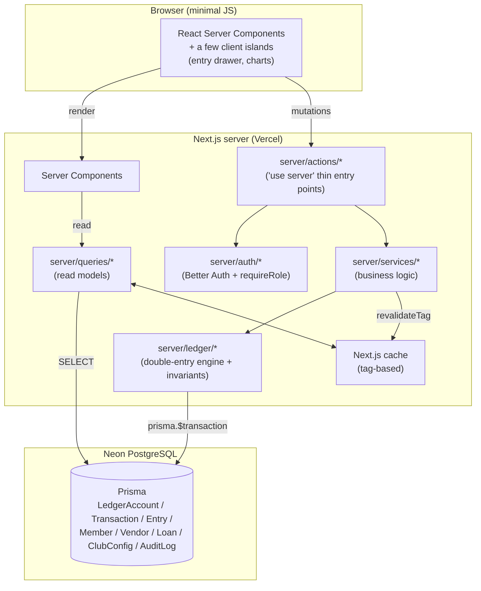
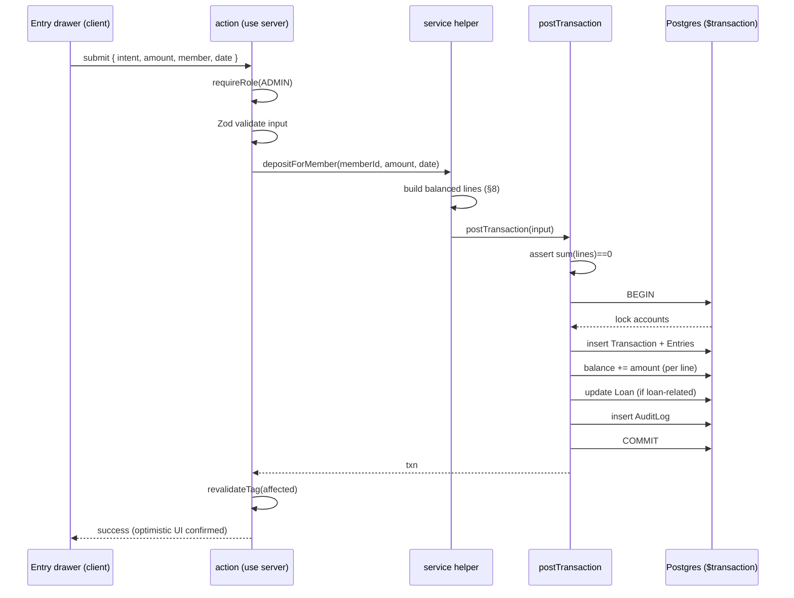
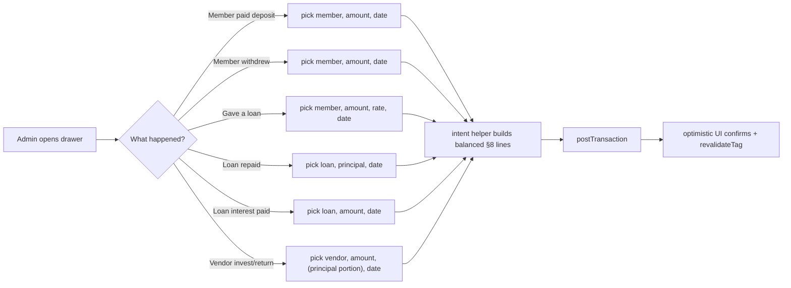
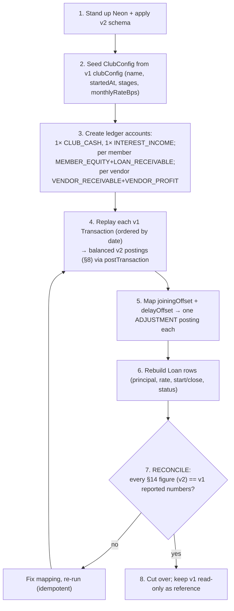

# Peacock v2 — Implementation Plan (Build Bible)

> **Status:** Pre-build, design-in-progress. This is the single, expanded, line-by-line
> engineering plan for building the new Peacock repository from scratch. It consolidates and
> supersedes (for build purposes) the three source planning docs: *Master Build Document*,
> *How every number is calculated*, and *Greenfield Architecture Plan*.
>
> **Audience:** the engineer(s) building this — including future-me. Everything needed to start
> typing code lives here: purpose, domain, schema, every calculation, every posting, the write
> path in pseudocode, the read models, auth, caching, migration, tests, and a phase-by-phase
> build order.
>
> **Out of scope of this doc:** visual/UI styling. The UI brief lives in `DESIGN_PROMPTS.md`
> (to be added). Functionally the UI mirrors v1; stylistically it is new.

---

## Table of contents

1. [Purpose & domain](#1-purpose--domain)
2. [Glossary](#2-glossary)
3. [Tech stack](#3-tech-stack)
4. [Locked decisions & defaults](#4-locked-decisions--defaults)
5. [Architecture at a glance](#5-architecture-at-a-glance)
6. [The double-entry ledger — mental model](#6-the-double-entry-ledger--mental-model)
7. [Chart of accounts](#7-chart-of-accounts)
8. [Posting spec — every transaction type, line by line](#8-posting-spec--every-transaction-type-line-by-line)
9. [Database schema (full Prisma + commentary)](#9-database-schema-full-prisma--commentary)
10. [Money handling — the BigInt/paise contract](#10-money-handling--the-bigintpaise-contract)
11. [Dates, timezone & month boundaries](#11-dates-timezone--month-boundaries)
12. [The critical write path — `postTransaction` line by line](#12-the-critical-write-path--posttransaction-line-by-line)
13. [Reverse & edit](#13-reverse--edit)
14. [Calculations — every figure derived, line by line](#14-calculations--every-figure-derived-line-by-line)
15. [Interest — the one time-based number](#15-interest--the-one-time-based-number)
16. [Read models / queries](#16-read-models--queries)
17. [Analytics & graphs](#17-analytics--graphs)
18. [Auth, roles & permissions](#18-auth-roles--permissions)
19. [Caching & revalidation](#19-caching--revalidation)
20. [Validation (Zod) & the service contract](#20-validation-zod--the-service-contract)
21. [App structure, routes & the entry drawer](#21-app-structure-routes--the-entry-drawer)
22. [Migration v1 → v2](#22-migration-v1--v2)
23. [Testing strategy](#23-testing-strategy)
24. [Build phases & checklists](#24-build-phases--checklists)
25. [Performance budget & "why this is fast"](#25-performance-budget--why-this-is-fast)
26. [Open questions to confirm](#26-open-questions-to-confirm)

---

## 1. Purpose & domain

**Peacock** is a **private investment-club / chit-fund manager** for a single club ("Many
feathers, one fortune"). It models real money moving between four kinds of parties:

- **The club** — the central pot of pooled money (`CLUB_CASH`).
- **Members** — people who pay recurring monthly **deposits** into the club, can **withdraw**,
  and can **borrow** from the club (loans with interest).
- **Vendors** — external parties the club hands money to so they can invest it and **return** it
  with profit.
- **The club's income** — interest earned from member loans, and profit earned from vendors.

There are two human audiences:

| Audience | What they do |
|----------|--------------|
| **Admin** (1–few) | Daily data entry: record deposits, withdrawals, loans, repayments, interest, vendor moves. Manage members/vendors/loans/config. |
| **Members** (many) | **Read-only transparency**: see the club's full financial picture, all members, all loans, all vendors, all transactions, and their own statement. They do not write. |

### The money flows, in plain English

1. Each month a member is **expected** to deposit a certain amount. That expected amount has
   **changed over the club's life** (it started low and was raised in *stages*). The app tracks
   *expected vs actually paid* per member.
2. The club uses pooled cash to **lend to members**. A loan accrues **interest monthly** (plus a
   pro-rated daily amount for partial months). Members repay principal and pay interest.
3. The club also gives cash to **vendors** to invest. Vendors later **return** money; the amount
   above what was invested is **profit** to the club.
4. Members can **withdraw**. A withdrawal up to their contributed principal is just principal
   coming back; anything **beyond** principal is treated as **withdrawing profit**.
5. The dashboard shows the club's total worth, available cash, money out on loan, money out with
   vendors, profit earned, and what's still pending (unpaid deposits, uncollected interest).

### Why v2 exists (what v1 got wrong)

| v1 problem | v2 fix |
|------------|--------|
| `Float` money → rounding drift | **Integer paise (`BigInt`)**, format to ₹ only at display |
| MongoDB JSON "passbook" blobs as a second source of truth | **One ledger**, full stop |
| Derived passbooks **stored *and* fully recomputed on every write** | Ledger is the only truth; balances updated **incrementally**; time-based values **derived on read** |
| Four caching layers + "invalidate everything" | **One** tag-based cache layer |
| Background recompute jobs on serverless | **No scheduled jobs at all** |
| Heavy REST + transformers + handlers | **Server Actions → services → ledger**, no REST |

The design goals, restated: **one source of truth, exact money, O(1) writes, no background
loops, one cache layer, far less code, an auditable ledger, and reporting that is mostly
`SELECT`s.**

---

## 2. Glossary

| Term | Meaning |
|------|---------|
| **Paise** | Indian minor currency unit. ₹1 = 100 paise. All money stored as integer paise in `BigInt`. |
| **Ledger account** (`LedgerAccount`) | A balance bucket in the chart of accounts. Has a cached `balance`. Not the same as a Better-Auth `Account`. |
| **Entry** | One signed line of a transaction, posted to one ledger account. |
| **Transaction** | A balanced group of entries whose `amount`s **sum to zero**. |
| **Posting** | The act of writing a transaction + its entries and updating balances. |
| **Stock** | A "right now" balance (e.g. available cash). In v2 = a ledger account balance. |
| **Flow** | A running lifetime total (e.g. total loans disbursed). In v2 = a `SUM` of typed entries. |
| **Derived-on-read** | A value computed at read time, never stored (e.g. interest-to-date). |
| **Stage** | A period during which the expected monthly deposit is a fixed amount. The club has multiple stages over time. |
| **Reversal** | A transaction that negates a prior transaction's lines; how edits/deletes happen. |
| **Offset / adjustment** | A legacy/manual correction to a member's expected or actual contribution (v1 `joiningOffset`, `delayOffset`). Becomes an `ADJUSTMENT` posting. |
| **bps** | Basis points. 1 bps = 0.01%. Loan rate stored as `monthlyRateBps`. |
| **IST** | Asia/Kolkata timezone; all month bucketing uses it. |

---

## 3. Tech stack

| Layer | Choice | Rationale |
|-------|--------|-----------|
| Language | **TypeScript** (strict) | Type-safety end to end; shared types between server and UI. |
| Framework | **Next.js (App Router)**, RSC + Server Actions | One codebase, minimal client JS, no hand-written REST. |
| UI runtime | **React Server Components** by default; client components only where interactivity is needed | Fast first paint, small bundles. |
| Database | **PostgreSQL** (Neon free tier) | Relational + ACID; ideal for a ledger; free hosting. |
| ORM | **Prisma** | Typed queries, migrations, `$transaction` for atomic posting. |
| Money | **`BigInt` paise** | Exact integer math; convert to ₹ only at the display edge. |
| Auth | **Better Auth** (Prisma adapter) | Modern, lightweight; owns User/Session/Account/Verification. |
| Validation | **Zod** | Single validation source shared by actions and forms. |
| Caching | **Next.js cache + `revalidateTag()`** | One predictable invalidation layer. |
| File storage | **Vercel Blob** | Avatars/files; no custom upload infra. |
| Charts | **A lightweight chart lib** (e.g. Recharts/visx — pick in P3) | Series come pre-computed from the ledger; lib just renders. |
| Testing | **Vitest** (unit) + **Playwright** (e2e, later) | Fast unit tests for the ledger; e2e for flows. |
| Hosting | **Vercel** + **Neon** | Serverless-friendly; no background workers needed. |
| Timezone | **Asia/Kolkata** | All month boundaries. |

> Versions get pinned in `package.json` at P0. Prefer the latest stable Next.js + Prisma at
> build time.

---

## 4. Locked decisions & defaults

### 4.1 Hard-locked

| Area | Choice |
|------|--------|
| Database | PostgreSQL (Neon) + Prisma |
| Money model | Double-entry ledger + incremental cached balances |
| Amounts | Integer paise as `BigInt` |
| Stack | Next.js App Router + RSC + Server Actions (no REST) |
| Time-based interest | Derive-on-read (no jobs/cron) |
| Auth | Better Auth |
| Caching | Next.js cache + tag revalidation only |
| Scope | Single club, with a clean `clubId` seam for later |
| Sign convention | Assets/receivables **positive**; equity & income **negative** |
| Timezone | Asia/Kolkata (IST) for all month boundaries |

### 4.2 Defaults (override any in one message)

1. **Transaction types:** keep `REJOIN` + `FUNDS_TRANSFER` (club-internal, net-zero). No
   member↔member transfers.
2. **Loans per member:** multiple concurrent loans allowed.
3. **Loan status:** `ACTIVE` / `CLOSED` only (no separate "overdue").
4. **Interest rounding:** round to whole rupee (parity with v1), stored as paise.
5. **Who logs in:** admins + opt-in members; vendors do **not** log in.
6. **Roles:** `SUPER_ADMIN`, `ADMIN`, `MEMBER`.
7. **Member visibility:** full read transparency, no write.
8. **Edit/delete:** admin only, always via reversal (audited); allowed unless the month is
   locked. Period-locking seam built, **off by default**.
9. **File/avatar storage:** Vercel Blob.
10. **Config storage:** single-row `ClubConfig` table (no hardcoding).
11. **Timezone:** Asia/Kolkata.
12. **Sign convention:** assets/receivables positive; equity & income negative.
13. **Legacy offsets:** `joiningOffset` + `delayOffset` → `ADJUSTMENT` postings at migration.
14. **Member ↔ User:** separate entities, optional link (`Member.userId` nullable).
15. **Graphs:** computed live from the ledger; optional rollup cache only if needed later.
16. **Analytics series:** portfolio value, available cash, outstanding loans, deposits/month,
    interest/month, member-vs-club-average.
17. **P2 extras:** optimistic UI on the entry drawer; defer notifications, PWA/offline.

---

## 5. Architecture at a glance



**Rules of the road:**

- **Reads:** Server Components call `server/queries/*` directly (typed function call, no HTTP).
  Queries are cached and tagged.
- **Writes:** UI → `server/actions/*` (thin, `'use server'`) → `server/services/*` (logic) →
  `server/ledger/*` (the engine) → `prisma.$transaction`. Then `revalidateTag()` the few
  affected tags.
- **No REST layer.** If an external client ever needs one, add a thin one then.
- **Money conversion** (₹↔paise) lives **only** in `lib/money`.
- **The ledger engine is the single choke point** for all balance changes and is the most
  heavily tested module.

---

## 6. The double-entry ledger — mental model

Every financial event is **one balanced `Transaction`** composed of signed `Entry` lines that
**sum to zero**. Each line posts to one `LedgerAccount`, and that account's cached `balance` is
updated **in the same DB transaction**.

### The invariant

```
For every Transaction t:  Σ (entry.amount for entry in t.entries) == 0
For every LedgerAccount a: a.balance == Σ (entry.amount for entry in a.entries)
```

The first invariant is enforced **before commit**. The second is maintained **incrementally**:
when we add entries we add their amounts to the cached balance, so a full re-sum is never
required — but the re-sum is also the canonical way to **verify** the cache in tests/audits.

### Sign convention (decision 12)

- **Asset / receivable** accounts (`CLUB_CASH`, `LOAN_RECEIVABLE`, `VENDOR_RECEIVABLE`) carry
  **positive** balances when the club holds value there.
- **Equity / income** accounts (`MEMBER_EQUITY`, `INTEREST_INCOME`, `VENDOR_PROFIT`) carry
  **negative** balances (they are claims against the club / income the club has recognized).

Because of this, the **net club value identity falls out automatically**: sum every account
balance and it nets to zero (assets = equity + income), which is exactly why we never
hand-maintain a `netClubValue` field.

### The four kinds of numbers (this is the whole calculation philosophy)

| Kind | Definition | How v2 computes it |
|------|-----------|--------------------|
| **Stock** | A balance "right now" | Read `LedgerAccount.balance` (O(1)) |
| **Flow** | A lifetime running total | `SUM(entry.amount)` filtered by txn type / account (indexed) |
| **Expected/config** | A pure function of config + time | `getMemberTotalDeposit(now)` over `ClubConfig.stages` |
| **Derived-on-read** | Time-based, computed when displayed | `interestToDate(loan)`, `pending = expected − actual` |

There is **no passbook**. Nothing that can drift.

---

## 7. Chart of accounts

| Kind (`LedgerAccountKind`) | Cardinality | Normal sign | Meaning |
|----------------------------|-------------|-------------|---------|
| `CLUB_CASH` | exactly 1 | + | Club money on hand |
| `MEMBER_EQUITY` | 1 per member | − | The member's stake/contributions |
| `LOAN_RECEIVABLE` | 1 per member | + | Principal the member currently owes |
| `VENDOR_RECEIVABLE` | 1 per vendor | + | Principal currently placed with the vendor |
| `INTEREST_INCOME` | exactly 1 | − | Club income from loan interest |
| `VENDOR_PROFIT` | 1 per vendor | − | Realized profit from that vendor |

Account creation rules:
- `CLUB_CASH` and `INTEREST_INCOME` are created **once** at club seed.
- `MEMBER_EQUITY` + `LOAN_RECEIVABLE` are created **when a member is created**.
- `VENDOR_RECEIVABLE` + `VENDOR_PROFIT` are created **when a vendor is created**.

---

## 8. Posting spec — every transaction type, line by line

`A` = transaction amount (paise, > 0). `P` = principal portion of a vendor return.
Every row **sums to zero**. `(m)` = the member's account; `(v)` = the vendor's account.

| `TxnType` | Postings (signed paise) | Loan side-effect |
|-----------|-------------------------|------------------|
| `PERIODIC_DEPOSIT` | `CLUB_CASH +A`, `MEMBER_EQUITY(m) −A` | — |
| `OFFSET_DEPOSIT` | `CLUB_CASH +A`, `MEMBER_EQUITY(m) −A` (tagged offset) | — |
| `ADJUSTMENT` | `CLUB_CASH +A`, `MEMBER_EQUITY(m) −A` | — |
| `WITHDRAW` | `CLUB_CASH −A`, `MEMBER_EQUITY(m) +A` | — |
| `REJOIN` | `CLUB_CASH +A`, `MEMBER_EQUITY(m) −A` (reverses a prior withdraw) | — |
| `FUNDS_TRANSFER` | club-internal cash sub-bucket move; **net-zero on club value** | — |
| `LOAN_TAKEN` | `CLUB_CASH −A`, `LOAN_RECEIVABLE(m) +A` | `loan.principalOutstanding += A` |
| `LOAN_REPAY` | `CLUB_CASH +A`, `LOAN_RECEIVABLE(m) −A` | `loan.principalOutstanding −= A`; if 0 → `CLOSED` |
| `LOAN_INTEREST` | `CLUB_CASH +A`, `INTEREST_INCOME −A` | — |
| `VENDOR_INVEST` | `CLUB_CASH −A`, `VENDOR_RECEIVABLE(v) +A` | — |
| `VENDOR_RETURN` | `CLUB_CASH +A`, `VENDOR_RECEIVABLE(v) −P`, `VENDOR_PROFIT(v) −(A−P)` | — |
| `VENDOR_WRITEOFF` | on close with a shortfall: `VENDOR_RECEIVABLE(v) −R`, `VENDOR_PROFIT(v) +R` (R = residual receivable) | — |
| `REVERSAL` | negated copy of the target transaction's lines | undo the target's loan side-effect |

> **Vendor return vs. shortfall (why `VENDOR_WRITEOFF` exists).** A single `VENDOR_RETURN`
> carries `P ≤ A`, so it can only clear receivable up to the cash actually received — it can
> never recognize a *loss*. If a vendor **closes having returned less than invested** (e.g.
> invest ₹20k, total returns ₹18k), ₹2k of `VENDOR_RECEIVABLE` would otherwise linger as a live
> asset, overstating `vendorInvestment` / `currentValue`. The **close** step posts a
> `VENDOR_WRITEOFF` that clears the residual `R = VENDOR_RECEIVABLE(v).balance` into
> `VENDOR_PROFIT(v)` as a loss (`VENDOR_PROFIT` is normally negative; `+R` moves it toward/past
> zero, i.e. a loss). This makes the ledger agree with business rule §7.3 (*closed vendor profit =
> `returns − invested`, which may be negative*). Conversely, if a closing vendor has *excess*
> cash beyond receivable, that excess is already booked as `VENDOR_PROFIT` by the final
> `VENDOR_RETURN`, so no write-off is needed.

### Worked examples

**Member pays a ₹5,000 deposit** (A = 500000 paise):
```
Transaction(type=PERIODIC_DEPOSIT, amount basis=500000)
  Entry  CLUB_CASH        +500000
  Entry  MEMBER_EQUITY(m) -500000      // sum = 0 ✓
→ CLUB_CASH.balance += 500000 ; MEMBER_EQUITY(m).balance -= 500000
```

**Loan of ₹10,000 to a member** (A = 1000000):
```
  Entry  CLUB_CASH            -1000000
  Entry  LOAN_RECEIVABLE(m)   +1000000   // sum = 0 ✓
→ loan.principalOutstanding += 1000000
```

**Vendor returns ₹22,000, of which ₹20,000 is principal** (A = 2200000, P = 2000000):
```
  Entry  CLUB_CASH           +2200000
  Entry  VENDOR_RECEIVABLE(v) -2000000
  Entry  VENDOR_PROFIT(v)      -200000   // sum = 0 ✓
```

**Vendor closes after returning only ₹18,000 of a ₹20,000 investment** — write off the ₹2,000
shortfall (R = 200000):
```
  Entry  VENDOR_RECEIVABLE(v) -200000   // clears residual asset to 0
  Entry  VENDOR_PROFIT(v)     +200000   // recognizes a ₹2,000 loss ; sum = 0 ✓
→ VENDOR_PROFIT(v).balance moves toward/past zero → net P&L = returns − invested = −₹2,000
```

> **`FUNDS_TRANSFER` note:** This is a placeholder for a cash sub-bucket move (e.g. "cash on
> hand" vs "bank") that must not change total club value. Until we model sub-buckets it can be a
> no-op/2-line transfer between two `CLUB_CASH`-kind accounts. Flagged in §26 for confirmation.

---

## 9. Database schema (full Prisma + commentary)

> Ledger accounts are named **`LedgerAccount`** specifically to avoid clashing with Better
> Auth's own `Account` table. Better Auth manages `User`, `Session`, `Account`, `Verification`.

```prisma
generator client { provider = "prisma-client-js" }
datasource db { provider = "postgresql"; url = env("DATABASE_URL") }

// ---------- Identity ----------
model Member {
  id         String   @id @default(cuid())
  firstName  String
  lastName   String?
  phone      String?
  avatarUrl  String?
  status     MemberStatus @default(ACTIVE)
  joinedAt   DateTime @default(now())
  userId     String?  @unique          // optional Better Auth user link
  equity     LedgerAccount? @relation("MemberEquity")
  loanAcct   LedgerAccount? @relation("MemberLoan")
  loans      Loan[]
  archivedAt DateTime?
  createdAt  DateTime @default(now())
  updatedAt  DateTime @updatedAt
}

model Vendor {
  id          String   @id @default(cuid())
  name        String
  status      VendorStatus @default(ACTIVE)
  receivable  LedgerAccount? @relation("VendorReceivable")
  profitAcct  LedgerAccount? @relation("VendorProfit")
  startedAt   DateTime @default(now())
  closedAt    DateTime?
  archivedAt  DateTime?
  createdAt   DateTime @default(now())
  updatedAt   DateTime @updatedAt
}

// ---------- Ledger ----------
model LedgerAccount {
  id        String   @id @default(cuid())
  kind      LedgerAccountKind
  balance   BigInt   @default(0)        // cached running balance (paise)
  memberId  String?  @unique
  vendorId  String?
  entries   Entry[]
  createdAt DateTime @default(now())
  @@index([kind])
  @@index([vendorId])
}

model Transaction {
  id          String   @id @default(cuid())
  type        TxnType
  occurredAt  DateTime                  // drives month bucketing (stored UTC, bucketed in IST)
  description String?
  reference   String?
  reversesId  String?  @unique          // set when this reverses another txn
  loanId      String?                   // link for loan-related txns
  entries     Entry[]
  createdById String?
  createdAt   DateTime @default(now())
  updatedAt   DateTime @updatedAt
  @@index([occurredAt])
  @@index([type, occurredAt])
  @@index([loanId])
}

model Entry {                            // journal line; SUM(amount) per txn = 0
  id            String  @id @default(cuid())
  transactionId String
  accountId     String
  amount        BigInt                   // signed paise
  transaction   Transaction   @relation(fields: [transactionId], references: [id], onDelete: Restrict)
  account       LedgerAccount @relation(fields: [accountId], references: [id])
  @@index([accountId])
  @@index([transactionId])
}

model Loan {
  id                   String   @id @default(cuid())
  memberId             String
  member               Member   @relation(fields: [memberId], references: [id])
  principal            BigInt
  principalOutstanding BigInt                 // kept current via repayments
  monthlyRateBps       Int                    // basis points/month (from ClubConfig default)
  startedAt            DateTime
  closedAt             DateTime?
  status               LoanStatus @default(ACTIVE)
  createdAt            DateTime @default(now())
  @@index([memberId])
  @@index([status])
}

// ---------- Config & audit ----------
model ClubConfig {
  id             String   @id @default("singleton")
  name           String
  startedAt      DateTime
  monthlyRateBps Int                           // default loan interest, basis points/month
  stages         Json                          // [{ amount, startDate, endDate? }]
  timezone       String   @default("Asia/Kolkata")
  updatedAt      DateTime @updatedAt
}

model AuditLog {
  id         String   @id @default(cuid())
  actorId    String?
  action     String                           // e.g. "txn.create", "txn.reverse"
  entityType String
  entityId   String
  meta       Json?
  createdAt  DateTime @default(now())
  @@index([entityType, entityId])
}

// Optional, added only if graphs need it later (deterministically rebuilt from ledger):
// model MonthlyRollup { month DateTime @id; data Json; builtAt DateTime }

enum LedgerAccountKind { CLUB_CASH MEMBER_EQUITY LOAN_RECEIVABLE VENDOR_RECEIVABLE INTEREST_INCOME VENDOR_PROFIT }
enum TxnType { PERIODIC_DEPOSIT OFFSET_DEPOSIT ADJUSTMENT WITHDRAW REJOIN FUNDS_TRANSFER LOAN_TAKEN LOAN_REPAY LOAN_INTEREST VENDOR_INVEST VENDOR_RETURN VENDOR_WRITEOFF REVERSAL }
enum MemberStatus { ACTIVE INACTIVE LEFT }
enum VendorStatus { ACTIVE INACTIVE CLOSED }
enum LoanStatus { ACTIVE CLOSED }
```

### Schema commentary

- **`LedgerAccount.memberId` is `@unique`** but a member has *two* accounts (equity + loan). The
  two named relations (`MemberEquity`, `MemberLoan`) both point back; the uniqueness applies per
  relation in practice via the relation name. **⚠ This needs verification at P0** — a single
  `@unique memberId` cannot back two distinct member relations. Likely fix: drop `@unique` and
  instead enforce one-equity-one-loan per member in the service layer, or split into
  `memberEquityId` / `memberLoanId` columns. Tracked in §26.
- **`Entry.amount` is signed.** Never store absolute values; the sign is the whole point.
- **`Transaction.occurredAt`** drives all month bucketing and is the date the user picks. It is
  distinct from `createdAt` (when the row was written).
- **`reversesId` is `@unique`** so a transaction can be reversed at most once.
- **`ClubConfig.stages`** shape: `[{ amount: number /* paise */, startDate: ISO, endDate?: ISO }]`,
  contiguous, covering the club's whole life. Money inside JSON is stored as a string or number
  of paise (decide at P0; prefer string to avoid JS float in JSON).
- **`onDelete: Restrict`** on `Entry.transaction` guards against orphaning; we never hard-delete
  transactions anyway (we reverse).

---

## 10. Money handling — the BigInt/paise contract

**Rule: money is `BigInt` paise on the server, everywhere. It becomes a formatted ₹ string only
at the display edge, only via `lib/money`.**

### Why this needs explicit care in Next.js

`BigInt` is **not serializable** in React Server Component payloads or Server Action
return values by default (`JSON.stringify` throws on `BigInt`). So we define a strict boundary:

```
DB (BigInt) ──read──▶ queries (BigInt) ──serialize──▶ RSC payload (string paise)
                                                          │
                                                          ▼
                                              lib/money.format() → "₹5,000.00"
```

### `lib/money` API (to build at P0)

```ts
type Paise = bigint;            // branded if we want: type Paise = bigint & { __paise: true }

rupeesToPaise(rupees: number | string): Paise   // "5000" -> 500000n ; validates 2-dp max
paiseToRupees(p: Paise): number                 // 500000n -> 5000   (for math/charts only)
formatINR(p: Paise): string                     // 500000n -> "₹5,000.00"  (Intl, en-IN)
serializePaise(p: Paise): string                // 500000n -> "500000"  (RSC boundary)
parsePaise(s: string): Paise                    // "500000" -> 500000n   (server-side parse)
addPaise(...xs: Paise[]): Paise
negate(p: Paise): Paise
isZero(p: Paise): boolean
```

### Conventions

- **Never** do floating-point arithmetic on money. All sums are `BigInt`.
- **Rounding** happens only where a real-world rounding rule applies (interest → whole rupee,
  §15). Rounding is a deliberate, tested function, not an accident of `number`.
- DTOs crossing the server→client boundary expose money as **string paise** fields named with a
  `Paise` suffix (e.g. `availableCashPaise: string`), and the UI formats with `formatINR`.
- Prisma returns `BigInt` for `BigInt` columns natively — good. We must add a global
  `BigInt.prototype.toJSON` shim **only** if we ever pass raw rows to the client (prefer mapping
  to DTOs instead, so we don't globally monkey-patch).

---

## 11. Dates, timezone & month boundaries

All month bucketing and "club age" math is in **Asia/Kolkata (IST)**, even though timestamps are
stored as UTC `DateTime`.

### `lib/date` API (to build at P0)

```ts
TZ = "Asia/Kolkata"

monthStartIST(d: Date): Date      // first instant of d's month, in IST, as a UTC Date
monthEndIST(d: Date): Date        // last instant of d's month, in IST
monthsSince(start: Date, asOf: Date): number   // whole months elapsed, IST
daysInMonthIST(d: Date): number   // 28..31
extraDaysIST(start: Date, asOf: Date): number  // leftover days beyond whole months
bucketKey(d: Date): string        // "2026-06" — the month bucket label, IST
```

These wrap a date library (e.g. `date-fns-tz` or `Temporal` when stable). Implemented once,
unit-tested against DST-free IST (IST has no DST, which simplifies things) and month-length edge
cases (Jan 31 → Feb).

---

## 12. The critical write path — `postTransaction` line by line

This is **the heart of the system**. Everything that changes money goes through it. It lives in
`server/ledger/postTransaction.ts`.

### Input shape

```ts
interface PostTransactionInput {
  type: TxnType;
  occurredAt: Date;
  description?: string;
  reference?: string;
  loanId?: string;                 // when loan-related
  reversesId?: string;             // set only by reverseTransaction
  lines: Array<{ accountId: string; amount: Paise }>;  // signed paise, must sum to 0
  actorId?: string;               // who did it (from session)
}
```

> Callers usually don't hand-build `lines`. Higher-level service helpers (e.g.
> `depositForMember`, `giveLoan`) build the correct lines from §8 and then call
> `postTransaction`. This keeps the posting spec in one place.

### Pseudocode (with the exact ordering that guarantees correctness)

```
function postTransaction(input):
  # ---- 0. pre-validate (pure, no DB) ----
  assert input.lines.length >= 2
  assert sum(line.amount for line in input.lines) == 0      # the core invariant
  for line in input.lines:
      assert line.amount != 0                                # no zero lines
  validate type-specific shape via Zod (correct account kinds, A>0, P<=A for vendor return)

  # ---- 1. one DB transaction (atomic) ----
  return prisma.$transaction(async tx => {

    # 1a. lock & load every affected account row (FOR UPDATE) to serialize concurrent posts
    accounts = tx.ledgerAccount.findMany({ where: id IN input.lines.accountId })
    assert every referenced accountId exists

    # 1b. create the transaction header
    txn = tx.transaction.create({
      type, occurredAt, description, reference, reversesId, loanId, createdById: actorId
    })

    # 1c. create entries
    tx.entry.createMany(input.lines.map(l => ({ transactionId: txn.id, accountId: l.accountId, amount: l.amount })))

    # 1d. incrementally update each account balance — O(lines)
    for line in input.lines:
        tx.ledgerAccount.update({ where: id=line.accountId, data: { balance: { increment: line.amount } } })

    # 1e. loan side-effects (see §8 table)
    if input.loanId:
        loan = tx.loan.findUnique(input.loanId)
        if type == LOAN_TAKEN:   loan.principalOutstanding += A
        if type == LOAN_REPAY:   loan.principalOutstanding -= principalPortion
                                 if loan.principalOutstanding == 0: status=CLOSED, closedAt=occurredAt
        if type == REVERSAL of a loan txn: undo the above
        tx.loan.update(...)

    # 1f. audit
    tx.auditLog.create({ actorId, action: reversesId ? "txn.reverse" : "txn.create",
                         entityType: "Transaction", entityId: txn.id, meta: {...} })

    return txn
  })
  # ---- 2. cache invalidation (after commit) ----
  revalidateTag(...affectedTags(input))     # see §19
```

### Why the ordering matters

- **Validate before any write** → a bad transaction never touches the DB.
- **All inside `$transaction`** → header, entries, balance updates, loan update, and audit
  either all commit or all roll back. No partial postings, ever.
- **`increment` (atomic SQL `balance = balance + x`)** rather than read-modify-write in app code
  → safe under concurrency; the `FOR UPDATE` lock (1a) plus atomic increment means two
  simultaneous deposits can't lose an update.
- **`revalidateTag` only after commit** → the cache is never invalidated for a write that rolled
  back.

### Flow diagram



---

## 13. Reverse & edit

```
reverseTransaction(targetId, actorId):
  target = load txn + entries ; assert not already reversed (reversesId unique)
  assert period not locked for target.occurredAt
  negatedLines = target.entries.map(e => ({ accountId: e.accountId, amount: -e.amount }))
  return postTransaction({
    type: REVERSAL, occurredAt: now (or target.occurredAt — see §26),
    reversesId: target.id, loanId: target.loanId, lines: negatedLines, actorId
  })
  # loan side-effect is undone inside postTransaction's REVERSAL branch

editTransaction(targetId, correctedInput, actorId):
  in prisma.$transaction (outer):
    reverseTransaction(targetId)         # net out the old
    postTransaction(correctedInput)      # post the new
  # net effect == the edit ; full history preserved ; cost O(lines)
```

- **Delete** = `reverseTransaction` (the original stays for audit, balances exactly restored).
- **Edit** = reverse + re-post atomically.
- Both refuse to act on a **locked period** (seam built, off by default).
- No replay, no rescans — an edit costs **O(lines)**, same as the original write.

---

## 14. Calculations — every figure derived, line by line

Every figure below is a **stock** (balance read), **flow** (`SUM`), **expected** (config
function), or **derived-on-read**. All formulas match v1 exactly; only the inputs change.

> **⚠ Sign normalization (read this before every formula below).** Because of the sign
> convention (§6), entries posted to **equity/income** accounts (`MEMBER_EQUITY`,
> `INTEREST_INCOME`, `VENDOR_PROFIT`) are **negative** for the "normal" direction (a deposit
> posts `MEMBER_EQUITY −A`; interest posts `INTEREST_INCOME −A`). So a raw `SUM(entry.amount)`
> over those legs is **negative** and must **not** be used directly in display/pending math.
> Define a single helper that always returns a **positive magnitude**:
>
> ```
> flow(type, m?) = | Σ entry.amount WHERE txn.type=type [AND account belongs to m] |
> ```
>
> Concretely: sum the **cash leg** (which is positive for inflows), or **negate** the
> equity/income leg. Equivalently, a "balance read" of an income/equity account is reported as
> `−account.balance`. **Throughout §14, every `SUM(...)`/`flow(...)`/income-balance below is the
> normalized positive value** unless a `±` sign is explicitly shown. This is unit-tested (a
> member who has paid deposits must show *positive* deposits and *reduced* pending).

### 14.1 Member figures (member `m`)

| Figure | Kind | Derivation |
|--------|------|-----------|
| Periodic deposits | flow | `flow(PERIODIC_DEPOSIT, m)` — positive magnitude (cash leg, or negated `MEMBER_EQUITY(m)` leg) |
| Adjustments / offset | flow | `flow(OFFSET_DEPOSIT, m) + flow(ADJUSTMENT, m)` (positive) |
| Total deposits / balance | stock | `−MEMBER_EQUITY(m).balance` (equity is stored negative; negate to display deposits + adjustments − withdrawals as positive) |
| Withdrawals | flow | `SUM` over `m`'s `WITHDRAW` entries |
| Profit withdrawn | flow | `SUM` of the portion of each `WITHDRAW` beyond principal (rule §7.2) |
| Loan outstanding | stock | `LOAN_RECEIVABLE(m).balance` |
| Loan taken / repaid | flow | `SUM` of `m`'s `LOAN_TAKEN` / `LOAN_REPAY` |
| Interest paid | flow | `SUM` of `m`'s `LOAN_INTEREST` |
| Interest pending | derived | `Σ_activeLoans interestToDate(loan) − interestPaid` |
| Expected deposit (to date) | expected | `getMemberTotalDeposit(now)` over `ClubConfig.stages` |
| Pending contribution | derived | `expected + offsetExpected − (periodic + offset)` — uses **contributions, not balance** (rule §7.1) |
| Expected return / profit share | derived | `availableProfit / activeMemberCount` |
| Current value | derived | equity balance + profit share − amounts already withdrawn |

### 14.2 Club statistics

```
activeMembers           = COUNT(members WHERE status = ACTIVE)
clubAgeMonths           = monthsSince(ClubConfig.startedAt, now)             # IST

totalAdjustments        = flow(ADJUSTMENT)                   # positive magnitude
totalInterestCollected  = −INTEREST_INCOME.balance           # income stored negative → negate (= Σ LOAN_INTEREST, positive)
totalVendorProfit       = Σ vendor P&L  (active: max(net,0); closed: net)   # rule §7.3 ; net = −VENDOR_PROFIT(v).balance
totalProfitCollected    = totalAdjustments? + totalInterestCollected + totalVendorProfit
availableProfit         = totalProfitCollected − profitWithdrawals
returnPerMember         = availableProfit / activeMembers
expectedTotalLoanInterest = Σ_loans interestToDate(loan)     # derived on read (§15)
interestBalance         = max(0, expectedTotalLoanInterest − totalInterestCollected)
expectedLoanProfitPerMember = interestBalance / activeMembers
```

### 14.3 Dashboard tiles (exact formulas)

```
# Member funds
totalDeposits (expected)   = getMemberTotalDeposit(now) * activeMembers      # config × count
memberDepositsPaid         = flow(PERIODIC_DEPOSIT)                           # positive magnitude
memberBalance              = memberDepositsPaid − totalDeposits
totalMemberPending         = Σ_active( expected + offsetExpected − (periodic + offset) )

# Member outflow
profitWithdrawals          = flow(profit portion of WITHDRAW)                 # rule §7.2, positive
memberAdjustments          = flow(ADJUSTMENT)
pendingAdjustments         = max(0, expectedAdjustments − receivedAdjustments)

# Loans
totalLoanGiven (lifetime)  = flow(LOAN_TAKEN)                                 # positive
totalInterestCollected     = −INTEREST_INCOME.balance                         # income stored negative → negate
currentLoanTaken (o/s)     = Σ LOAN_RECEIVABLE.balance
interestBalance            = max(0, expectedTotalLoanInterest − totalInterestCollected)

# Vendor
vendorProfit               = Σ vendor P&L (active: max(net,0); closed: net)   # net = −VENDOR_PROFIT(v).balance
vendorInvestment (holding) = Σ VENDOR_RECEIVABLE.balance

# Cash flow
totalProfit                = vendorProfit + totalInterestCollected
totalInvested              = currentLoanTaken + vendorInvestment
pendingAmounts             = totalMemberPending + interestBalance

# Valuation / portfolio
availableCash              = CLUB_CASH.balance
currentValue               = availableCash + currentLoanTaken + vendorInvestment     # asset-side identity, rule §7.4
totalPortfolioValue        = currentValue + interestBalance + totalMemberPending
```

### 14.4 The six business rules (must carry over verbatim — unit-tested)

1. **Pending uses contributions, not balance.** `pending = expected + offset − (periodic + offset
   deposits)`. A member who withdrew principal doesn't appear to "owe" it back.
2. **Profit-withdrawal split.** A `WITHDRAW` beyond the member's principal is booked as profit
   withdrawn, not principal.
3. **Vendor profit recognition.** Active vendor → `max(returns − invested, 0)`; closed/inactive →
   full `returns − invested`.
4. **Current value = asset-side identity** `cash + loansOutstanding + vendorHolding` — never the
   equity-side sum (which over-counts withdrawals).
5. **Interest = monthly rate + pro-rated days, rounded to whole ₹.**
6. **Stage-based expected deposits** from `ClubConfig.stages`.

These live as small, pure, unit-tested functions in `server/queries/*` and `server/ledger/*`,
gated by characterization fixtures (v1 numbers).

### 14.5 `getMemberTotalDeposit` (stage-based expected)

```
getMemberTotalDeposit(asOf):                 # expected cumulative deposit for one member, to date
  total = 0
  for stage in ClubConfig.stages:            # [{ amount, startDate, endDate? }]
      from = max(stage.startDate, member-relevant start)
      to   = min(stage.endDate ?? asOf, asOf)
      months = monthsBetweenInclusive(from, to)      # IST, clamp >= 0
      total += stage.amount * months
  return total                                # paise
```

> Exact month-counting semantics (inclusive of join month? proration in first month?) must be
> copied from v1's `getMemberTotalDeposit` and locked by fixtures. Tracked in §26.

---

## 15. Interest — the one time-based number

This is the **only** genuinely time-based figure, and it is **never stored** — computed on read
for active loans.

```
interestToDate(loan, asOf = now):
  outstanding = loan.principalOutstanding                      # paise
  monthRate   = loan.monthlyRateBps / 10000                    # e.g. 200 bps -> 0.02
  whole       = monthsSince(loan.startedAt, asOf)              # IST whole months
  days        = daysInMonthIST(asOf)
  extra       = extraDaysIST(loan.startedAt, asOf)             # leftover days in partial month

  base        = outstanding * monthRate * whole
  prorated    = (outstanding * monthRate / days) * extra
  return roundToWholeRupee(base + prorated)                    # rule §7.5; result in paise
```

- `monthRate` math is done carefully in integer/decimal terms to avoid float drift; the final
  result is **rounded to whole rupee** and stored/displayed as paise (multiple of 100).
- This mirrors v1's `calculateInterestByAmount()` exactly. The rounding function and the
  month/day boundary semantics are locked by fixtures.
- For analytics "interest through month M", call `interestToDate(loan, monthEndIST(M))` for loans
  active in that window.

---

## 16. Read models / queries

All in `server/queries/*`, each: typed, Zod-validated output DTO (money as string paise),
cached with an explicit tag.

| Query | Returns | Backed by |
|-------|---------|-----------|
| `getDashboard()` | all §14.3 tiles | a few balance reads + a handful of `SUM`s + interest pass over active loans |
| `getMemberStatement(id)` | §14.1 figures + that member's transactions | member accounts + filtered entries + their loans |
| `listMembers()` | members with equity/loan balances + pending | join members → their accounts; expected from config |
| `listLoans(filter?)` | loans with outstanding + interest-to-date | loans + `interestToDate` |
| `listVendors()` | vendors with holding + profit | vendor accounts |
| `listTransactions(filter, page)` | paginated ledger with entries | transactions + entries, indexed by `occurredAt`/`type` |
| `getGraphSeries(range)` | analytics series (§17) | grouped aggregates over entries |

Every query reads **balances or indexed `SUM`s** — no eager recompute, no passbook.

---

## 17. Analytics & graphs

Two kinds of series, both **straight from the ledger**, so historical add/edit/delete reflects
instantly with no snapshot rebuild.

### a) Point-in-time ("as of" a month-end)

```
balanceAsOf(account, monthEnd) = Σ entry.amount WHERE account = a AND occurredAt <= monthEnd
```
One windowed/grouped SQL query yields the running month-end balance for the whole range
(portfolio value, available cash, outstanding loans).

### b) Per-month flow (activity within a month)

```
flow(type, month) = Σ entry.amount
                    WHERE type = t AND occurredAt IN [monthStart, monthEnd]
                    GROUP BY date_trunc('month', occurredAt)
```
One grouped aggregate returns the whole time series (deposits/month, interest/month, loans
disbursed/month).

### c) Time-based interest per month

`interestThroughMonth(M) = Σ_activeLoans interestToDate(loan, monthEndIST(M))`.

### Series we ship (decision 16)

portfolio value · available cash · outstanding loans · deposits/month · interest/month ·
member-vs-club-average.

### Why this beats v1's Summary snapshots

- **Historical edits reflect instantly** (computed from entries, not frozen rows).
- **Re-dating works for free** (changing `occurredAt` moves a txn between buckets).
- **No snapshot table to maintain or rot.**

### Optional rollup (only if needed)

If the ledger grows large, add a `MonthlyRollup` cache, **deterministically rebuilt from the
ledger**, invalidated for the **earliest dirty month** on any historical mutation. The ledger
stays authoritative; the rollup is just a cache. Not built unless profiling demands it.

---

## 18. Auth, roles & permissions

### Identity

- **Better Auth** owns `User`/`Session`/`Account`/`Verification` via its Prisma adapter.
- A `Member` optionally links to a user via `Member.userId` (nullable). Members and users are
  **separate entities**: a member can exist with no login; a user (admin) can exist with no
  member record.
- Roles (`SUPER_ADMIN` / `ADMIN` / `MEMBER`) live on the Better Auth user as a custom field (or a
  small `UserRole` mapping). Decide the exact mechanism at P0.

### `requireRole()` guard

```
requireRole(min): 
  session = getServerSession()
  if !session: redirect(/login)
  if roleRank(session.role) < roleRank(min): throw Forbidden
  return session
```
Wraps every protected action and protected page. One guard, used everywhere.

### Permissions matrix

| Capability | SUPER_ADMIN | ADMIN | MEMBER |
|------------|:-----------:|:-----:|:------:|
| View club dashboard & statistics | ✓ | ✓ | ✓ |
| View all members / loans / vendors / transactions | ✓ | ✓ | ✓ (read) |
| View own member statement | ✓ | ✓ | ✓ |
| Create / edit / reverse transactions | ✓ | ✓ | — |
| Manage members / vendors / loans | ✓ | ✓ | — |
| Edit club config & run maintenance | ✓ | ✓ | — |
| Lock / unlock periods | ✓ | ✓ | — |
| Manage admins & roles | ✓ | — | — |

---

## 19. Caching & revalidation

**One layer:** Next.js cache, invalidated by **tags**.

### Tag scheme

| Tag | Covers | Invalidated by |
|-----|--------|----------------|
| `dashboard` | dashboard tiles | any financial mutation |
| `member:{id}` | one member's statement | mutations touching that member |
| `members` | member list | member create/archive, member-touching txns |
| `loans` | loan list/views | loan/repay/interest mutations |
| `vendors` | vendor list/views | vendor mutations |
| `transactions` | ledger list | any txn create/reverse |
| `analytics` | graph series | any financial mutation (historical edits included) |
| `config` | ClubConfig | config edits |

> **⚠ Config edits cascade.** Expected deposits, pending contributions, and interest all derive
> from `ClubConfig.stages` / `monthlyRateBps`. So `updateClubConfig` must invalidate **not just
> `config`** but every derived read-model that consumes config: `dashboard`, `members`, all
> `member:*`, `loans`, and `analytics`. Otherwise a stage/rate change leaves those views stale.
> Because per-member tags can't be enumerated cheaply, the practical approach is to revalidate the
> coarse tags (`dashboard`, `members`, `loans`, `analytics`) — member statements read through
> `members`-tagged queries — or bump a global `config-version` tag that all config-dependent
> queries also carry.

### `affectedTags(input)` (computed in the service/action after commit)

```
affectedTags(input):
  tags = ["dashboard", "analytics", "transactions"]
  if input touches member m: tags += ["member:"+m, "members"]
  if input is loan-related:   tags += ["loans"]
  if input is vendor-related: tags += ["vendors"]
  return unique(tags)

# config mutations don't go through affectedTags(input); updateClubConfig invalidates:
configTags() = ["config", "dashboard", "members", "loans", "analytics"]   # + all member:* (or via config-version tag)
```

`revalidateTag()` is called **only after** the DB transaction commits. No NodeCache, no ETags,
no sessionStorage.

---

## 20. Validation (Zod) & the service contract

Zod is the single validation source, shared by actions and forms.

### Service / action build list

**Mutations** (`server/actions/*` → `server/services/*` → `ledger`):
`postTransaction`, `reverseTransaction`, `editTransaction`, member CRUD, vendor CRUD,
loan open/close, `updateClubConfig`, `lockPeriod`.

Plus intent-shaped helpers that build the §8 lines:
`depositForMember`, `withdrawForMember`, `giveLoan`, `repayLoan`, `payLoanInterest`,
`vendorInvest`, `vendorReturn`, `adjustMember`.

**Queries** (`server/queries/*`):
`getDashboard`, `getMemberStatement`, `listMembers`, `listLoans`, `listVendors`,
`listTransactions`, `getGraphSeries`.

All inputs and outputs validated by Zod. Money fields in DTOs are **string paise**.

### Example action shape

```ts
'use server'
export async function deposit(formData: unknown) {
  const session = await requireRole('ADMIN')
  const input = DepositSchema.parse(formData)          // { memberId, amountPaise, occurredAt, reference? }
  const txn = await depositForMember(input, session.userId)
  revalidateTag('dashboard'); revalidateTag('member:'+input.memberId); /* ...affectedTags */
  return { ok: true, id: txn.id }
}
```

---

## 21. App structure, routes & the entry drawer

```
src/
  app/                      # App Router (RSC by default)
    (auth)/login
    dashboard/
    members/  members/[id]
    loans/
    transactions/
    vendors/
    analytics/
    settings/
    profile/
  server/
    ledger/                 # double-entry engine + invariants (core, fully tested)
    services/               # postTransaction wrappers, intent helpers, CRUD
    actions/                # 'use server' thin entry points → services
    queries/                # read models: balances, dashboard, statements, graphs
    auth/                   # Better Auth config + requireRole guard
  lib/                      # money (paise<->₹), dates (IST), zod schemas, formatting
  components/               # UI per DESIGN_PROMPTS.md
  db/                       # prisma client (singleton)
prisma/  schema.prisma  seed.ts  migrate-from-v1.ts
```

### The intent-first entry drawer (the admin's main tool)

The admin doesn't pick a `TxnType` enum; they pick an **intent**, and the drawer builds the
posting:



- **Optimistic UI** on submit (decision 17): the row appears immediately, confirmed/rolled back
  when the action resolves.
- Server Components render lists/dashboards directly from `server/queries/*`.

---

## 22. Migration v1 → v2

One-time, with a **hard reconciliation gate**.



- The reconciliation step compares **every figure in §14** computed from the v2 ledger against
  v1's reported numbers, using **fixtures captured from current prod data**. This is the
  pass/fail gate; migration is not "done" until it's green.
- The importer (`prisma/migrate-from-v1.ts`) must be **idempotent / re-runnable** (truncate +
  rebuild, or upsert by a stable external id) so it can be iterated safely.
- **Blocker:** I currently have no access to v1 source/data/fixtures (different repo). Needed at
  P4: the v1 repo or a data export + the captured fixture numbers.

---

## 23. Testing strategy

Correctness gates every phase. Tests are concentrated on the ledger and calculations.

| Layer | Tool | What |
|-------|------|------|
| **Ledger invariants** | Vitest | `sum(lines)==0` enforced; balance == Σ entries after random sequences; reversal restores exactly; double-reverse rejected. |
| **Every `TxnType`** | Vitest | each posting from §8 produces the right lines + balance deltas + loan side-effects. |
| **Business rules §7** | Vitest | each of the 6 rules has dedicated cases (pending-from-contributions, profit-split, vendor active/closed, asset-side value, interest rounding, stage deposits). |
| **Money** | Vitest | paise↔₹ round-trips, no float drift, formatting, serialization boundary. |
| **Dates/IST** | Vitest | month boundaries, month counts, pro-rated days, month-length edges. |
| **Interest** | Vitest | `interestToDate` vs hand-computed and vs v1 `calculateInterestByAmount` fixtures. |
| **Queries** | Vitest + test DB | dashboard/statement numbers vs fixtures. |
| **Reconciliation** | Vitest/script | v2-derived totals == v1 reported (the migration gate). |
| **E2E (later)** | Playwright | login, record deposit, give/repay loan, vendor return, see dashboard update. |

Characterization fixtures (the **v1 numbers**) are the source of truth for "correct."

---

## 24. Build phases & checklists

Each phase ships independently; **correctness gates every step**.

### P0 — Foundation

- [ ] Repo init: Next.js (App Router, TS strict), ESLint/Prettier, CI (typecheck + test).
- [ ] Prisma + Neon connection; apply the schema; resolve the `LedgerAccount.memberId @unique`
      question (§9 / §26).
- [ ] `lib/money` (paise/₹, serialization) + exhaustive tests.
- [ ] `lib/date` (IST boundaries) + tests.
- [ ] Better Auth wired (User/Session/Account/Verification); `requireRole`.
- [ ] **`server/ledger/postTransaction` + `reverseTransaction`** with **exhaustive unit tests**
      (invariants, every `TxnType`, all §7 rules), gated by v1 fixtures.
- [ ] `db/` prisma client singleton; `prisma/seed.ts` (ClubConfig + base accounts).

### P1 — Core data + entry

- [ ] ClubConfig CRUD (Settings).
- [ ] Member / Vendor / Loan CRUD (services + actions + Zod), auto-create their ledger accounts.
- [ ] Intent helpers (`depositForMember`, `giveLoan`, …) building §8 lines.
- [ ] Intent-first **entry drawer** wired to `postTransaction` (optimistic UI).
- [ ] Transactions ledger view (`listTransactions`).

### P2 — Reads & dashboards

- [ ] `getDashboard`, `getMemberStatement`, `listMembers`, `listLoans`, `listVendors`.
- [ ] Interest-on-read everywhere it appears.
- [ ] Tag-based caching + `affectedTags` wired into every mutation.

### P3 — Analytics & polish

- [ ] `getGraphSeries` (point-in-time + per-month + interest-through-month).
- [ ] Charts; the 6 series from decision 16.
- [ ] Exports (CSV/JSON), empty/loading states, mobile card views.

### P4 — Migration

- [ ] `prisma/migrate-from-v1.ts` (idempotent) + reconciliation script.
- [ ] Reconcile every §14 figure vs v1 fixtures → green.
- [ ] Cut over; keep v1 read-only.

---

## 25. Performance budget & "why this is fast"

- **Writes are O(lines)** (typically 2–3): insert header + entries, `increment` each balance,
  maybe update one loan, one audit row. No recompute, no replay.
- **Dashboard read** = a handful of indexed balance reads + a few `SUM`s + one pass over
  **active** loans for interest. All indexed (`@@index([kind])`, `@@index([type, occurredAt])`,
  `@@index([occurredAt])`).
- **Analytics** = one or two grouped aggregates over an indexed `occurredAt`/`type`.
- **No background jobs**, so no serverless cron cost and no eventual-consistency windows.
- **One cache layer**: tag invalidation touches only affected views; everything else stays warm.
- **Edits are as cheap as writes** (reverse + re-post = O(lines)).

The net effect: the "very fast website" goal is met because the expensive thing v1 did
(recompute-everything-per-write + multi-layer cache invalidation) **does not exist** in v2.

---

## 26. Open questions to confirm

These don't block starting P0, but resolving them sharpens the schema and the fixtures:

1. **`LedgerAccount.memberId @unique` vs two member accounts.** A single `@unique memberId`
   cannot back both `MemberEquity` and `MemberLoan` relations. **Proposed fix:** drop `@unique`,
   add `@@unique([memberId, kind])`, and enforce one-equity/one-loan in the service layer. Confirm.
2. **`FUNDS_TRANSFER` semantics.** Do we actually need cash sub-buckets (e.g. cash vs bank), or
   is this a legacy no-op we can drop until needed?
3. **`getMemberTotalDeposit` exact month-counting.** Inclusive of the join month? First-month
   proration? Must copy v1 semantics exactly — need v1 source or fixtures.
4. **Interest rounding details.** Round per-loan or on the aggregate? Round half-up? Need v1
   `calculateInterestByAmount` to match to the rupee.
5. **`REVERSAL.occurredAt`.** Date it "now" (audit-accurate) or copy the target's `occurredAt`
   (keeps analytics buckets stable)? For edits we likely want the corrected txn's own date and
   the reversal dated to match the original — confirm.
6. **Role storage mechanism** in Better Auth (custom field vs `UserRole` table).
7. **Profit-withdrawal split source of "principal".** Rule §7.2 needs a definition of a member's
   "principal" at withdrawal time (contributed principal = periodic + offset deposits, minus
   prior principal withdrawals?). Lock against v1.
8. **Money-in-JSON for `ClubConfig.stages`.** String paise vs number — recommend string.
9. **v1 access for P4.** Need the v1 repo or a data export + captured fixture numbers.

> Reply with any overrides (e.g. "drop FUNDS_TRANSFER", "add overdue status", "round interest
> half-up") and I'll fold them in before P0 scaffolding.
