# Peacock Investment Club — Product Guide

> *Many feathers, one fortune.*

> **This is the single source of truth for *what Peacock does* and *how it behaves*.**
> It describes the product in plain language — the people, the money, the rules, and the
> step-by-step flows — for designers, stakeholders, and anyone joining the project.
>
> It deliberately contains **no code, schema, or database detail** — those live in
> `IMPLEMENTATION_PLAN.md` (the technical companion). When the two ever disagree about
> *behavior*, **this document wins** and the technical plan is corrected to match.
>
> **Maintained by Claude.** Product behavior is only changed here after the owner confirms
> "yes, we're changing this flow." See `CLAUDE.md`.

---

## Table of contents

1. [What Peacock is](#1-what-peacock-is)
2. [The people](#2-the-people)
3. [Core concepts (glossary)](#3-core-concepts-glossary)
4. [How money is held — no central club account](#4-how-money-is-held--no-central-club-account)
5. [Admin settings (the knobs)](#5-admin-settings-the-knobs)
6. [Monthly deposits](#6-monthly-deposits)
7. [Joining & catch-up](#7-joining--catch-up)
8. [Loans](#8-loans)
9. [Interest — how it's calculated](#9-interest--how-its-calculated)
10. [Vendors (including the bank) & chit funds](#10-vendors-including-the-bank--chit-funds)
11. [Profit — how the club earns and shares it](#11-profit--how-the-club-earns-and-shares-it)
12. [Leaving, freezing & rejoining](#12-leaving-freezing--rejoining)
13. [Penalties](#13-penalties)
14. [The dashboard](#14-the-dashboard)
15. [Transparency & permissions](#15-transparency--permissions)
16. [Corrections & history](#16-corrections--history)
17. [Transaction types (the "What happened?" entry screen)](#17-transaction-types-the-what-happened-entry-screen)
18. [Notifications](#18-notifications)
19. [End-to-end example](#19-end-to-end-example)

---

## 1. What Peacock is

**Peacock Investment Club is a money manager for a private investment club** ("Many feathers, one
fortune"). A group of friends/members pool money every month, lend it to each other for interest,
and place it with outside vendors (like a bank or a chit fund) to grow it. The app keeps the
whole thing **accurate, transparent, and easy to run**.

There are two everyday jobs the app supports:

- **Running the club** (an admin enters what happened — deposits, loans, repayments, vendor
  moves).
- **Watching the club** (every member can see the full, honest picture at any time).

The guiding values: **everyone is equal**, **every rupee is traceable**, and **nothing is
hidden**.

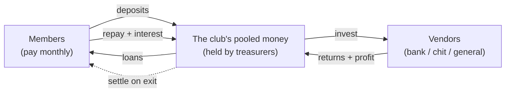

---

## 2. The people

Everyone in Peacock is a **member**. Some members also wear extra hats:

| Who | What it means | Notes |
|-----|---------------|-------|
| **Member** | A person in the club. Pays monthly, can borrow, can leave & rejoin. | Everyone is a member first. |
| **Admin** | A member who is allowed to **enter and edit data**. | Admin is a permission, not a different person. |
| **Treasurer** | A member who is currently **holding some of the club's cash**. | Any member can be a treasurer — short-term or long-term. There can be several at once. |

- **Members and treasurers are the same kind of person** — a treasurer is just a member who
  happens to be holding club money right now.
- **Vendors are not people in the club** — they're outside places money goes (see §10). They
  never log in.

### A member is a *person*; each stint is a *membership* (the bank model)

A person can **leave and rejoin** over the years. To keep each period's money clean, Peacock works
like a bank: **the person is one stable customer (one login, one phone), but each time in the club is
a separate "membership" — like an account that opens when they join and closes when they leave.**

- **Member = the person/customer** — never duplicated; one login, one identity.
- **Membership = one stint/"account"** — opens on join, **closes on leave (settled)**, and a **new
  membership opens on rejoin**. Each membership has its **own** deposits, catch-ups, penalties, loans
  and profit, so old stints never get mixed into the new one.
- Their **member page shows the current membership**; closed ones appear as **previous memberships
  (history)**, linked to the same person. (See §12.)

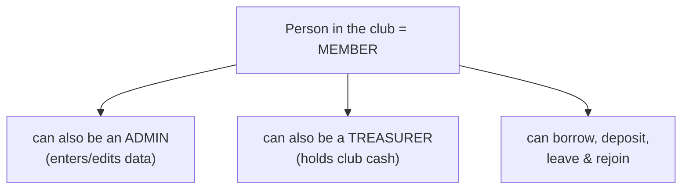

### Logging in (no sign-up)

There is **no public registration** — the club's members already exist. To get in, you **pick your
name from a list** of members and **enter your password**.

- The **default password is your phone number** (set when you're added). **On your first login
  you're required to change it.**
- **Forgot your password?** Request a reset — the request **goes to the admin** (who sees it and
  gets an **in-app notification**), and the **admin resets it** for you (back to your phone number by
  default). There's no email-link reset.
- Phone numbers are **unique** per member.
- Admins can always log in; members optionally (to view). Vendors never log in.

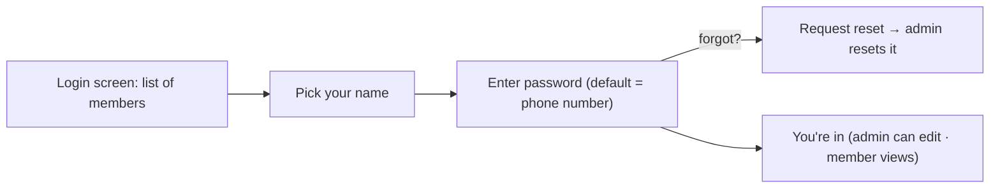

(The exact fields stored per member are in `FORMS_AND_FIELDS.md`.)

---

## 3. Core concepts (glossary)

| Term | Plain meaning |
|------|---------------|
| **Member (person)** | A person in the club — one stable identity/login, never duplicated. |
| **Membership** | One stint in the club ("account"): opens on join, closes on leave, a new one opens on rejoin. Holds that period's deposits, charges, loans and profit. |
| **Deposit** | The monthly money each member must pay into the club. |
| **Treasurer / treasury** | A member holding club cash / the pot of cash they hold. |
| **Loan** | Money the club lends to a member, with interest. |
| **Interest** | The charge a borrower pays for keeping a loan, calculated daily. |
| **Catch-up** | Extra money a new or returning member pays so they're equal to everyone else (was called "offset"). |
| **Vendor** | An outside place the club invests money — a **general** vendor (e.g. a bank) or a **chit** fund. |
| **Chit fund** | A scheme where the club pays a monthly amount for a fixed number of months and receives a lump payout. |
| **Profit** | What the club earns — loan interest + vendor returns above what was invested. |
| **Profit per member** | The club's shareable profit divided by the number of members. |
| **Settlement** | The money a member receives when they leave the club. |
| **Overdue** | A loan kept past its allowed time, or a deposit paid late. |
| **Pending** | Money that *should* have come in but hasn't yet (e.g. unpaid deposits, uncollected interest). |

---

## 4. How money is held — no central club account

**The club does not have a bank account or a vault. The club is not a physical thing.** All of
the club's cash is physically held by **members acting as treasurers**.

- When a member pays a deposit, the cash goes to **a specific treasurer**.
- When the club gives a loan, the cash comes out of **a specific treasurer's** hands.
- Treasurers can **pass club cash to each other** (an internal transfer) — this doesn't change
  how much the club has in total, just who's holding it.

So at any moment, the club's **available cash = the sum of what every treasurer is holding**,
and Peacock always shows **who is holding how much**.

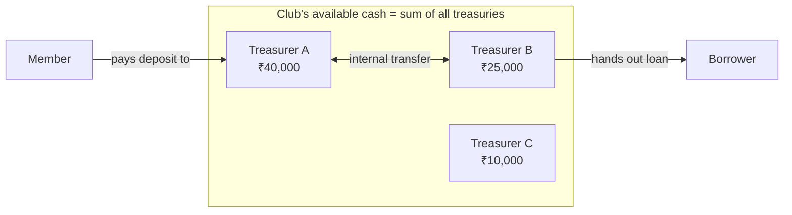

> **Why this matters for design:** almost every money action needs to say *which treasurer*
> the cash came from or went to. The UI should always make picking a treasurer quick and clear.

---

## 5. Admin settings (the knobs)

Everything that can change over time lives in **admin settings** — no fixed values are baked in.
An admin can adjust:

| Setting | What it controls | Today's value |
|---------|------------------|---------------|
| **Club name & start date** | Identity; when the club began. | Started **01 Sep 2020**. |
| **Deposit stages** | The monthly deposit amount over time (it has been raised). | ₹1,000 (Sep 2020 → Aug 2023), then **₹2,000** (Sep 2023 → now). |
| **Loan interest rate** | The monthly interest rate for **new** loans. Dated changes are allowed. | **1% per month** since the start. |
| **Daily-interest start date** | The date from which interest is pro-rated by the day. | **01 Jun 2024**. |
| **Loan limit** | The most a member may borrow. | **₹5,00,000** (revisable). |
| **Loan term** | How long a loan may run before it's "overdue." | **5 months**. |
| **Loan cooldown** | Wait time after closing a loan before taking a new one. | **1 month**. |
| **Overdue penalty** | Extra interest on loans kept past the term. | **0** (off) — can be switched on anytime. |
| **Late-deposit penalty** | Charge for paying a monthly deposit late. | **0** (off) — overdue is only flagged. |
| **Dividend** | Periodic profit payout to members. | **Off** — profit accumulates instead. |

Two important rules about settings:

1. **A loan's interest rate is fixed when the loan starts.** If the admin later raises the rate,
   it applies only to **new** loans — existing loans keep their original rate for life.
2. **The overdue penalty (when turned on) applies immediately to *all* loans**, current and
   future — it is not locked per loan.

---

## 6. Monthly deposits

Every member is expected to pay the **current monthly deposit** (today ₹2,000) each month. The
expected amount has changed over the club's life (the "stages" above), and Peacock knows, for any
member and any date, **how much they should have paid in total so far**.

**Everyone is measured against the full club life.** A member's *expected* total is the sum of the
monthly amounts **from the club's start to today** (today that's ₹1,00,000 = ₹1,000 × 36 months +
₹2,000 × 32 months, **counting the current month**) — the **same for every active member**.

A member's **deposit pending** is measured against their **monthly (periodic) deposits only** —
**catch-up does *not* count toward it.** Catch-up is *profit-gap equalisation* (§7), not a monthly
deposit, so it builds the member's value but does not reduce their deposit shortfall. Late/returning
members owe their missed months as **back deposits**, which are paid as ordinary periodic deposits
(§12), separately from catch-up.

- **Paid vs expected:** Peacock always shows what a member *has* paid against what they *should*
  have paid. The difference between expected and **periodic deposits paid** is their **pending**
  deposit. Any catch-up or penalty still owed is tracked separately and adds into the member's
  **total pending** (deposit due + catch-up due + penalty due).
- **Late deposits** are flagged as **pending / overdue** in the UI. There's an optional penalty
  for lateness (off today — see §13).
- Deposits are **capital, not profit** — they're the member's own money working in the club.

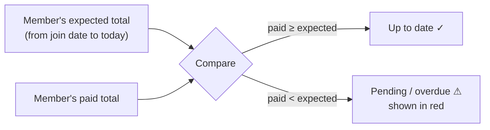

---

## 7. Joining & catch-up

The club has been running for years and has built up value. So when **a new member joins late**,
or a member **rejoins**, they must catch up so that **everyone holds equal value**. (This used to be
called "offset.")

### Catch-up is a *charge the member owes*, paid down over time

A catch-up is **not a single payment** — it's a **charge** (an amount the member **owes**) that they
**pay down later in any number of instalments**. A member can have **several catch-up charges over
time** (e.g. one each time they rejoin); they all **accumulate** and are shown on the member's page.

Each catch-up charge has:
- an **amount** — for a **new or returning member** it is **auto-suggested** (= the per-member
  profit gap that brings them to equal value) and admin-editable. For an **existing active member**,
  catch-up is **entered manually** — there is **no auto-suggestion**, because an active member
  equalises by paying their **Deposit due** (§6), which also restores their full profit share; an
  auto profit-gap catch-up on top would double-count the same shortfall,
- a **reason** — *First-time join · Rejoin · Profit-gap top-up · Mid-term equalisation · Other*,
- a **date**.

Catch-up money **counts as the member's own** (it builds their capital/value in the club, and it
counts toward their **profit share**). But because catch-up is *profit-gap equalisation* — not a
monthly deposit — it **does not reduce their deposit pending** (§6): a member's monthly-deposit
shortfall is always measured against **periodic deposits only**. It is **auto-added** at first join
and at each rejoin (see §12), and the admin can edit the amount.

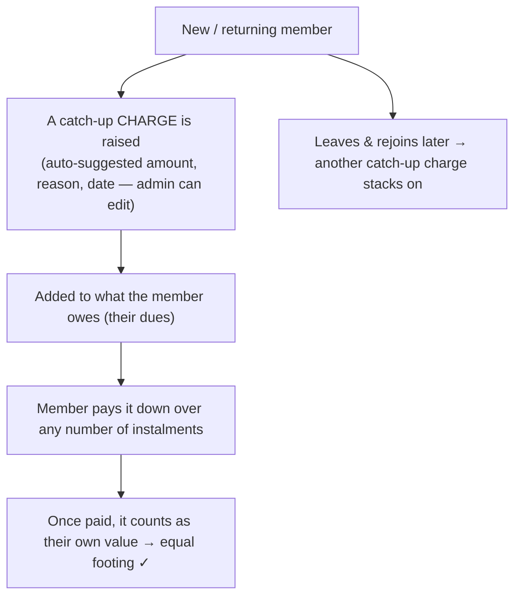

> **Note — "delayed payment" is a *penalty*, not a catch-up** (§13). Both catch-ups and penalties
> are *charges the member owes* and work the same way (multiple over time, each with a reason, paid
> down in instalments) — but catch-up builds the member's **own value**, while a penalty is **club
> income**.
```

---

## 8. Loans

The club lends its pooled cash to members. Loans are a core source of the club's profit.

### The rules

- **One loan at a time.** A member must fully clear any existing loan (and have no outstanding
  balance) before taking a new one.
- **No top-ups.** You can't add to a running loan; you take a fresh loan later.
- **Cooldown.** After fully repaying, wait **1 month** before borrowing again.
- **Limit.** Up to **₹5,00,000** (an admin setting).
- **Term.** A loan should be repaid within **5 months**. After that it's **overdue** — but it
  **stays active** (it isn't cancelled or auto-penalised unless the penalty is turned on).
- **Repay anytime, any amount.** There's no minimum repayment; round figures are encouraged but
  not enforced.
- **Borrower priority (a hint).** Peacock shows whether a member is **high priority** (hasn't
  borrowed before / borrows little) or **low priority** (borrows often). This is **advice only** —
  the admin decides who actually gets the loan.
- **No separate "create loan" step.** The admin just records **"Give a loan"** for a member, and the
  loan is **created automatically in the background**. Later hand-outs to the same member (before
  that loan closes) attach as **further tranches** of the same loan.

### How a loan moves through its life

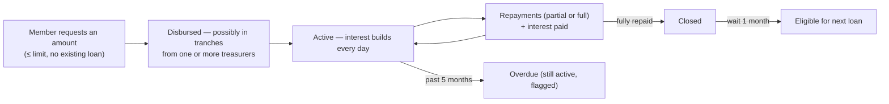

### Disbursement in tranches (an important real-world detail)

Because no single treasurer may hold enough cash, **one loan can be paid out in pieces** from
**different treasurers over a few days**. It's still **one loan** with **one start date**. Interest
is charged on whatever is actually outstanding at each point in time.

> Example: a member is approved for ₹2,50,000. Treasurer A gives ₹1,00,000 today; a week later
> Treasurer B gives the remaining ₹1,50,000. For that first week, interest is on ₹1,00,000; after
> the second hand-out, interest is on the full ₹2,50,000.

---

## 9. Interest — how it's calculated

Interest is the heart of loan accounting, so this section is precise. **Interest is shown live,
up to today** — the borrower doesn't pay daily, so there's always some interest accruing that
hasn't been paid yet.

### The rule in words

- The rate is **monthly** (today **1%**).
- **A full "month" of a loan is counted from the day it started** (e.g. the 20th to the 20th).
  Each completed month charges the full monthly rate.
- **Leftover days** beyond the last complete month are charged **per day**, where the daily rate
  is the monthly rate **divided by 30** — a fixed 30-day convention, whatever calendar month the
  days fall in.
- The principal can change over the loan's life (more disbursed, or some repaid). **Each time the
  outstanding amount changes, the month-count restarts from that day** for the new amount.
- A loan's rate is **fixed at its start** — later rate changes don't affect it.

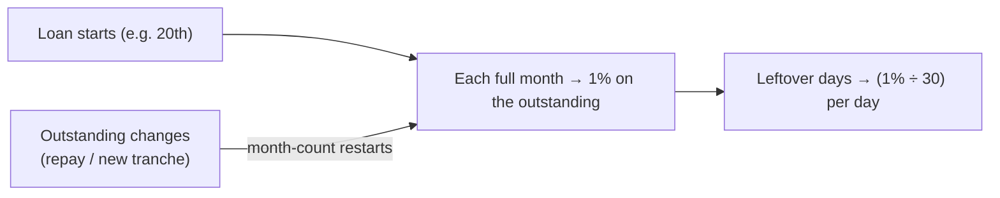

### Worked example

> A member borrows **₹50,000** and keeps it **2 months and 25 days**.
> - 2 full months → **2 × 1% of ₹50,000**.
> - 25 extra days → **25 × (1% of ₹50,000 ÷ 30)**.
>
> If they then repay ₹20,000, the remaining **₹30,000** starts a **fresh count from that day**,
> charged the same way until it's cleared.

### A note on dates

Before **01 Jun 2024**, interest was charged by **whole months only** (a part-month rounded up).
From that date on, the **daily** method above applies. (This mostly matters for historical loans.)

---

## 10. Vendors (including the bank) & chit funds

A **vendor** is an outside place the club puts money to grow it. There are **two kinds**:

### General vendor (covers banks and anything else)

Money goes out (invested), money comes back later (returns); anything above what was invested is
**profit**. A **bank is just a general vendor** — for example, a treasurer keeps club cash in a
bank for a few months, the bank pays ₹500 interest, and that ₹500 comes back to the club as profit.
A vendor can be **labelled** (e.g. "Bank", "Stocks") for grouping in reports, but it behaves the
same.

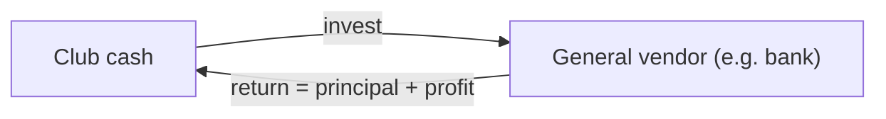

### Chit fund

A chit fund is a fixed-term scheme. For example: a **₹5,00,000 chit over 20 months**.

- The club **pays a monthly installment**. The installments **start small and rise over time**, up
  to a **margin** (here ₹5,00,000 ÷ 20 = **₹25,000**) — never beyond.
- At some point (often between months 10–20, or at the very end) the club **receives a payout**.
- **Even if the payout is taken early, the club must keep paying the remaining monthly installments
  until the term ends.** That future commitment is tracked as an **obligation** the club still owes.
- **Profit** = the payout minus everything the club paid in (can be positive or negative).

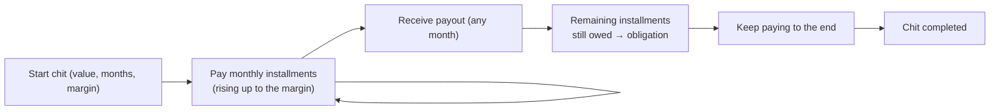

> **Why obligation matters:** the money the club still has to pay into chits is subtracted from the
> club's shareable profit — the club doesn't count gains it hasn't fully earned yet.

---

## 11. Profit — how the club earns and shares it

### Where profit comes from

1. **Loan interest** the club collects from borrowers.
2. **Vendor returns** above what was invested (bank interest, chit payouts, etc.).

### Realized vs pending

- **Realized profit** — already collected and in the club's hands.
- **Pending interest** — interest that has built up on active loans **but hasn't been paid yet**.
  Because the club *will* collect it, **pending interest counts as profit**.
- **Pending deposits are NOT profit** — they're members' own capital that's simply late.

### Obligations reduce profit

The **money still owed to chit funds** is subtracted, so the club never overstates what it can
share.

### Profit per member

```
shareable profit = realized profit + pending loan interest − chit obligations (− anything already paid out)
profit per member = shareable profit ÷ number of members
```

This **profit-per-member figure is shown on the dashboard** so everyone can see how the club is
doing per head.

### No automatic payout (for now)

The club **does not** pay profit out periodically. **Profit accumulates** and belongs to members
as their growing share; a member only receives their profit **when they leave** (see §12). A yearly
dividend may be added in the future — the capability exists but is **switched off**.

### Profit is shared by how much you paid in

Crucially, a member's profit share is **proportional to how fully they've paid their deposits**, not
a flat equal slice. If a member is behind on deposits, they earn proportionally less profit.

The share is measured against the **expected** deposit base — *what everyone should have paid* — not
against what has actually been collected. Concretely, the **full share** is the shareable profit
split equally per member (the dashboard's profit-per-member), and each member earns that full share
**times the fraction of their own deposits they've paid**. This has three consequences that matter:

- **A member who has paid in full is never affected by anyone else.** They always earn their full
  per-head share, no matter how far behind other members are.
- **Each underpaying member alone bears their own shortfall.** The profit they forfeit by being
  behind is *not* handed to the members who paid — it simply **stays in the pool**, unearned, until
  that member catches up (at which point they earn it).
- **The club never shares out more profit than it has earned.** Because every share is capped at the
  full per-head share and reduced for underpayment, the sum of all members' shares can never exceed
  the shareable profit. So even if **every member settled and left at once**, the club's value would
  **never go negative** — the un-earned remainder is retained, not owed.

> Example: everyone's expected deposit so far is **₹30,000** and the full per-head profit share is
> **₹9,000**. A member who has paid only **₹20,000** has paid **two-thirds**, so they earn
> **two-thirds of ₹9,000 = ₹6,000**. The missing **₹3,000** isn't given to anyone — it stays pooled
> until they pay up. A member who paid the full ₹30,000 still earns the full **₹9,000**, unchanged by
> the first member being behind. **The UI shows both** the full share and the actual reduced share,
> so the gap is clear.

---

## 12. Leaving & rejoining (closing and opening memberships)

Peacock follows the **bank model** (§2): leaving **closes** the person's current **membership**;
rejoining **opens a new membership**. The person stays one customer; old memberships become history.

### Leaving (settle & close the membership)

A member leaves by **settling** — taking their money out of the club. **There is no partial exit
and no "take just the profit" option** — it's all or nothing.

When a member leaves, Peacock **computes a suggested settlement** that brings together everything:

- **plus** their paid-in capital (deposits + catch-up),
- **plus** their **profit share** (reduced if they underpaid — §11),
- **minus** any loan they still owe,
- **minus** any unpaid interest on that loan.

The **admin enters the final settlement amount** (it may be slightly less than the computed guide),
and the member is **paid out in cash at that time** (from a treasurer) — including their profit
share. After settling:

- the member's **profit becomes zero**,
- their **current membership is closed** (marked Closed, with the leave date and settled amount),
- **all their history is kept** — nothing is deleted; it becomes a **previous membership**.

The settlement is **recorded as its real parts, not one lump**: the interest they owed is collected,
any loan is repaid, their capital is returned, and their profit is paid out — each booked separately.
Because of this the **settlement guide is preserved**: a closed membership's page shows exactly what
was paid out and how it broke down (capital + profit − loan − interest), so a past exit can always be
reviewed. The profit a leaver takes is tracked as **profit paid out**, so it correctly leaves the
pool the remaining members share (§11) and the club can never promise profit that has already left.


### Rejoining (open a new membership)

A person whose membership is closed can come back — this **opens a fresh membership (#N+1)**. The
**Rejoin** flow shows what it takes to return to **equal value**:

- **Back deposits** — the **full** monthly deposits they'd owe since the club's start. A prior
  membership's deposits were paid back when they settled and left, so the new membership starts at
  **zero paid** — they owe the whole baseline afresh (no credit for the closed stint).
- **Catch-up** — **auto-added** (suggested from per-member profit), and **admin-editable**. It's
  posted to the member's ledger as a **charge tagged "Rejoin"** that they pay down (counts as their
  own value).
- **Total to rejoin** = back deposits + catch-up.

On confirm, a **new membership opens (Active)** with the catch-up charge on it; the member then
**pays the dues down over time** (any number of instalments). The old membership stays in history.

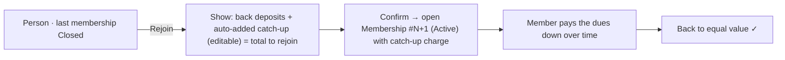

### The member page (one person, current + history)

The member detail page is the **person**. It shows an **identity header** ("Customer since …"), a
**membership bar** ("Membership #N · Active since …", with a switcher if there's more than one), the
**current membership's** full breakdown, and — only if they've rejoined — a **"Previous memberships"**
section listing each closed stint (dates, settled amount) as **read-only history**. For a member who
never left, it looks exactly as before (no history section).

---

## 13. Penalties

There are three kinds of penalty — the overdue-loan rate, two **automatic** penalties, and the
manual charge.

| Penalty | How it works | Today |
|---------|--------------|-------|
| **Overdue loan penalty** | An **automatic** extra interest rate on loans kept past the **5-month** term. A config setting; when switched on it applies **immediately to all loans**. | **0** — overdue loans are only **flagged**. |
| **Auto deposit penalty** | Automatic monthly charge when a member's **deposit pending** stays high (§13.1). | **On** since **1 May 2026** — 2% / mo on pending over ₹6,000. (Off by default; a toggle.) |
| **Auto loan-interest penalty** | Automatic charge when a **closed loan's interest** is left unpaid (§13.1). | **On** since **1 May 2026** — 2% on pending interest over ₹1,000, every 30 days. (Off by default; a toggle.) |
| **Penalty charge** | A **manual charge** the admin raises against a member. Like catch-up, it's an amount the member **owes** and **pays down over time in any number of instalments**, and a member can have **several** over time (e.g. ₹100 today, another ₹100 next week — they accumulate). | Applied **case-by-case** by the admin. |

### 13.1 Automatic penalties (deposit & loan-interest)

Two automatic penalties, **each independently toggled** and **off by default**. Both are
**admin-configurable** (rate %, minimum trigger, and — for the loan penalty — the grace window) and
share **one "apply from" date** (default **1 September 2026**): **nothing is charged for any date
before it**. Turning a penalty on therefore applies **from that date forward**, not across the whole
past.

**Deposit penalty.** On the **1st of every month** (IST), if a member's **deposit pending** is
**more than the minimum** (default **₹6,000** — i.e. more than roughly three months behind), the
club adds **2% of that full pending amount** for the month. Whole months only — crossing the
threshold mid-month costs nothing until the next 1st. A member is only charged for months from their
current join onward.

**Loan-interest penalty.** When a member's loan **closes** with interest still unpaid, a **grace
window** (default **30 days**) passes, then **every 30 days** thereafter, if the **pending interest**
is **more than the minimum** (default **₹1,000**), the club adds **2% of the pending interest**. The
2% is always on the **interest** — **never on the loan principal**. Every interest payment shrinks
the next charge (and stops it once pending drops to the minimum). Taking a **new loan pauses** the
clock; it re-anchors to the new loan's close date.

Both are **simple, not compounding**: each period's 2% is on the pending **base** (deposits owed /
interest owed), **never on penalty already added**. So a second month adds its own 2% of the
still-pending base on top of the first — it does not charge penalty-on-penalty, and the loan penalty
never touches principal.

**How they're added.** Each auto penalty becomes a normal **penalty due** on the member (collected
through the usual **"Pay penalty"** entry, shared as club profit like any penalty) and carries a
**reference recording the exact working at charge time** — *"Deposit penalty · Sep 2026 — 2% of
₹15,000 deposit pending"* or *"Loan-interest penalty · 30 days after close — 2% of ₹11,983 interest
pending"*. On the member's page the row is titled by its **reason** (*Deposit penalty (auto)* /
*Loan-interest penalty (auto)*), attributed to the **auto scheduler** (manual charges say *admin*),
with that working underneath. They're **added automatically when an entry is recorded** (or on
demand via **Sync now**), and the same month or loan-tick can **never be charged twice**. Once added,
the amount is **fixed**; if history later changes so a period no longer qualified, the admin can
**dismiss** that auto penalty (and it won't come back).

Admins review every system-added penalty on a dedicated **Auto penalties** page (**Admin → Auto
penalties**): the member, what it was charged for, the amount, the date, a **by-member** and
**by-month** breakdown, and a **Sync now** button. Both the breakdown and the register can be
**filtered by penalty type** (All · Deposit · Interest), and the register is **paginated**. The
toggles, rates, minimums, grace window, and
start date are edited **right on that page** (and also in Settings → Club → Edit) — turning a penalty
on there applies it from the start date immediately.

### 13.2 Penalty charges (manual, multiple, paid down)

Each penalty charge has:
- an **amount** — **auto-suggested but admin-editable** (suggestion = *2% of this member's pending
  dues*, **not** the full accumulated dues),
- a **reason** — *Delayed payment · Loan repayment delay · Holding club money too long · Missed
  deposit · Other*,
- a **date**.

Unlike catch-up (which builds the member's own value), penalty money the member pays down is **club
income — shared as profit among all members** (including the member who paid it). All of a member's
penalty charges are shown **cumulatively** on their page (each with reason / amount / date / paid /
remaining). Overdue loans and late deposits are still **flagged** regardless of any penalty.

So **overdue loans** and **late deposits** are always **flagged** with clear indicators (red
badges) regardless of penalties. The **overdue-loan penalty** is an automatic switch (off today),
while the **delayed-payment penalty** is a judgement call the admin makes and enters by hand.

---

## 14. The dashboard

The dashboard is the club's at-a-glance health, all figures **live**. It has two views the user
can switch between:

- **Summary** — a friendly, modern overview (headline numbers, a trend chart, recent activity).
- **Club Passbook** — the full, detailed breakdown of every figure (for members who want all the
  numbers), plus a one-tap **Screenshot/Share**.

### 14.1 Headline cards (top of Summary)

The first thing you see — the five numbers that matter most:

| Card | What it means (plain) |
|------|------------------------|
| **Total portfolio value** | Everything the club is worth = cash in hand + money out on loan + money with vendors + money still coming in (pending interest & deposits). Shows the **change this month** (e.g. +4.2%). |
| **Available cash** | The liquid money the club can use right now (sum of all treasurers' holdings). |
| **Outstanding loans** | How much is currently out on loan, and **how many active loans** (with an **overdue** flag if any are past term). |
| **Pending deposits** | Monthly savings members still owe, and how many members are behind. |
| **Profit per member** | The club's shareable profit ÷ number of members — the "how are we doing per head" number. |

### 14.2 Trend chart

A line chart of **portfolio value over time**, with **3M / 1Y / All** ranges, so members can see
the club steadily growing.

### 14.3 Recent activity

A simple running feed of the latest money events — name, what happened (deposit, loan disbursed,
vendor return, interest, withdrawal, repayment…), the date, and the amount in **green (money in)**
or **red (money out)**. A "View all" link opens the full history.

### 14.4 The detailed breakdown (Club Passbook)

Grouped, labelled sections — every number has a short "what it means". Each figure has an info
tooltip.

**Club snapshot**
| Figure | Meaning |
|--------|---------|
| Active members | How many members are currently active. |
| Club age | How long the club has been running (in months). |

**Member funds**
| Figure | Meaning |
|--------|---------|
| Member deposits | Total monthly savings paid in so far. |
| Catch-up contributions | Total equalisation money paid by late-joiners / those who fell behind. |
| Average balance | Average money each member holds in the club. |

**Member pending**
| Figure | Meaning |
|--------|---------|
| Member pending | Monthly savings still owed across all members. |
| Catch-up pending | Equalisation amounts still expected. |

**Loans — lifetime**
| Figure | Meaning |
|--------|---------|
| Total loan given | Everything ever lent to members. |
| Total interest collected | Interest actually received from borrowers. |

**Loans — active**
| Figure | Meaning |
|--------|---------|
| Current loans outstanding | Money currently out with borrowers. |
| Interest pending | Interest built up on active loans but not yet collected. |
| Active / overdue loans | How many loans are running, and how many are past their 5-month term. |

**Vendors**
| Figure | Meaning |
|--------|---------|
| Vendor investment (holding) | Money currently placed with vendors (bank/general/chit). |
| Vendor profit | Profit earned from vendors so far. |
| Chit obligations | Future chit installments the club still has to pay. |

**Profit summary**
| Figure | Meaning |
|--------|---------|
| Current profit | The club's earnings (collected + pending interest, net of chit obligations). |
| Profit withdrawn | Profit already paid out to members who left. |

**Cash-flow position**
| Figure | Meaning |
|--------|---------|
| Total invested | Money working outside the cash pile (loans + vendors). |
| Total pending | Everything still expected to come in (pending deposits + pending interest). |
| 30-day inflow / outflow / net | Money in, money out, and the net over the last 30 days. |

**Valuation & liquidity**
| Figure | Meaning |
|--------|---------|
| Available cash (per treasurer) | Liquid cash, **broken down by who holds it**. |
| Current value | Cash + loans outstanding + vendor holdings (what the club has right now). |
| **Total portfolio value** | Current value **+ pending loan interest + pending member deposits** — the grand total. |

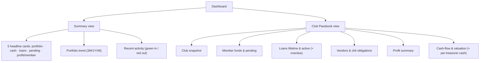

> **Design intent:** *Summary* answers "is the club healthy?" in five seconds; *Club Passbook*
> answers "show me every number" for members who want full transparency. The per-treasurer cash
> breakdown and profit-per-member are the two figures unique to how this club works — keep them
> prominent.

---

## 15. Transparency, submitting entries & approvals

Transparency is a core value. **Every member can see everything** about the club's finances — all
members, all loans, all vendors, all transactions, and their own statement.

### Members submit, admins approve

Recording money uses a simple **submit → approve** flow:

- **A member submits an entry** (e.g. "I paid my ₹2,000 deposit"). It becomes a **pending request** —
  it does **not** change the club's books yet.
- **An admin approves (or rejects)** it. Only on **approval** does it actually post to the records.
- **An admin's own entry** posts directly (no self-approval).

Pending requests reach admins as **actionable notifications** (Approve / Reject), and the same
queue is available on a dedicated **Pending approvals** page (Admin hub → Pending approvals) for
reviewing several submissions at once (§18).

There is **no complicated permissions matrix** — just **one setting**: *who may submit entries —
**admins only**, or **all members** (with admin approval).* Everything else (approving, managing
members/vendors/loans, changing settings, closing a quarter) is **admin-only**.

| Action | Admin | Member |
|--------|:-----:|:------:|
| See everything (dashboard, members, loans, vendors, transactions, own statement) | ✓ | ✓ (view) |
| **Submit** an entry (pending until approved) | ✓ (posts directly) | ✓ *if the club allows member submissions* |
| **Approve / reject** submitted entries | ✓ | — |
| Manage members/vendors/loans/chits; change settings; close a quarter | ✓ | — |
| Hold club cash (be a treasurer) | ✓ (any member) | ✓ (any member) |

Vendors are not users and never log in. Members can optionally have a login to view; admins always do.

### Exporting records (CSV)

The transactions ledger can be **downloaded as a spreadsheet (CSV)** — the export honours whatever
filters are active, so filtering by one member and exporting produces that member's **statement**.
Any signed-in member can export (they can already see everything).

---

## 16. Corrections & history

Peacock is built to be **auditable**: nothing is ever silently deleted.

- You fix a mistake by **editing or deleting the specific transaction** in the ledger. Behind the
  scenes the app **reverses** the original (and, for an edit, posts the corrected one) — so the
  original always stays on record. There's **no separate "correction" entry to choose**; edit/delete
  *is* the correction.
- The reversal is **dated to the original entry's month** so past months and charts stay accurate,
  while separately recording **when** the change was made (the audit trail).
- Because these are real entries, **all the numbers and history update instantly and stay
  consistent** — including past months and charts.

### Audit log

Every action is recorded in an **audit log** — *who did what, and when* ("Approved loan disbursal to
Rahul", "Changed default loan interest to 2%/month", "System posted monthly interest to 41 accounts",
"Priya updated her phone number"). Admins can browse it; it's the club's tamper-evident history.

### Closing a quarter

At the end of each quarter (the club's financial quarters), an admin can **close the quarter**. This:

- **Locks** that quarter's entries so no one can edit the past by accident, and
- **Takes a snapshot** of the club's figures at that point (a clean quarter-end statement).

It **doesn't move any money** — the club's profit simply **keeps accumulating** (there's no payout);
closing is **housekeeping**: a lock plus a snapshot. It **can't be undone**, so the app warns before
confirming.

### Backups

An admin can **download a full backup** of the club's data (one file) anytime from the Admin hub,
and **restore** from one. In addition, **once a month the app automatically emails that same backup
file to the club's admin** (when the email service is configured) — so a backup exists even if
nobody remembers to click.

---

## 17. Transaction types (the "What happened?" entry screen)

When recording activity, the admin doesn't deal with accounting — they pick **what happened in
plain language** ("Member paid deposit", "Give a loan"…) and the app does the rest. Every entry is
**money IN** (club gains cash), **money OUT** (club pays cash), or **neutral** (cash just moves
around / no net change). The app **always asks which treasurer** the cash came from or went to.

Below is the **complete, correct list** of transaction types for Peacock Investment Club, grouped
the way the entry screen should present them.

### Everyday entries (the common ones)

| What happened | Direction | What it does |
|---------------|:---------:|--------------|
| **Member paid deposit** | IN | A member pays their monthly savings to a treasurer. |
| **Pay catch-up** | IN | A member pays down a **catch-up charge** they owe (builds their own value → counts as their capital). |
| **Pay penalty** | IN | A member pays down a **penalty charge** they owe (becomes club income, shared as profit). |
| **Give a loan** | OUT | The club hands a loan to a member. Can be done **in parts (tranches)** from different treasurers — all under one loan. |
| **Record repayment** | IN | A member pays back loan principal (and optionally interest in the same entry). |
| **Collect interest** | IN | A member pays interest earned on their loan. |
| **Funds transfer** | neutral | One treasurer hands club cash to another — total club money unchanged. |

### Vendors & chit funds

| What happened | Direction | What it does |
|---------------|:---------:|--------------|
| **Vendor investment** | OUT | The club places money with a vendor (general/bank). |
| **Vendor return** | IN | A vendor returns money (principal + profit; bank interest is all profit). |
| **Chit installment** | OUT | The club pays a monthly chit amount (rises toward the margin). |
| **Chit payout** | IN | The club receives a chit's lump payout (remaining installments stay owed). |

### Member lifecycle

| What happened | Direction | What it does |
|---------------|:---------:|--------------|
| **Member leaves (settle up)** | OUT | A member **fully exits** — capital + their profit share − any loan owed. This is the **only** kind of withdrawal (no partial, no profit-only). Account is then frozen/inactive, history kept. |
| **Member rejoins** | IN | A returning member pays back in (one or two installments) + catch-up, and is reactivated to equal value. |

### Raising charges (admin, on the member page — *not* cash entries)

These don't move cash; they record an amount the member **owes** (paid down later via "Pay catch-up"
/ "Pay penalty"). They can be raised **multiple times** and each carries a **reason**.

| What happened | What it does |
|---------------|--------------|
| **Add catch-up charge** | Raise an amount the member owes to reach equal value (reason: first-time join · rejoin · profit-gap top-up · mid-term equalisation · other). Auto-suggested, editable. Auto-added on rejoin. |
| **Add penalty charge** | Raise a penalty the member owes (reason: delayed payment · loan repayment delay · holding club money too long · missed deposit · other). Auto-suggested, editable. |

### Fixing mistakes & losses

There is **no manual "adjustment"** that nudges a number, and no separate "correction" entry to pick
— those would be untraceable. Instead:

| Situation | What you do |
|-----------|-------------|
| **One specific posted transaction was wrong** | **Edit** or **Delete** that transaction from the ledger (§16). The system reverses it behind the scenes and keeps full history — no separate "correction" action to choose. |
| **Money placed with a vendor is truly gone** | **Vendor write-off** (admin) — records the real loss when a vendor returns less than invested / defaults. Reached from the vendor's close flow. |

> Money a member *owes* is never a manual balance edit — it's a **catch-up or penalty charge** (above).
> Money genuinely *lost* is a **vendor write-off**. A *mistyped entry* is fixed by **editing that
> entry**. Together these remove any need for a free-form "adjustment."

> **Catch-up & penalty are *charges* (dues), not single payments.** Raising a charge (above) records
> what's owed (with a reason; multiple over time accumulate); **paying it down** is the cash entry
> ("Pay catch-up" / "Pay penalty"), in any number of instalments. The member page shows the
> **cumulative** charges and how much is paid vs remaining.

---

## 18. Notifications (one inbox for everything)

A **simple, in-app** notification centre (the **bell**, with an unread count) is the single place for
everything that needs attention — deliberately lightweight (no email/push for now). It carries
**three kinds** of item:

1. **Events** — things that happened: "Anita recorded a ₹5,000 deposit", "loan disbursed to Rahul",
   "vendor return from Surya Traders", "member settled / rejoined", "password reset requested".
   *(Stored the moment they happen.)* One scheduled event exists: on the **25th of each month** the
   app stores a **deposit reminder** for every member behind on deposits ("₹X pending — pay before
   the 1st to avoid a penalty"), ahead of the 1st-of-month auto-penalty tick (§13.1). One reminder
   per member per month.
2. **Alerts** — proactive warnings computed from the club's current state: **a loan is overdue**, a
   **large amount** was involved (over a set threshold), or **pending deposits / pending interest are
   heavy**. *(Worked out live when you open the bell, against thresholds set in Settings.)*
3. **Approvals** — a **pending entry** waiting on an admin, shown with **Approve / Reject** right
   there. The same queue also has a dedicated **Pending approvals** page (Admin hub) for reviewing
   several at once — both act on the same submissions.

**Members** mostly get events relevant to them (their deposit/loan/interest/settlement, a new joiner,
their password reset). **Admins** additionally get **approvals** (pending entries, forgot-password
requests) and **alerts** (overdue loans, big amounts, heavy pending).

Each item has a **short message, a link** to the thing, a **read/unread** state, and a time. Approval
items also carry **Approve/Reject**. "Mark all read" clears the count.

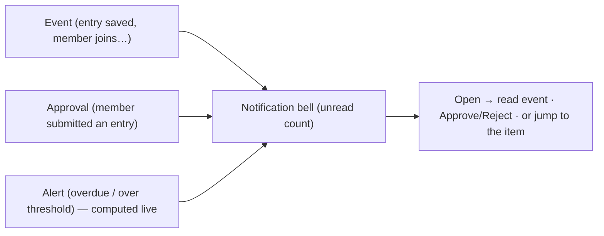

> **Thresholds** for alerts (what counts as a "large amount", heavy pending deposit / interest) are
> set in **admin Settings**, so the club decides when it wants to be nudged.

---

## 19. End-to-end example

A small story that touches most of the product:

1. **Setup.** The club started in Sep 2020 at ₹1,000/month, raised to ₹2,000 in Sep 2023. Loan
   interest is 1%/month.
2. **A member deposits.** Asha pays her ₹2,000 for the month; Treasurer Ravi receives it, so the
   club's cash (held by Ravi) goes up ₹2,000.
3. **A loan.** Bhaskar is approved for ₹2,50,000. Ravi gives ₹1,00,000 today; a week later
   Treasurer Meera gives ₹1,50,000. Interest builds daily — on ₹1,00,000 for the first week, then
   on ₹2,50,000.
4. **A repayment.** After two months Bhaskar repays ₹2,00,000 plus the interest so far; the
   remaining ₹50,000 keeps accruing from that day until he clears it. Treasuries that receive the
   cash go up accordingly.
5. **A vendor.** The club places ₹3,00,000 in a chit fund (₹5,00,000 over 20 months); it pays a
   rising monthly installment and will receive a payout later, while still owing the remaining
   installments.
6. **The bank.** A treasurer parks spare club cash in a bank; the ₹500 interest the bank pays comes
   back as club profit (a general-vendor return labelled "Bank").
7. **The dashboard** shows available cash (split across Ravi, Meera, others), money out on loan,
   money in the chit, profit collected and pending, and **profit per member**.
8. **A member leaves.** Priya decides to leave. She had paid ₹20,000 of an expected ₹30,000 (so a
   two-thirds profit share) and owes nothing. Peacock suggests her settlement (capital + two-thirds
   profit share); the admin enters the final amount; Priya's profit goes to zero and her account is
   frozen — her history stays.
9. **She rejoins later** by repaying in two installments plus a catch-up for the profit-per-member
   and deposits she missed, returning to equal value.

---

*End of product guide. For technical/implementation detail, see `IMPLEMENTATION_PLAN.md`.*
